Process Library
===========================

The Process library is where members of the team site creates new processes and edit existing ones, and where processes are published so others can see them. 

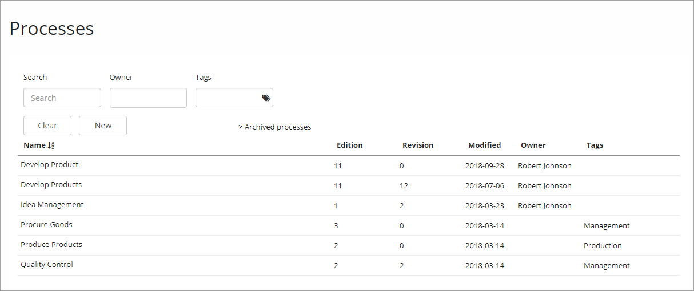

A published process is made available through a Process Viewer, see :doc:`Process Viewer </quality-management/end-user/process-viewer/index>`

Published processes can also be made available through a Process Directory, see :doc:`Process Directory </quality-management/end-user/process-directory/index>`

All processes
*************
The main list (see image above) displays a list of all processes in this process library. Click any process for details or to start editing the process.

You can click the headings "Name", "Edition", "Revision", "Modified" and "Owner" to switch between ascending and descending sort order.

Use the following options to filter the list and more:

+ **Search**: Filter the list by process names. All processes that contain the letters you have entered, somewhere in the process name, are shown.
+ **Owner**: Filter the list on an owners name.
+ **Tags**: Filter the list on one or more of the available tags.

Note that these filters are cumulative. An example: if you filter on a process name and a tag, a process must contain the letters in the name AND be tagged with the tag you have chosen, to be shown in the list.

+ **Clear**: Use this button the clear filters and show the full list.
+ **New**: Create a new process by using this button. See below for more information.
+ **Archived processes**: To see the list of archived processes, click this link. See below for more information.

Navigate between processes
*****************************
When you have selected a process you can go back to the main list by selecting "All processes" in the upper left corner and you can go to another process by selecting it in the list to the left. Here's an example:

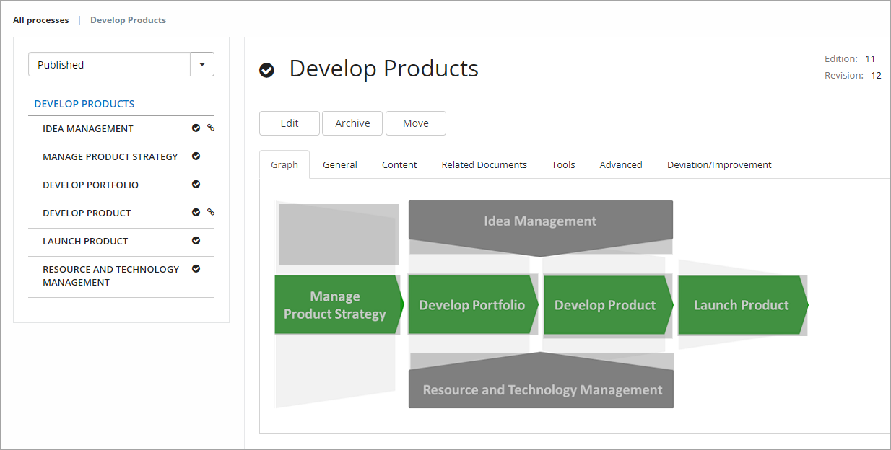

Create a new process
**********************
To create a new process:

1. Go to the Processes library and click "New".

The following is shown:

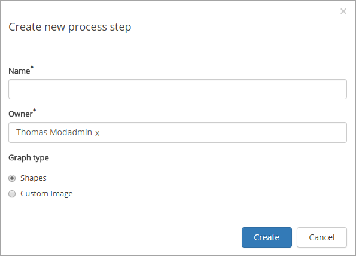

2. Enter a name for the process.
3. Add or delete owners if needed.
4. Choose if you are going to use the shapes from the Omnia QMS library or a custom image.

If you choose to use a custom image, browse for the image and select it using the Omnia Image Browser.

5. Click "Create".

Important note on custom images
-------------------------------
A custom process image with image maps will have a draft status and a published status. The images are stored in the local team site, not in a global image bank (but can be uploaded to the process from any source available).

When editing a process, a new image can be uploaded to replace the existing custom image. The image maps will remain in place, but can of course be edited.

When a custom image is replaced, you always need to  publish to make the changes visible for end users.

Archived processes
*******************
A process that no longer is used can be archived, so it's not shown in the main list. Use the "Archive" button when editing the process.

**Note!** An archived process can not be published. A published process is automatically unpublished when you select to archive the process.

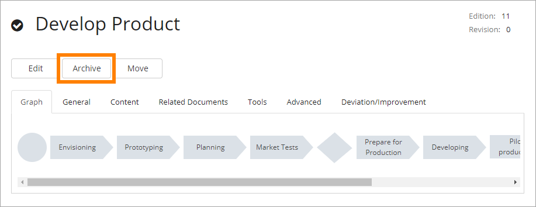

A list of archived processes can be reached by clicking the link "Archived processes" in the main list, see above.

Here's an example of a list of archived processes:

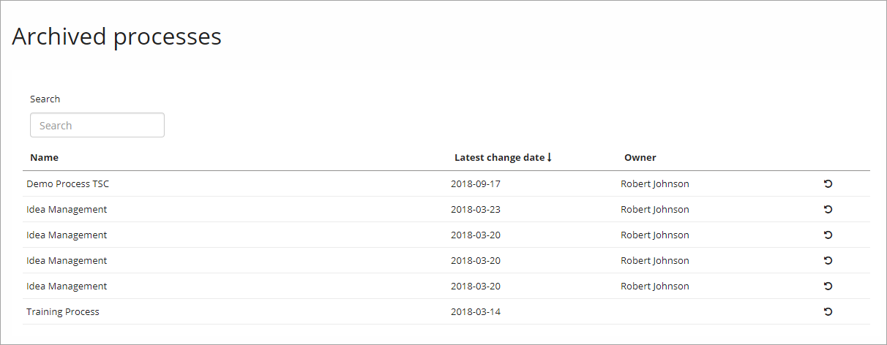

You can search the list and sort it by using the headings. A process can be restored by clicking the icon to the far right, and thus be available in the main list for editing and publishing.

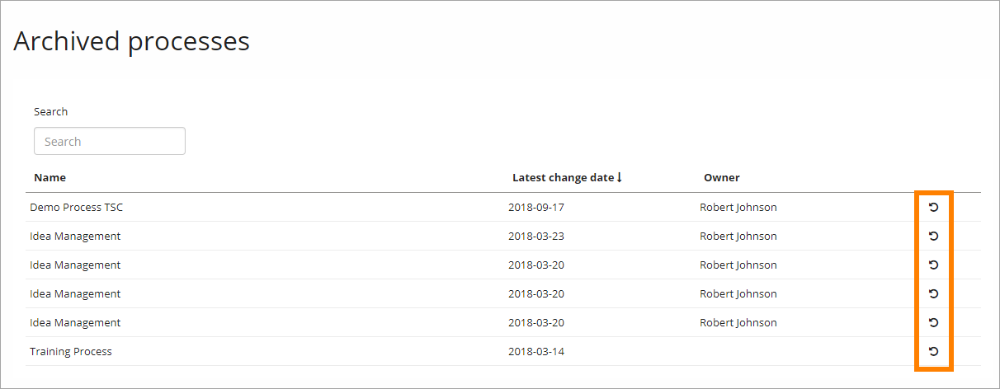

Edit a process
****************
You edit a newly created process and an existing one the same way. Note that access mode is read only until you click "Edit". You can browse just some of the tabs in read-only mode. 

1. Open the process from the list, if it's not already open.
2. Click "Edit".

.. image:: edit-process-1-newer.png

Edit access mode is activated and some more tabs are shown:

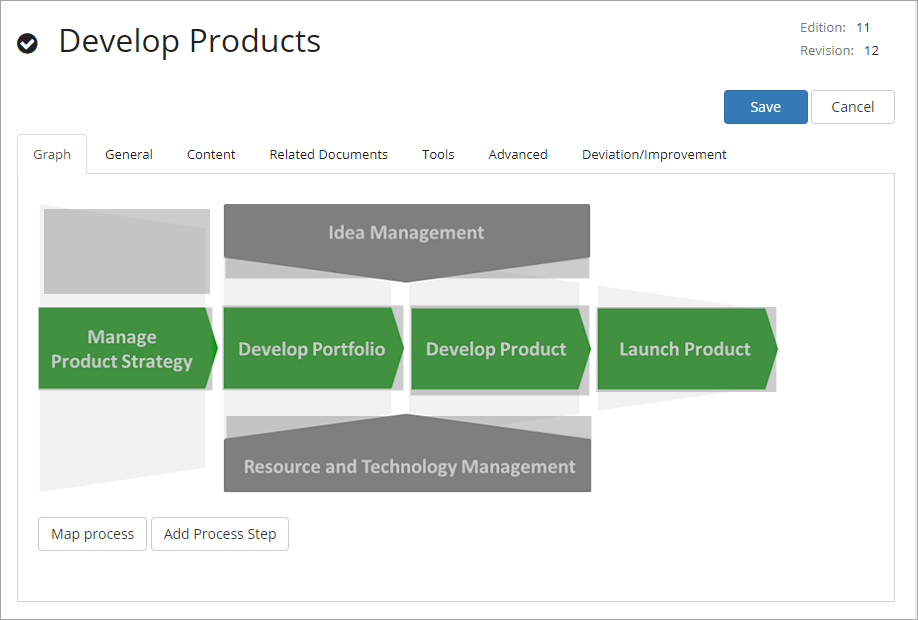

The Graph tab
--------------
Use this tab to work with the graphical presentation.

To add a new process step, do the following:

1. Click "Add process step"

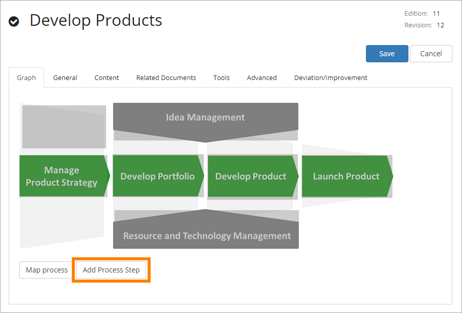

or "Add new process step" - the plus - in any step where you want to create a new step.

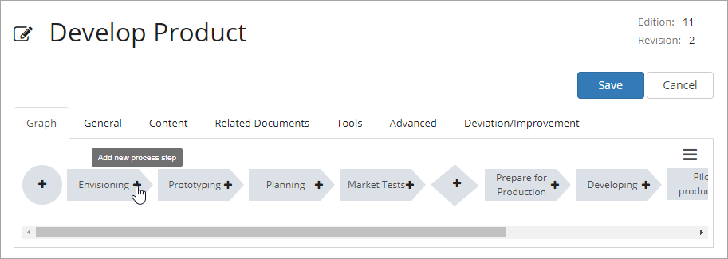

The following is shown (some options may not be shown, depending on where in the process you add something):

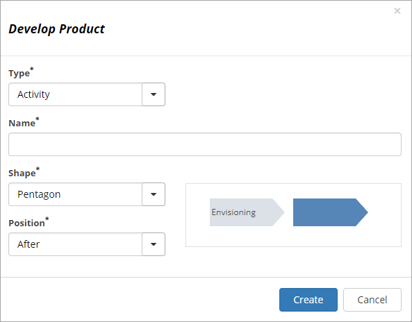

+ **Type**: It can be Sub Process, Activity or Linked Process. "Activity" is the end of the process or sub process, where you add actions. For an Activity you select which shape to use. When you select "Linked process" you add the link to that process.
+ **Name**: Enter a name for the step here.
+ **Shape**: Select shape for the process step here. For a "Sub Process" you can choose to use to use Shapes or a Custom image. A sub process can have other sub processes, activities or links to other processes.
+ **Position**: Select position for the new step, in relation to the step where you selected to create the new step - After, Before or Parallell.

You can reorder the process graph if needed. Select the menu to the right:

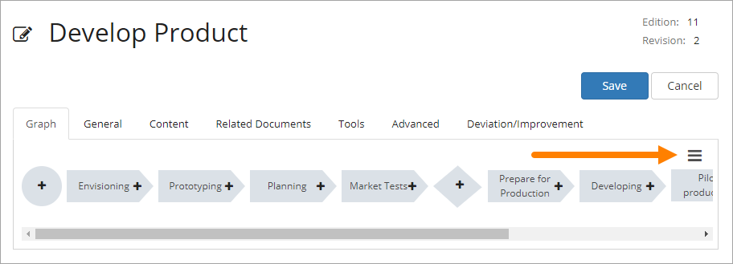

Choose what you want to do:

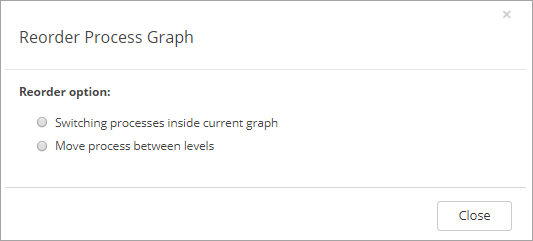

The General tab
------------------
On this tab you can set the following:

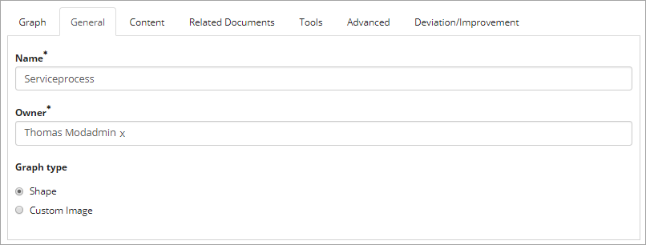

+ **Name**: Edit the Process Name here if needed.
+ **Owner**: Edit process owner(s) here if needed. Note that process owners is separate from site owners. 
+ **Graph type**: You can change from using Shapes to Custom image, or vice versa.

The Content tab
-----------------
Here you add/edit the description for the process. Note the format options. You can also insert images, links and tables.

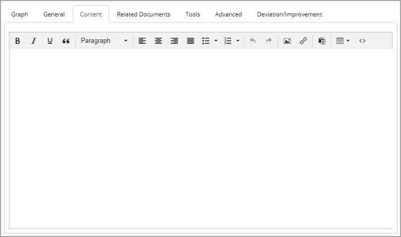

The Related Documents tab
--------------------------
If Omnia Document Managament is installed in the current tenant, editors of controlled documents can relate a published document to a process. It's then up to the Process Owner to decide to make the document available at the process in the Process viewer, or not. Another way of doing this is that Process Authors can relate published controlled documents to the process.

Any related document is listed on this tab. To relate a new document, click the button.

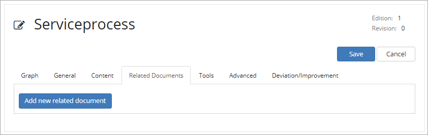

Use this dialog to find and select documents (note the "Add" button at the bottom, not shown in the image).

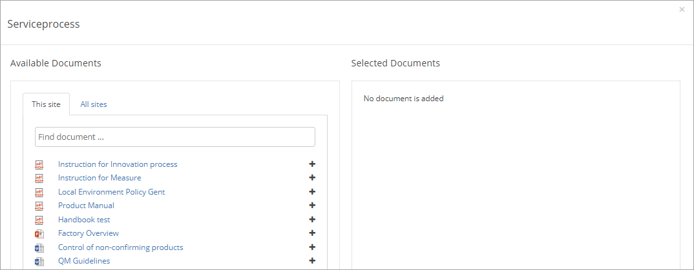

The Tools tab
-----------------
Use this tab to link to documents, pages and more. It's very similar to using the Links tab for a publishing page in Omnia.

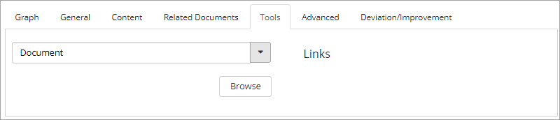

The Advanced tab
-------------------
On this tab you can set the following:

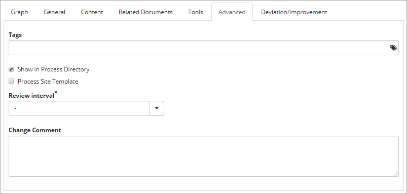

+ **Tags**: Add tags for the process. This is a metadata list. You can select tags from the list, you can not create new tags here. The tags are important for search. (Available tags are set up centrally, see :doc:`Setup Quality Management </quality-management/setup-quality-management/index>`.)
+ **Show in Process Directory**: Decide if the process could be shown in a possible Process Directory or not (Default: Show).
+ **Process Site Template**: You can create a "Process Site Template" from this process. You can then create a new team site based on this process. Documents you link to and actions you add here will then be set up in the team site created from this template process.
+ **Review interval**: Set Review interval. When a published process is nearing it's reviewal time, it will be part of the revewial list in Omnia Admin.
+ **Change comment**: Here you can add a comment about the latest changes for this process.

The Deviation/Improvement tab
------------------------------
If set up, users can send feedback to a process, via the link "Feedback" in the Process Viewer, and tag the posting as Improvement, Deviation or Risk. These feedback posts are shown and can be handled on this tab.

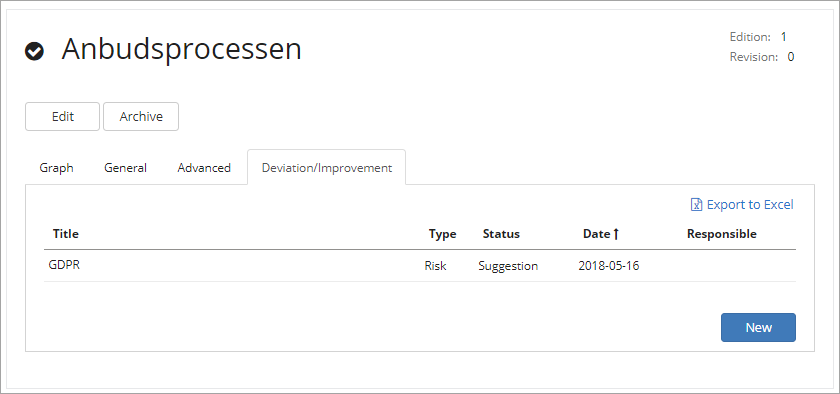

You can use the "New" button to add feedback here yourself.

More information is found here: :doc:`Deviations/Improvements </quality-management/author/deviations-improvements/index>`

Publish a process
******************
To publish the process, just click "Publish".

To be able to publish a process, you have to have the correct permission. If you don't have the permission, the Publish button is grey.

