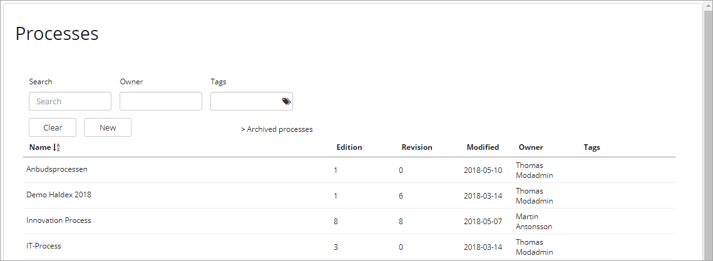
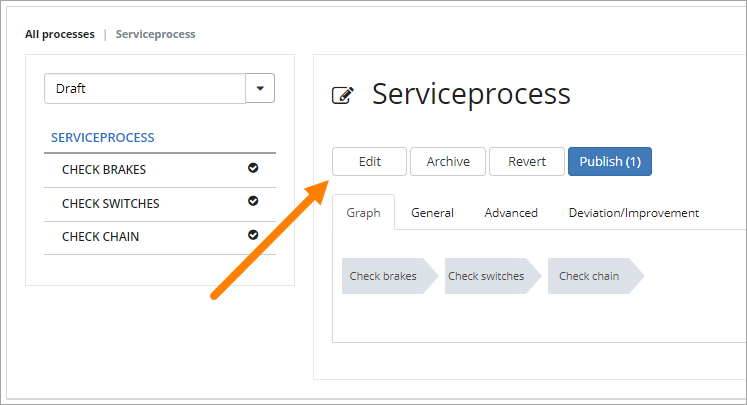
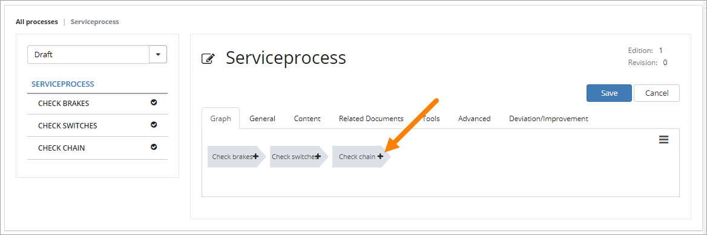
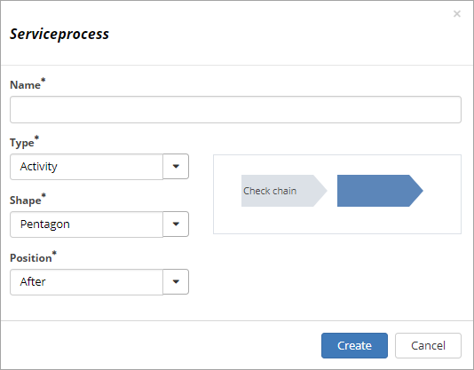
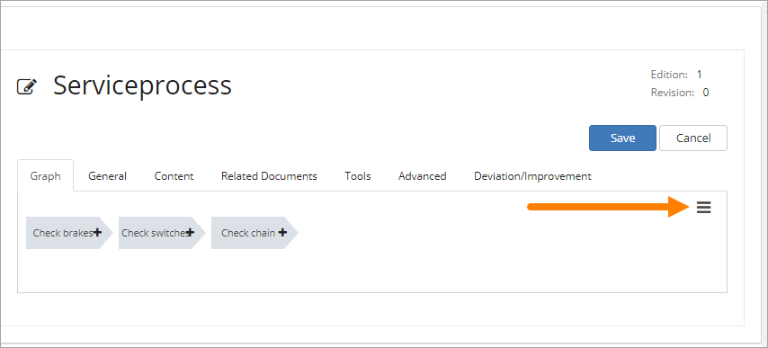

Process Library
===========================

The Process library is where members of the team site creates new processes and edit existing ones, and where processes are published so others can see them. 

Here is some short information on how to do that.

Create a new process
**********************
To create a new process:

1. Go to the Processes library and click "New".

The following is shown:

.. image:: create-new-process.png

2. Enter a name for the process.
3. Add or delete owners if needed.
4. Choose if you are going to use the shapes from the Omnia QMS library or a custom image.

If you choose to use a custom image, browse for the image and select it using the Omnia Image Browser.

5. Click Create.

Important note on custom images
-------------------------------
A custom process image with image maps will have a draft and published status. The images are stored in the local team site, not in a global image bank (but can be uploaded to the process from any source available).

When editing a process, a new image can be uploaded to replace the existing custom image. The image maps will remain in place (but can of course be edited).

When a custom image is replaced, you always need to  publish for end users to see the changes.

Edit a process
****************
You edit a newly created process and an existing one the same way. Note that access mode is read only until you click "Edit". You can browse just some of the tabs i read-only mode. 

1. Open the process from the list, if it's not already open.
2. Click "Edit".

Edit access mode is activated and some more tabs are shown:

.. image:: dit-mode.png

The Graph tab
--------------
Use this tab to work with the graphical presentation.

To add a new process step, do the following:

1. Click "Add new process step" - the plus in any step where you want to create a new step.

The following is shown:

+ **Name**: Enter a name for the step here.
+ **Type**: It can be Sub Process, Activity or Linked Process. "Activity" is the end of the pocess or sub process, where you add actions. For an Activity you select which shape to use. When you select "Linked process" you add the link to that process.
+ **Shape**: Select shape for the process step here. For a "Sub Process" you can choose to use to use Shapes or a Custom image. A sub process can have other sub processes, activities or links to other processes.
+ **Position**: Select position for the new step, in relation to the step where you selected to create the new step - After, Before or Parallell.

You can reorder the process graph if needed. Select the menu to the right:

Choose what you want to do:

.. image:: reorder-options.png

The General tab
------------------
On this tab you can set the following:

.. image:: general-tab.png

+ **Name**: Edit the Process Name here if needed.
+ **Owner**: Edit process name and process owner(s) here if needede. Note that process owners is separate from site owners. 
+ **Graph type**: You can change from using Shapes to Custom image, or vice versa.

The Content tab
-----------------
Here you add/edit the description for the process. Note the format options. You can also insert images, links and tables.

.. image:: content-tab.png

The Related Documents tab
--------------------------
If Omnia Document Managament is installed in the current tenant, editors of controlled documents can relate a published document to a process. It's then up to the Process Owner to decide to make the document available at the process in the Process viewer, or not. Another way of doing this is that Process Editors can relate published controlled documents to the process.

Any related document is listed on this tab. To relate a new document, click the button.

.. image:: related-documents.png

Use this dialog to find and select documents (note the "Add" button at the bottom, not shown in the image).

.. image:: relate-documents.png

The Tools tab
-----------------
Use this tab to link to documents, pages and more. It's very similar to using the Links tab for a publishing page.

.. image:: tools-tab.png

The Advanced tab
-------------------
On this tab you can set the following:

.. image:: advanced-tab-new2.png

+ **Tags**: Add tags for the process. This is a metadata list. You can select tags from the list, you can not create new tags here. The tags is important for search. 
+ **Show in Process Directory**: Decide if the process could be shown in a possible Process Directory or not (Default: Show).
+ **Process Site Template**: You can create a "Process Site Template" from this process. You can then create a new team site based on this process. Docmuments you link to and actions you add here will then be set up in the team site created from this template process.
+ **Review interval**: Set "Review interval". When a published process is nearing it's reviewal time, it will be part of the revewial list in Omnia Admin.
+ **Change comment**: Here you can add a comment about the latest changes for this process.

The Deviation/Improvement tab
------------------------------
Users can add feedback to processes, via the Process Viewer, and tag them as Improvement, Deviation or Risk. These feedback posts are shown and can be handled on this tab.

.. image:: deviation-tab.png

You can use the "New" button to add feedback here yourself.

Publish a process
******************
To publish the process, just click "Publish".

To be able to publish a process, you have to have the correct permission. If you don't have the permission, the Publish button is grey.

