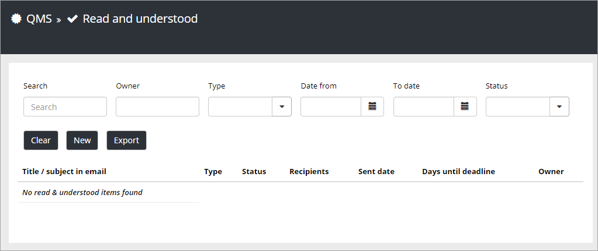
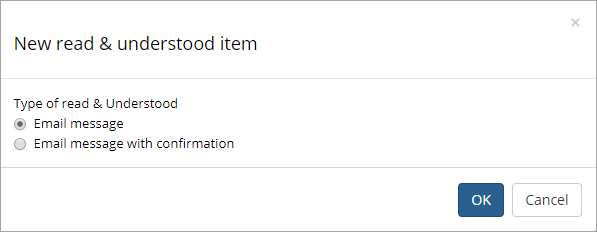
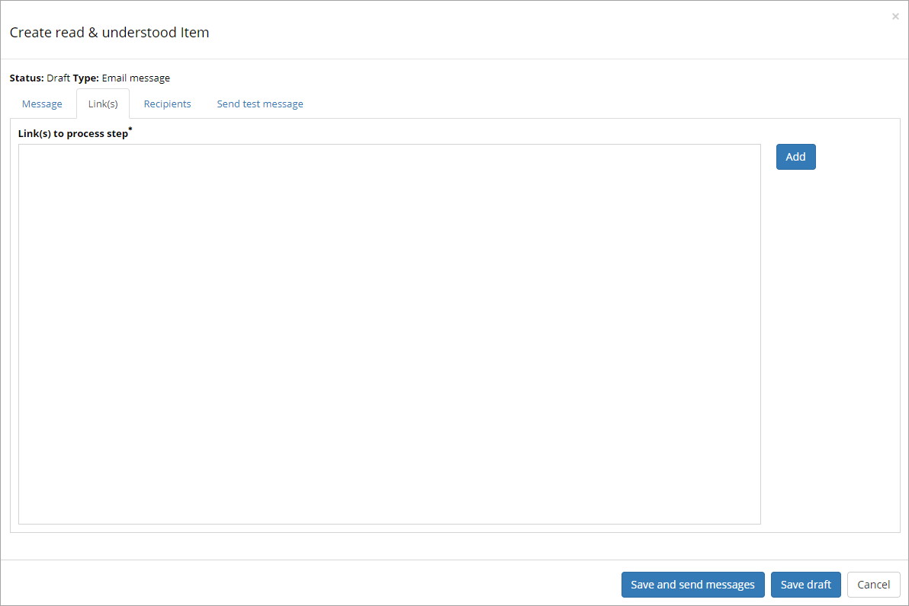
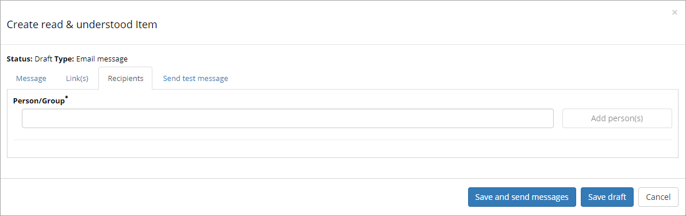
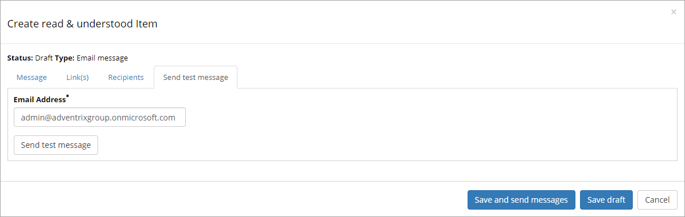

Read & Understood
===========================

Use this option in Omnia Adm to send messages to managers or others to make sure they are aware of changes or additons in a process.

**Note!** The scope for this option is Site Collection so each team site has it's own list.

All Read & Understood items (if any) for the current team site, will be shown in the list.

When sending a new message, first choose a one way Email message, or an Email message with confirmation.

For the message, use the following tabs:

The Message tab
***************
Use this tab to type a title and the message text for the e-mail:

.. image:: read-message-tab.png

The name in the field "Owner" will bo noted in the e-mail. Names can be deleted and added in this field, if needed.

The Link(s) tab
****************
Use this tab to add links to process steps that has been changed or added.

The Recipients tab
******************
All recipients of the e-mail should be added to this tab. Recipients can be both persons and groups.

The Send test message tab
**************************
To make sure tha added e-mailaddresses are still valid, use this tab to send a test message. If any address is no longer valid, you will see a message here.

