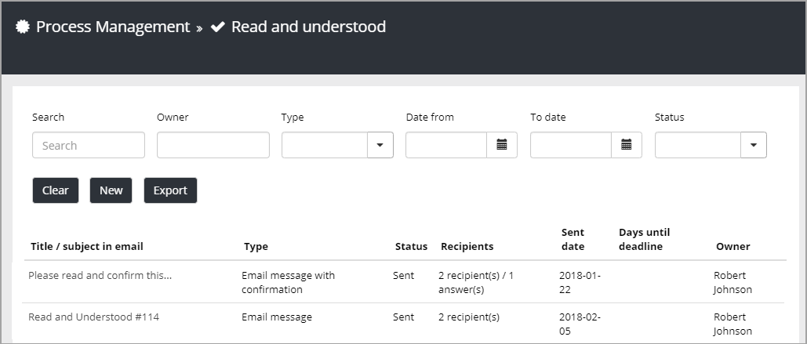
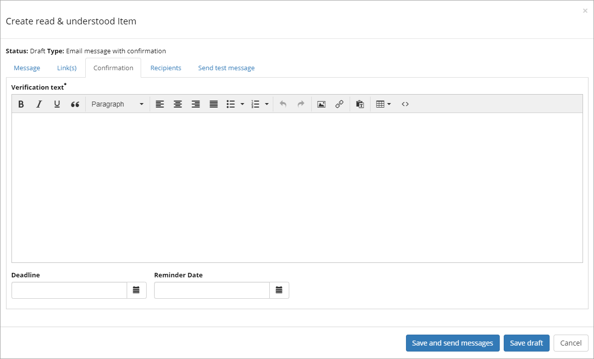

Read & Understood
===========================

Use this option in Omnia Admin to send messages to managers or others to make sure they are aware of changes or additions in a process.

**Note!** The scope for this option is Site Collection so each team site has it's own list.

1. Select "Process Management" under "Site Collection".

.. image:: read-understood-png

2. Then select "Read and understood".

All Read & Understood items (if any) for the current team site, will be shown in the list.

When sending a new message, first choose a one way Email message, or an Email message with confirmation.

.. image:: read-and-understood-new.png

For the message, use the following tabs:

The Message tab
***************
Use this tab to type a title and the message text for the e-mail:

.. image:: read-message-tab.png

The name in the field "Owner" will be noted in the e-mail. Names can be deleted and added in this field, if needed.

The Link(s) tab
****************
Use this tab to add links to process steps that has been changed or added.

.. image:: read-links-tab-borders.png

Confirmation
*************
If "Email message with conformation is selected, this tab is shown.

+ **Verification text**: You must enter a text here to be able to send the message.
+ **Deadline**: You can add a deadline for reading the message.
+ **Reminder**: You can set a date for a reminder to be sent if the recipient hasn't read the message yet.

The Recipients tab
******************
All recipients of the e-mail should be added to this tab. Recipients can be both persons and groups.

.. image:: read-recipients-tab.png

The Send test message tab
**************************
To make sure that added e-mail addresses are still valid, use this tab to send a test message. If any address is no longer valid, you will see a notification here.

.. image:: read-test-message.png

