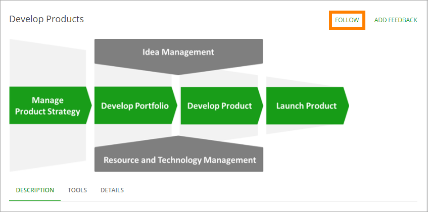

My Processes
===========================

Users can follow (and unfollow) processes using this control. 

A "My processes" control can be added to any Quick Page as a block, to show the list of the processes the logged in user follows. 

Here's an example of a My processes list, from a users point of view:

.. image:: my-processes.png

The user can click a link to go to the process.

There are no settings for the control.
