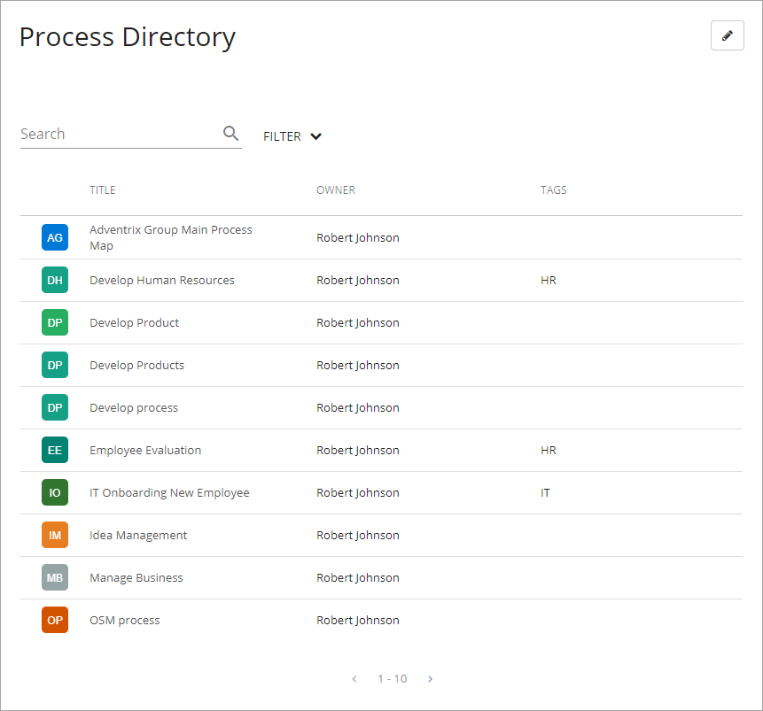
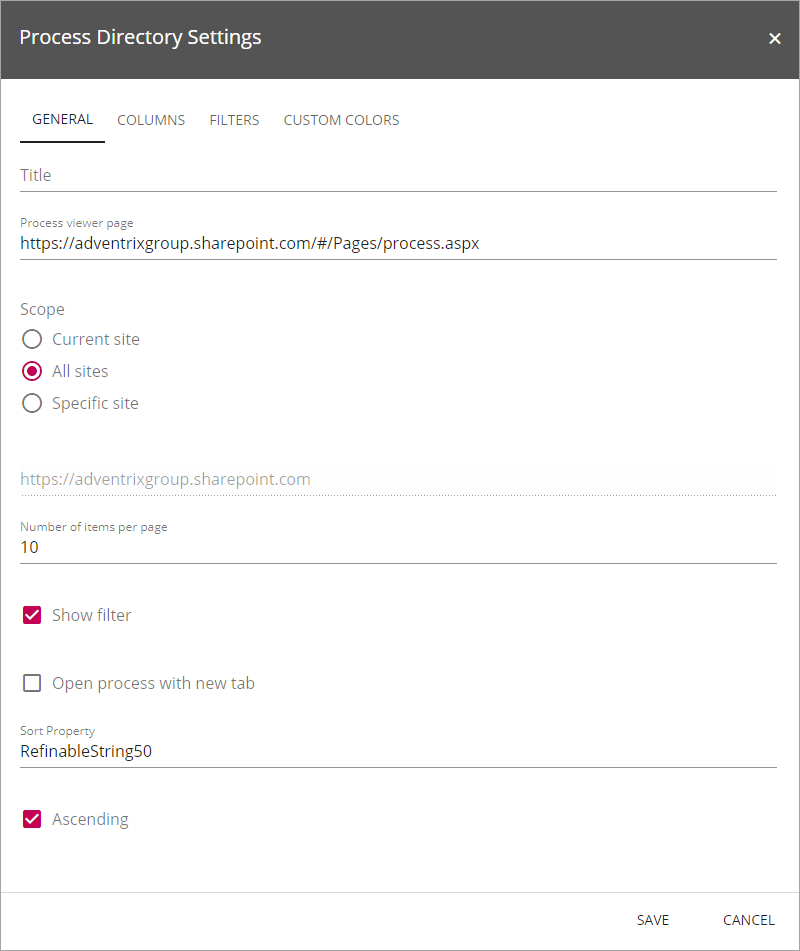
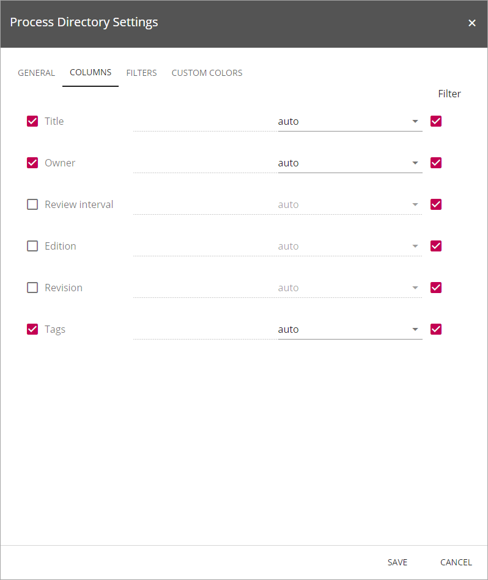
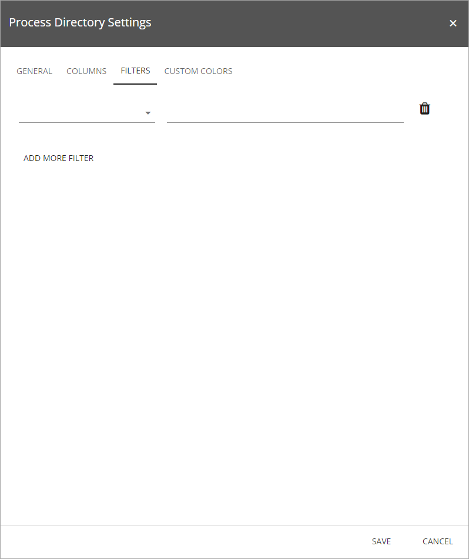
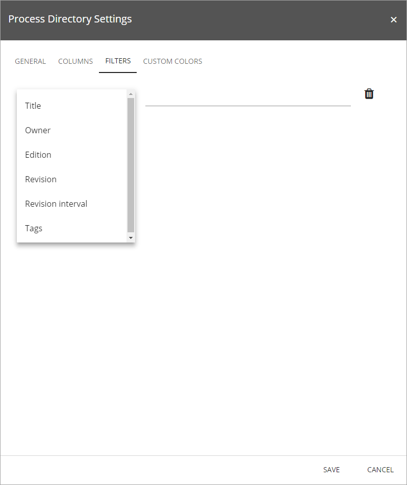
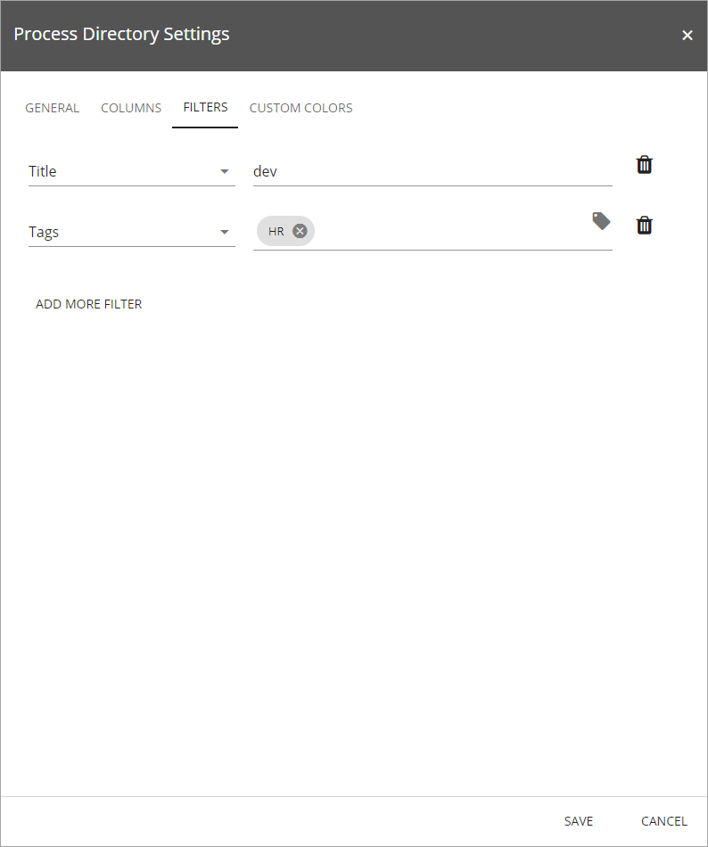
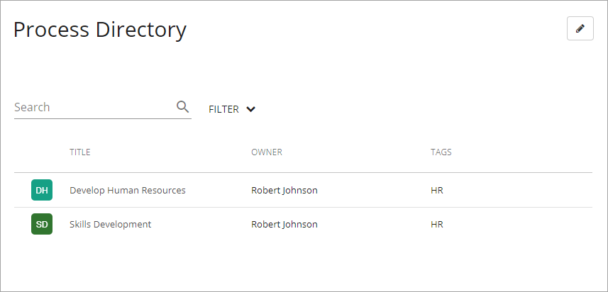
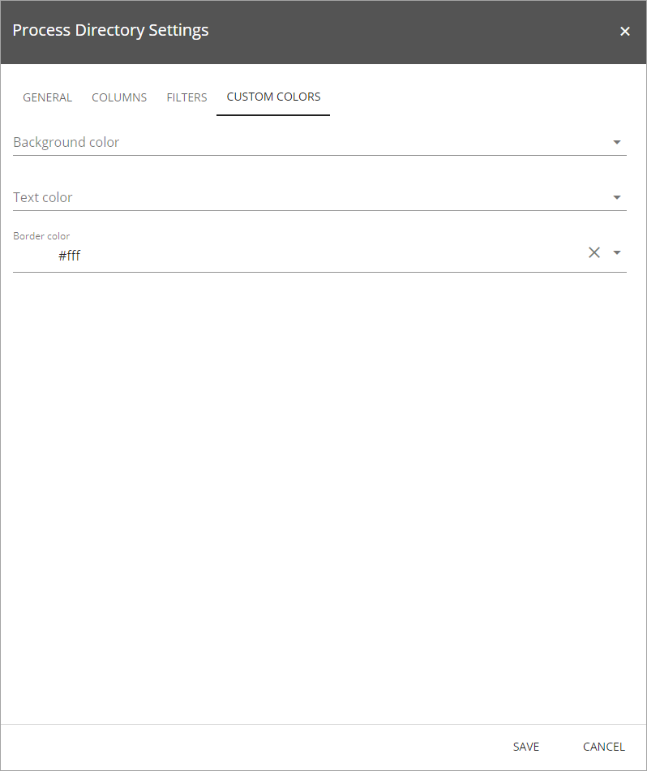

Process Directory
===========================

The Process Directory control is available as a web part for legacy pages and as a block for Quick Pages.

Here's how a Process Directory block can look for end users:

**Note!** The control is best suited to the main part of the page. It will need space.

Settings for the control
**************************
The settings are organized in fours tabs, see the sections below.

The General tab
-------------------
On this tab the following settings are available:

+ **Title**: Set the title for the list, that will be displayed for users.
+ **Process viewer page**: The address to the actual page that was set up for the Process viewer is added to this field.
+ **Scope**: The most common setting for the scope is "All sites". If "Current site" is selected, all processes (and only these) that exists in the current site will be available in the list.
+ **Number of items per page**: Set the number of items to be displayed on each "page" in the list.
+ **Show filter**: Set if users should be able to filter the list. 
+ **Open process with new tab**: Set what will happen when a user clicks a process link in the list - open in new tab or new page.
+ **Sort Property**: This field needs to contain a sort property, see example in the above image.
+ **Ascending**: Keep this selected for ascending sorting. Deselect for descending sorting.

The Columns tab
------------------
Use this tab to decide which columns to display for the list.

You can set the column order and set an exact width for the column (default: Auto). You can also turn the filter option on or off for each column, meaning if the column should be used for filtering or not.

The Filters tab
------------------
This tab is used to set filter options if just some of the available processes should be displayed in this list.

1. Open the list to select type of filter.

2. The next step is to add details for the filter:

+ **Title**: Type part of titles to filter on. Example: "dev" would show any process that has these letters in the title, for example Develop and development.
+ **Owner**: Type a full name or part of a name.
+ **Edition**: Select an edition number.
+ **Revision**: Select a revision number.
+ **Revision interval**: Select a number for the interval on which to filter.
+ **Tags**: Select one or more of the available tags. (Available tags are set up centrally, see :doc:`Setup Quality Management </quality-management/setup/index>`.)

3. Click "Add more filter" to add more filter rows and.

To remove a filter row, click the dust bin.

Filtering is cumulative. An example: With this list (not filtered):

If the following filters are added:

The result could be this list:

To be shown in this filtered list, a process must contain dev or Dev in the title, AND be tagged with HR.

The Custom Colors tab
-----------------------
You should primarily set colors through Theme colors in Omnia Admin (System/Settings/Default colors). If you still would like custom colors for the control, you can set them using this tab.

