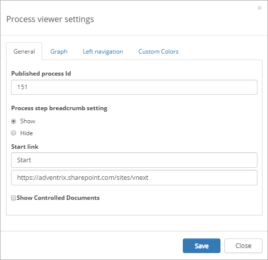
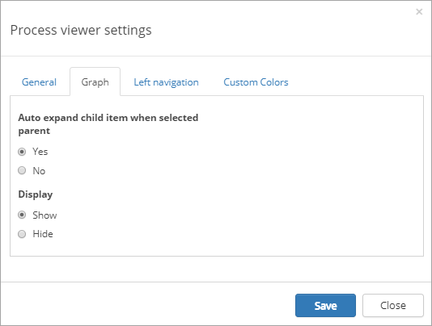
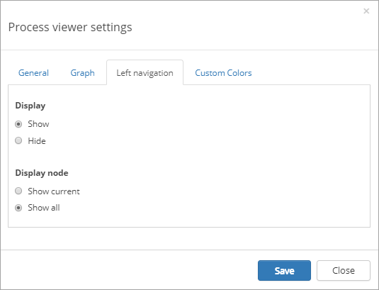
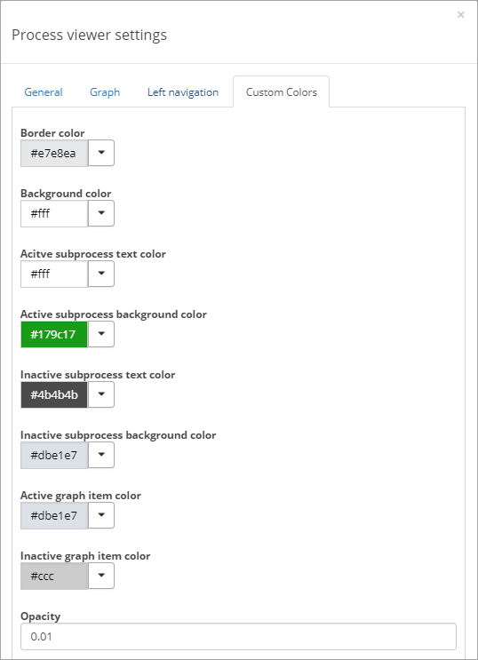

Process Viewer
===========================

The Process viewer control is available as a web part for legacy pages and as a block for Quick Pages.

This control is used to display the process for end users, where they can navigate, read the description, linked documents and more. 

Here's an example:

.. image:: process-viewer-new.png

**Note!** This control is best suited to the main part of the page. It will need space.

The end users experience
*************************
The following options are normally available:

+ **Follow**: If this option is available, users can follow a process. For more information about this, see:
:doc:`My Processes </quality-management/end-user/my-processes/index>`

+ **Add feedback**: If this option is available, a user can send feedback about the process, see:
:doc:`Deviations/Improvements </quality-management/author/deviations-improvements/index>`

+ **Navigation**: If a graph is available users can normally click parts of the graph to go to a sub processes. If process images are shown, they can be used the same way (see below). Normally a navigation is also shown to the left of the graph, for example:

.. image:: navigation-example.png

+ **Description**: A description of the process, or sub process, is shown on this tab. This tab is normally active when the page is first shown.

(More will be added here very soon.)

Document templates for users
****************************
The process can be set up so that users can just not read documents, but also create documents from one or more templates. If creating a document is possible, the "Create Document" link will be shown. Here's an example:

.. image:: create-document-link.png

The Create Document Wizard will be used in such a case, for example:

.. image:: create-new-document-example.png

More information about the Create Document Wizard is found here: :doc:`Create Document Wizard </document-management/end-user/create-document-wizard/index>`

Settings for the control
*************************
The settings are organized in four tabs, see the sections below.

The General tab
-------------------
On this tab the following settings are available:

+ **Published process id**: Enter the process id for the process to be displayed. This id will be found in the authoring site.
+ **Process step breadcrumb setting**: Decide to show the process steps in the breadcrumb or not. (Default=Show.)
+ **Start link**: (a description will be added soon.)
+ **Show Controlled Documents**: (a description will be added soon.)

The Graph tab
-----------------
Here you can set the following:

+ **Auto expand child item when selected parent**: (a description will be added soon.)
+ **Display**: (a description will be added soon.)

The Left navigation tab
------------------------
Use this tab to set if left navigation should be available (Default: Show), and if all nodes or just the current should be shown (Default: Current).

The Custom Colors tab
-----------------------
You should primarily set colors through Theme colors in Omnia Admin (System/Settings/Default colors). If you still would like custom colors for the control, you can set them using this tab.

(Not all options are shown in the image.)
