Process Viewer
===========================

The Process viewer control is available as a web part for legacy pages and as a block for Quick Pages.

This control is used to display the process for end users, where they can navigate, read the description, linked documents and more. 

Here's an example:

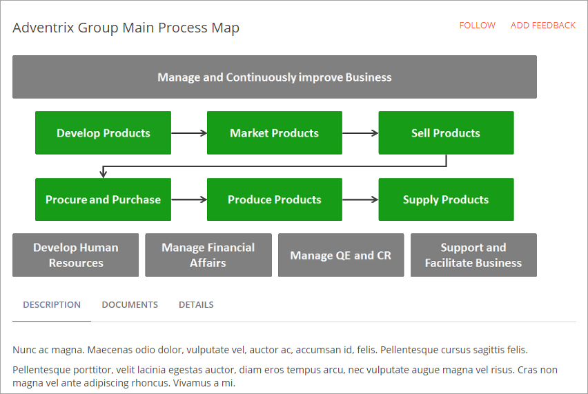

**Note!** This control is best suited to the main part of the page. It will need space.

The end users experience
*************************
The following options are normally available:

+ **Follow**: If this option is available, users can follow a process. For more information about this, see: :doc:`My Processes </quality-management/end-user/my-processes/index>`

+ **Add feedback**: If this option is available, a user can send feedback about the process, see: :doc:`Deviations/Improvements </quality-management/author/deviations-improvements/index>`

+ **Navigation**: If a graph is available users can normally click parts of the graph to go to a sub processes. If process images are shown, they can be used the same way (see below). Normally a navigation is also shown to the left of the graph, for example:

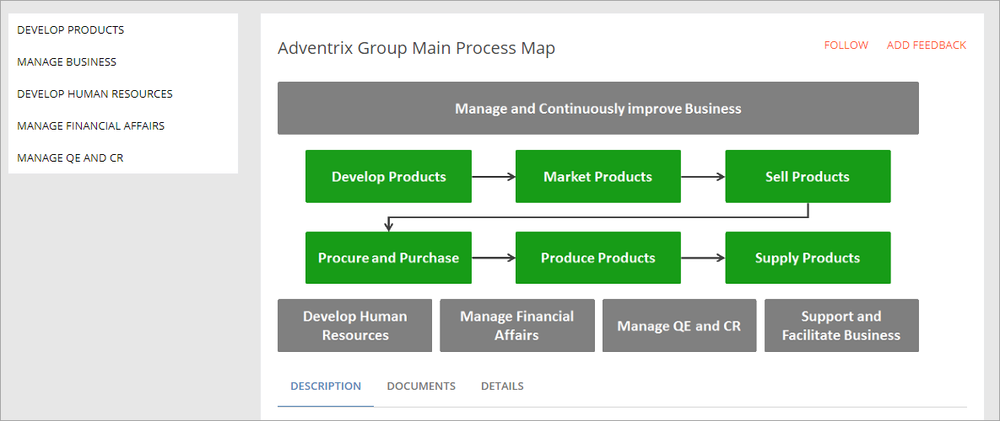

+ **Description**: A description of the process, or sub process, is shown on this tab. This tab is normally active when the page is first shown.

+ **Documents**: If integrated with Omnia Document Management, a "Documents" tab will be shown. Controlled Documents published to a process will then be listed where appropriate, so that users can read these documents. 

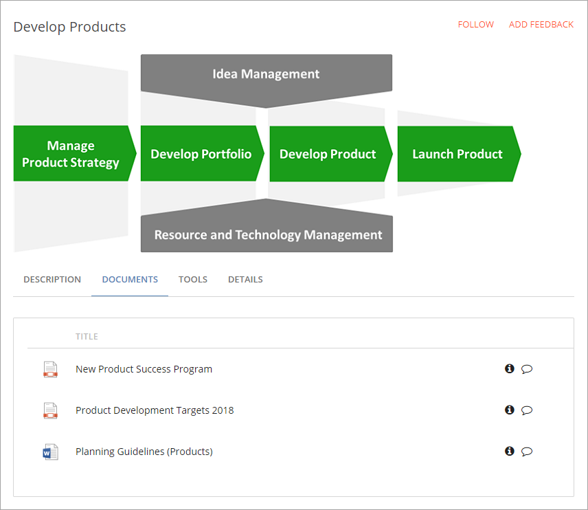

Furthermore, the process can be set up so that users can just not read documents, but also create documents from one or more templates. If creating a document is possible, the "Create Document" link will be shown. Here's an example with both documents and a template:

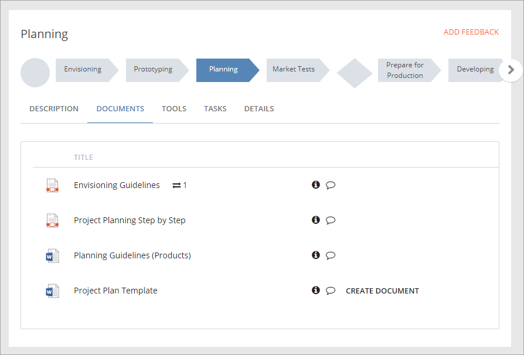

When a user creates a document from the template (clicks the link by the template), the Create Document Wizard will be used, for example:

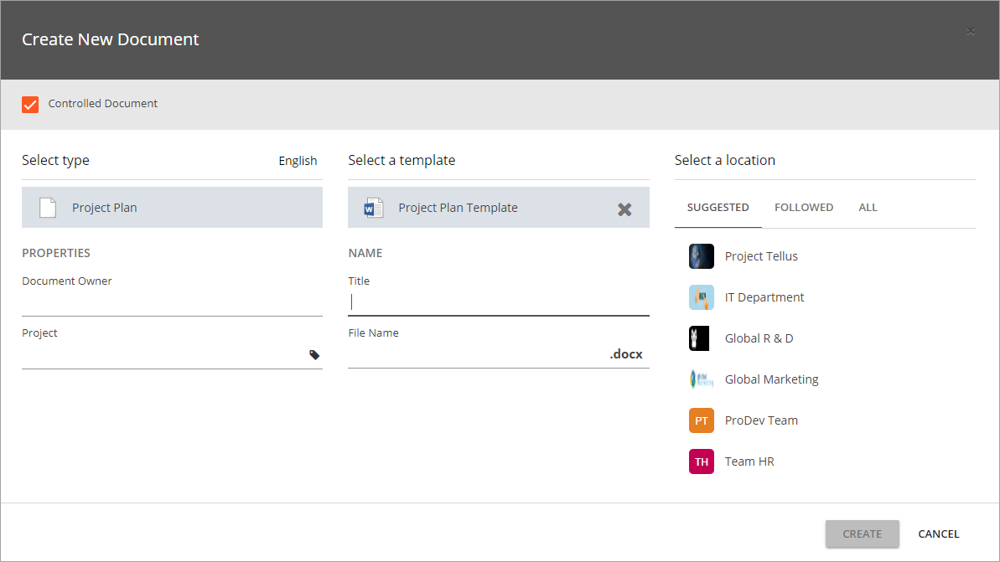

More information about the Create Document Wizard is found here: :doc:`Create Document Wizard </document-management/end-user/create-document-wizard/index>`

+ **Tools**: Process authors can publish tools to be used by users. It can for example be useful links or documents. Documents available under this tab can not be controlled documents, but it can be useful to make documents available on this tab if, for example, Omina QMS is not integrated with Omnia Document Management. Here's an example of links available on the "Tools" tab:

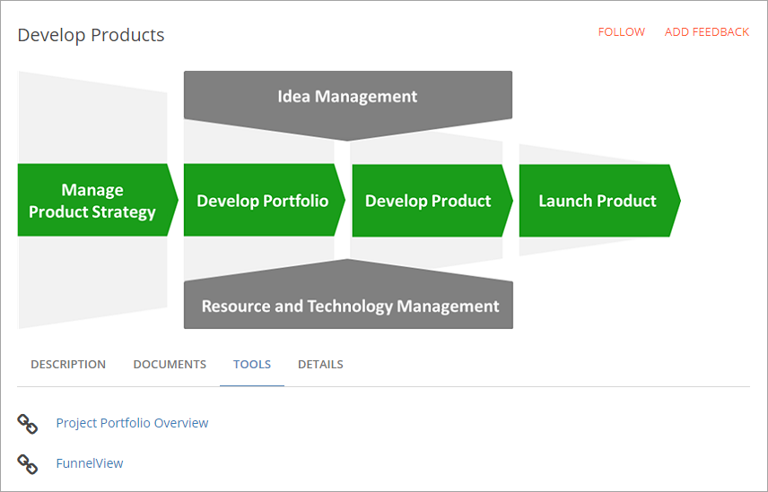

+ **Details**: On the "Details" tab more information about the process is shown, for example owner, edition, revision, and when the process weas last edited. Here's an example:

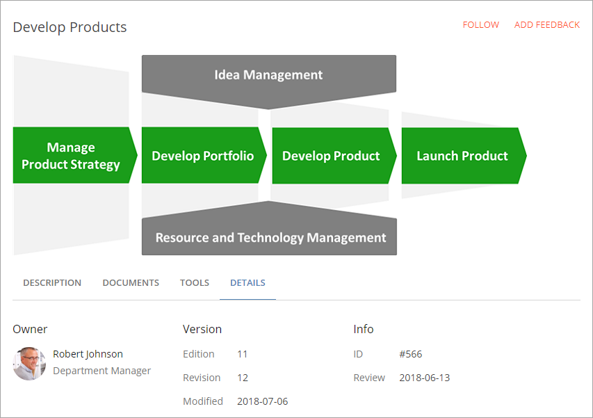

+ **Tasks**: A process author can also add a list of tasks that should be completed for a process step. If any tasks are added, a "Tasks" tab will be visible here, and the tasks list shown as a check list, for example:

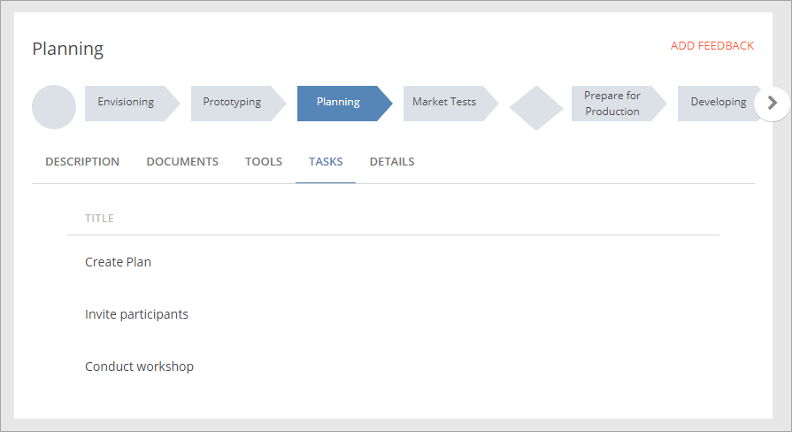

Actual work with tasks is done in the team site.

This image is also a good example of when a process author has added images to illustrate the process steps necessary. Users can click the images to get information about each step and, depending on what is available, tabs, as described above, can be shown.

Settings for the control
*************************
The settings are organized in five tabs, see the sections below.

The General tab
-------------------
On this tab the following settings are available:

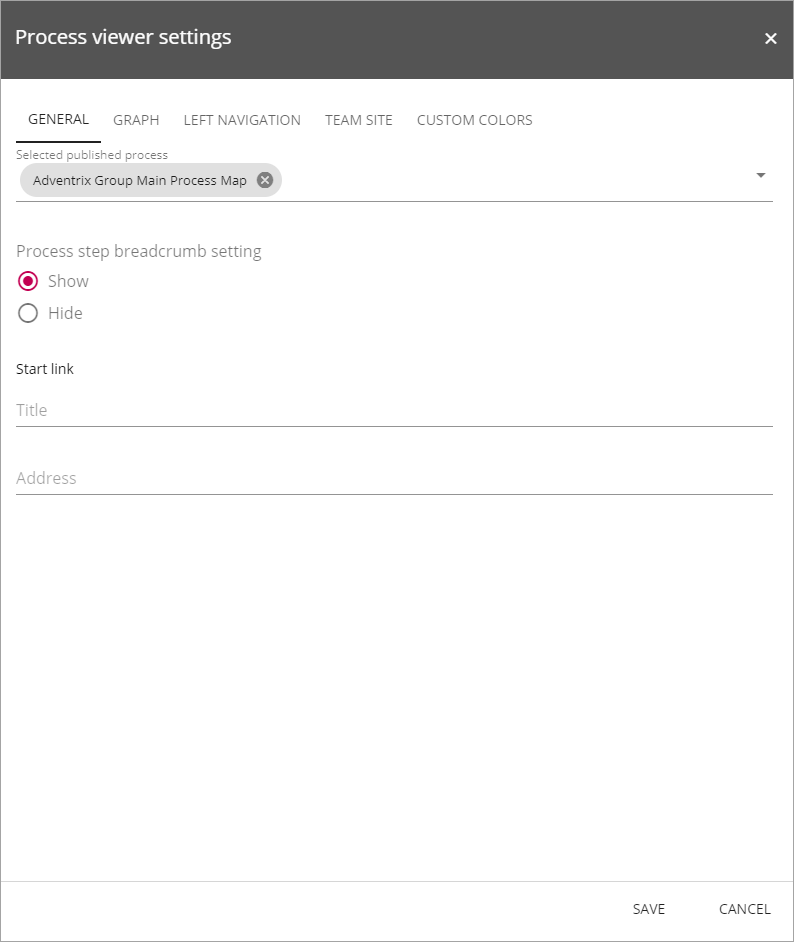

+ **Selected published process**: Add the name for the process to be shown here (As the heading says, the process must be published). When you start typing, the processes that corresponds with what you have typed so far is shown in a list. You can then select from the list or continue typing.
+ **Process step breadcrumb setting**: Decide to show the process steps in the breadcrumb or not. (Default=Show.)
+ **Start link**: You can use this to set the start link for the breadcrumb. If not used, the breadcrumb will work according to the Omnia Intranet settings.

The Graph tab
-----------------
Here you can set the following:

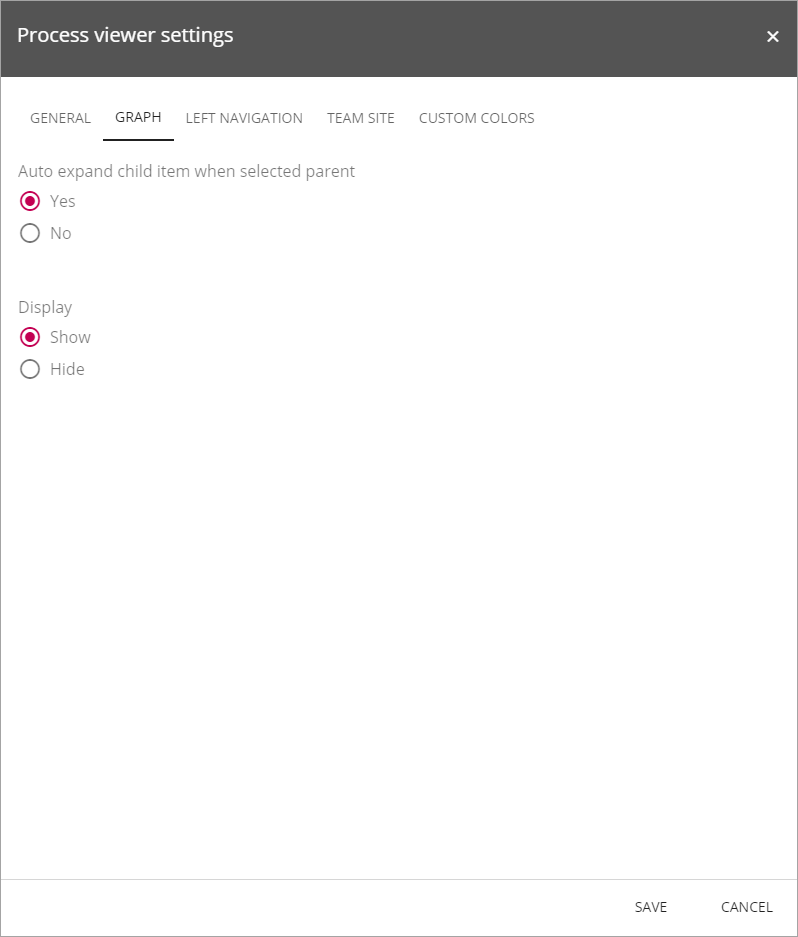

+ **Auto expand child item when selected parent**: This is an older setting, kept for compatibilty reasons. Not used in later installments.
+ **Display**: If no graphs should be shown for this process, select this box.

The Left navigation tab
------------------------
Use this tab to set if left navigation should be available (Default: Show), and if all nodes or just the current should be shown (Default: Current).

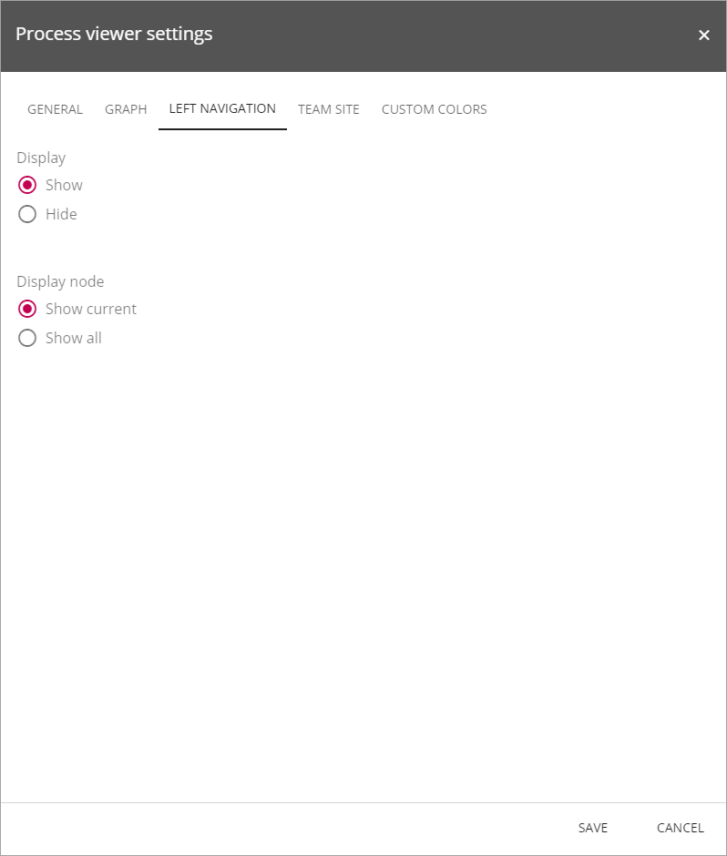

Team Site
----------
Use this tab to select if task planning should be enabled. This is valid when a Process Viewer is set up in a team site. If there are more than one Tasks lists in the site, select which Tasks list to use for task planning.

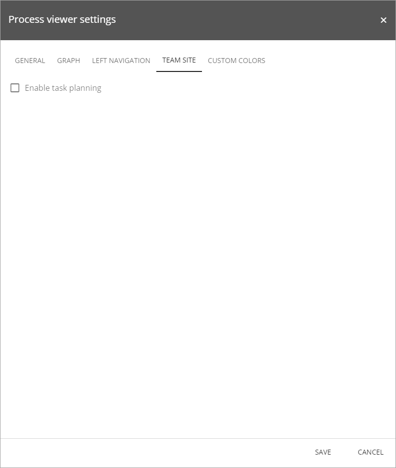

The Custom Colors tab
-----------------------
You should primarily set colors through Theme colors in Omnia Admin (System/Settings/Default colors). If you still would like custom colors for the control, you can set them using this tab.

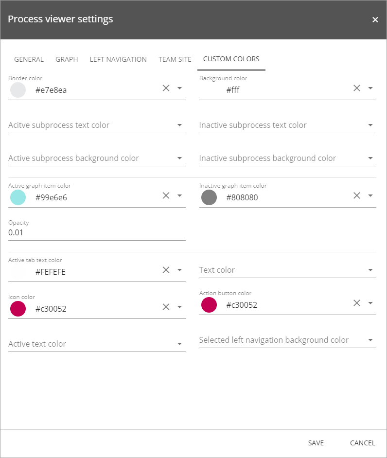

