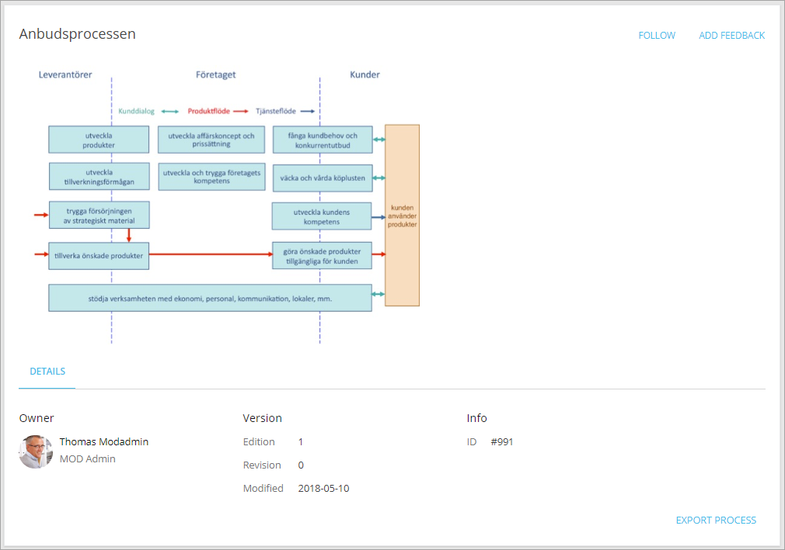

Process Viewer
===========================

The Process viewer control is available as a web part for legacy pages and as a block for Quick Pages.

This control is used to display the process for end users, where they can navigate, read the description, linked documents and more. 

Here's an example:

**Note!** This control is best suited to the main part of the page. It will need space.

Settings for the control
*************************
The settings are organized in four tabs, see the sections below.

.. image:: process-viewer-settings-general.png

The General tab
-------------------
On this tab the following settings are available:

+ **Published process id**: Enter the process id for the process to be displayed. This id will be found in the authoring site.
+ **Process step breadcrumb setting**: Decide to show the process steps in the breadcrumb or not. (Default=Show.)
+ **Start link**: (a description will be added soon.)
+ **Show Controlled Documents**: (a description will be added soon.)

The Graph tab
-----------------
Here you can set the following:

.. image:: process-viewer-graph.png

+ **Auto expand child item when selected parent**: (a description will be added soon.)
+ **Display**: (a description will be added soon.)

The Left navigation tab
------------------------
Use this tab to set if left navigation should be available (Default: Show), and if all nodes or just the current should be shown (Default: Current).

.. image:: qms-viewer-left-navigation.png

The Custom Colors tab
-----------------------
You should primarily set colors through Theme colors in Omnia Admin (System/Settings/Default colors). If you still would like custom colors for the control, you can set them using this tab.

.. image:: process-viewer-colors.png

(Not all options are shown in the image.)
