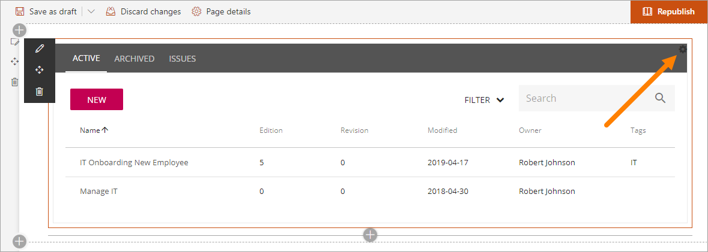
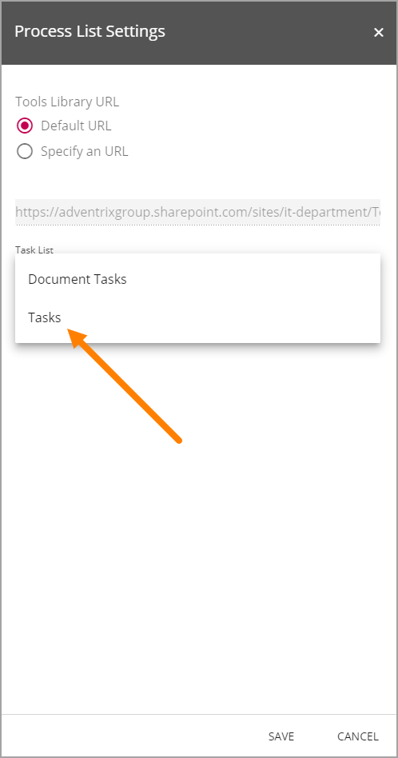

Setup Process Authoring Site
===================================

1. Create a new Team Site.
#. Go to Omnia Admin > Features.
#. Activate the site collection scoped feature “Omnia QMS Process Authoring Infrastructure”.
#. Activate the site scoped feature “Omnia QMS Process Authoring Site”.

Associate a SharePoint Task list with a Process library
--------------------------------------------------------
It is possible to associate a SharePoint Task list with the Process library (in the Process Authoring Site). If a Task list is associated, actions in issues will become SharePoint tasks.
 
1. Go to the Process Library.
2. Click "Edit".
3. Click the settings icon.

4. Select "Tasks" for "Task List".

5. Save.

