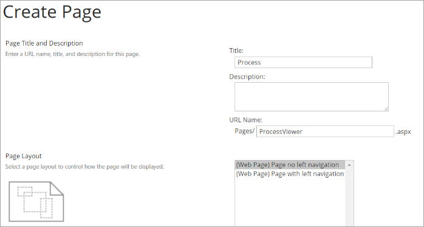
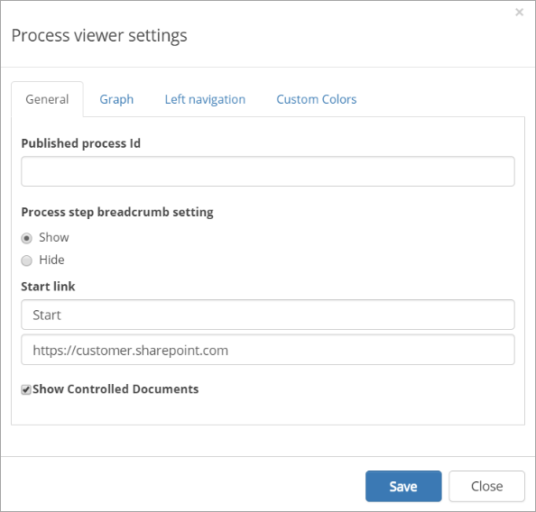

Setup Process Viewer
======================

To setup a Process Viewer, do the following:

1. Go to the start page of the main publishing site. 
2. Go to Site Contents > Pages. 
3. Create a new Web Page.  

4. Publish the page. 
5. Go to the page using its quick page url. Example: https://customer.sharepoint.com/#/Pages/ProcessViewer.aspx.  
6. Go into edit mode using the Edit Switch and add a Process Viewer to the page configured accordingly. 

 
7. Open Manage Content and create a new page in the content structure called Process Directory. 
 
 .. image:: process-directory-settings.png

 .. image:: process-directory-settings-2.png