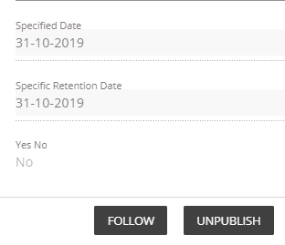
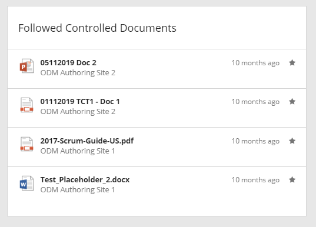
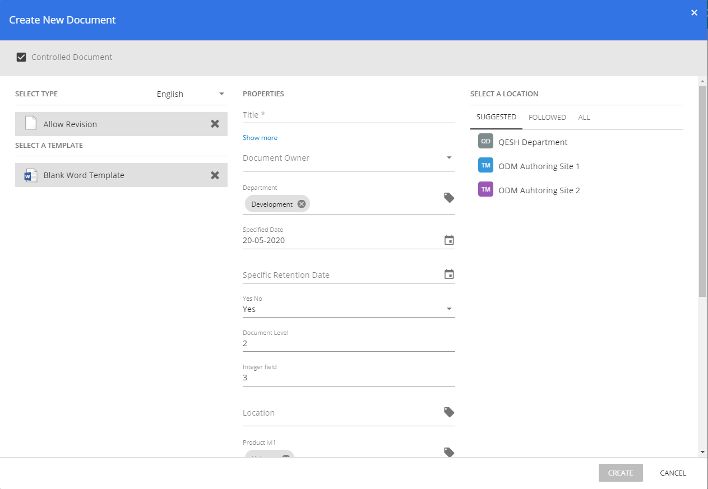
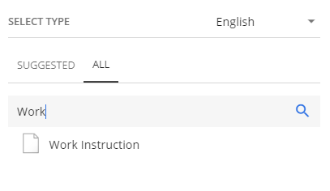
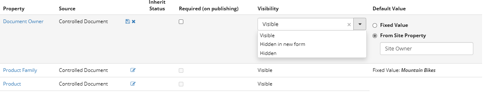

Release Notes 1.29.0
========================================

New Features
---------------------------------

Subscribe to published Controlled Documents
************************************************
(#115730)

It is now possible to set subscribe to a specific published controlled document. Click the Follow/Unfollow button in the information panel of a document to start or stop following the document. 

The followed documents are displayed in the new followed controlled documents block. Add the block to the notification panel to get notified on updates. You can show the documents in two views. List view or Grouped by TimeSpan.

Create Document Wizard Improvements.
************************************************
We have done some changes to the Document Create Wizard to make it more user friendly. The template selection & properties area has switched places. The File Name property is now hidden by default but can easily be accessed via the show more link.

The document type and Template now has a Suggested and All Tab. We added a search function when using the All tab to make it easier to find your document types and templates.

You can now configure if a property should show up in the Document Wizard. Set the wanted behaviour in the document profile. You can set it to "Visible", "Hidden in new form" or "Hidden".

Enhancements
------------------------------------

- Added support for wildcard search for people rollup block search. (#108483)
- Loading experience for Site Directory (#104748)
- Added support for browsers that are not able to handle | char in URL. (#117996, #118492, #118550)

Omnia Document Management

- Document Templates are now sorted alphabetical in create document wizard. (#114273)
- Taxonomy Picker now show the path of the term when hovered. (#113897)
- Added icon for XSLM in document viewer. (#120935)
- Show or hide properties in the creation wizard.
- New view in the Controlled Document Block to show drafts for the current user.

Fixes
------------------------------------

- Rendering issues with various block titles. (#112760, #113609, 106735)
- Related links rendering of icon when using long titles. (#111488)
- Issue with rendering current navigation for some tenants. (#110826)
- Upload file dialog being to small for some browsers. (#102746)
- Issue with icon for takes not rendering correct when using long titles. (#109096)
- IE11 various fixes. (#107214, #109987, #102306, #103704)
- Rendering issues in create size dialog for some tenants. (#106549, #107643)
- Group Selection issues for People Rollup. (#101118)
- Language Picker taking up space even if no translation is created. (#106509)
- Navigation issues for some tenants when ending URL with "/" char. (#102921)
- Title issues for News Viewer being cut even when there is space available. (#106503)
- Page content not being loaded when navigating between publishing sites for some tenants. (#118518)
- News Viewer, View: Image on left having some responsive issues. (#118759)
- News Viewer rendering issues on some iPhone Modes. (#105904)
- Showing events in Aggregated Calendar when start & end date is the same time. (#107802)
- Publishing sub site showing up in My Sites. (#118299)
- Issue showing some images in the Image Picker. (#107408)
- News Viewer no result text margins. (#105164)
- Issues showing title and summary in legacy pages. (#103227)
- Action link margin issues for Aggregated Calendar block. (#106914)
- News Viewer - New item icon not being aligned. (#109161)
- Issues with My Links panel double scrollbars.
- Issue for pages faulty showing "The page you're looking for doesn't exist" in some tenants.
- My Site & My Links panels closing unexpectedly.
- Colour and style rendering issues for banners.
- Field alignment in User Feed Block.
- Wrong URL send when notified for added page feedback.
- Global menu rendering issues. content overlapping for some clients.
- Rendering issues for Media Picker filters.
- Problems accessing Manage Content on some clients.
- Dialog issues for sharing from User Feed Block.
- Aggregated Calendar, button alignment.
- English labels for Page Feedback updated.
- Problems loading Page Feedback Panel on some clients.
- Issues rendering Page Feedback Button for some clients.
- My Links, updated icon for follow and unfollow not being the same for some clients.

Omnia Document Management

- Create wizard dialog showing double scrolls in some browsers. (#115327)
- Rendering issues in document creation wizards for large number of document types.
- Labels for delete draft buttons change to be more consistant.
- Issue with paging sometimes not working for some clients.

.. toctree::
   :titlesonly:
   
   versions
