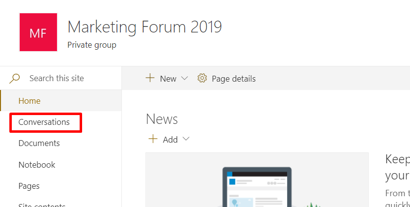
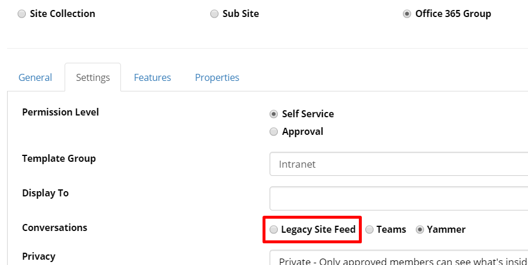
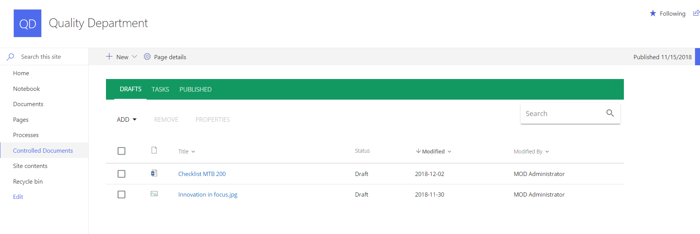

Release Notes November 2018
========================================

Features
---------------------------------

Yammer Integration
~~~~~~~~~~~~~~~~~~~~~~~~~~~~~~~~~~~~~~~~~~~

It is possible to use Yammer as the preferred choice for conversations on site templates of type Office 365 Group.

.. image:: YammerSetup.png

When this option is selected, a Yammer Group will be created integrated with an Office 365 Group.

.. image:: YammerGroup.png

The conversations link in quick launch on the SharePoint site will go to the connected Yammer Group.

The prequisites for using this, is that the Yammer network is setup to allow Office 365 Group integration and that communication with the Yammer API has been configured.

Legacy Site Feed for Modern Sites
~~~~~~~~~~~~~~~~~~~~~~~~~~~~~~~~~~~~~~~~~~~

The User Feed block has been updated to support the legacy SharePoint Site Feed in Modern Sites.

The conversations link in quick launch will go to a modern page with the user feed block configured as a Site Feed.

.. image:: SiteFeedModern.png

New Media Picker
~~~~~~~~~~~~~~~~~~~~~~~~~~~~~~~~~~~~~~~~~~~

Document Management for Modern Sites (Document Management)
~~~~~~~~~~~~~~~~~~~~~~~~~~~~~~~~~~~~~~~~~~~~~~~~~~~~~~~~~~~~~~~~~

Document Management is now fully supported in Modern Sites.

If the Omnia SPFx Infrastructure feature is activated on a team site, the Controlled Documents library will be deployed as a modern page.

Quality Management for Modern Sites (Quality Management)
~~~~~~~~~~~~~~~~~~~~~~~~~~~~~~~~~~~~~~~~~~~~~~~~~~~~~~~~~~~~~~~~~

Quality Management is now fully supported in Modern Sites.

.. image:: QMSModern.png

If the Omnia SPFx Infrastructure feature is activated on a team site, the Process library will be deployed as a modern page.

Bug Fixes and Small Improvements
----------------------------------

- Fix 1
