Release Notes July 2018
=================================

Features
---------------------------------

Web Page Approval
~~~~~~~~~~~~~~~~~~

Simple Approve/Reject functionality has been added to the Manage Content UI.

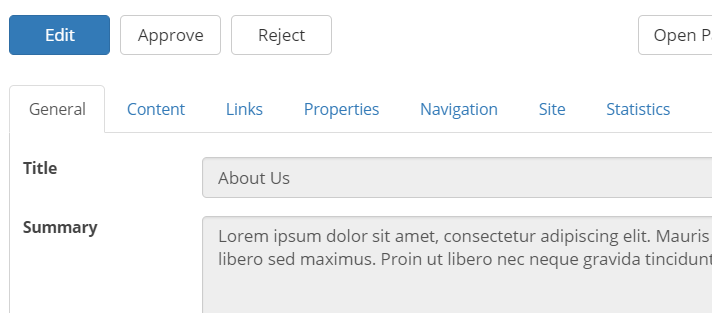

Activate approval on the Pages library in SharePoint to show the Approve/Reject buttons.

Web Statistics
~~~~~~~~~~~~~~~~~~

A new tab has been added in the Manage Content UI showing page hits and unique visitors statistics for each page.

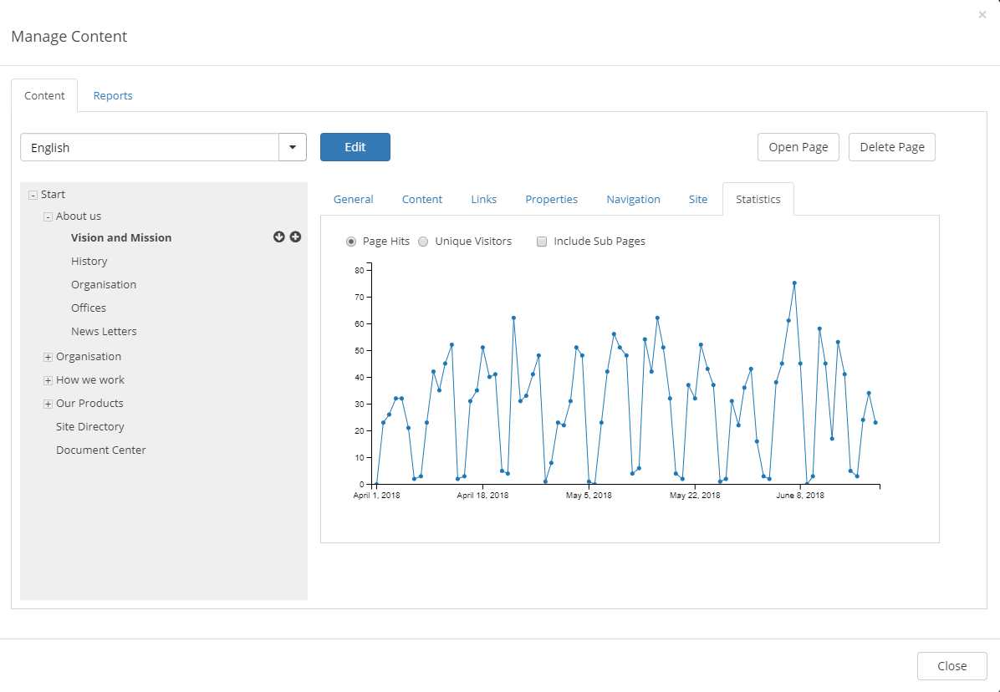

It is also possible to consume three types of reports:

- Usage: Most viewed pages.
- Review: Pages that needs review.
- Checked Out: Pages checked out by users.

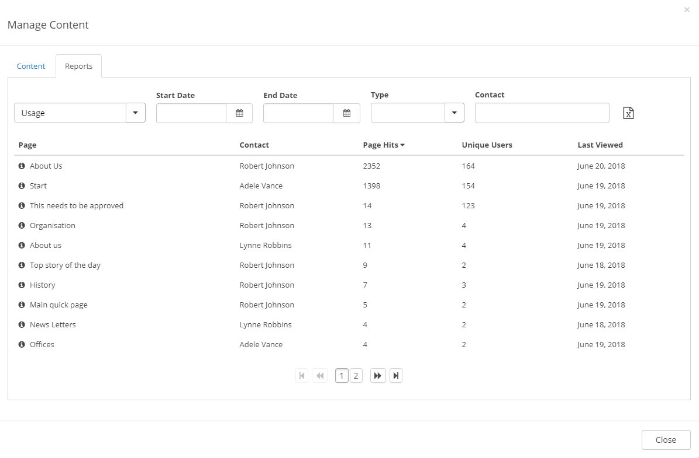

Default Document Types (Document Mangament)
~~~~~~~~~~~~~~~~~~~~~~~~~~~~~~~~~~~~~~~~~~~~~~~~~~~~~~

It is possible to configure which document types that should be default in the controlled documents library in a team site.

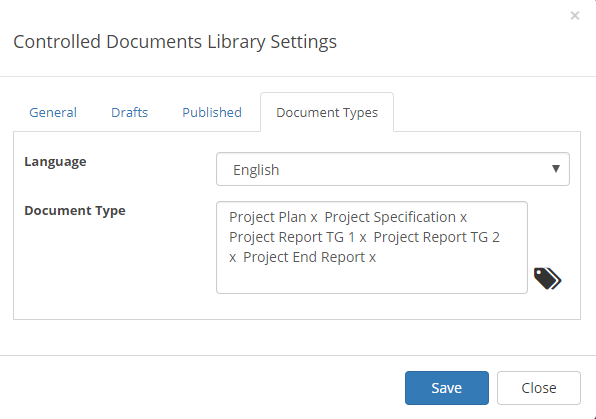

These document types will be shown as suggested in the document wizard with a possibility to show all document types.

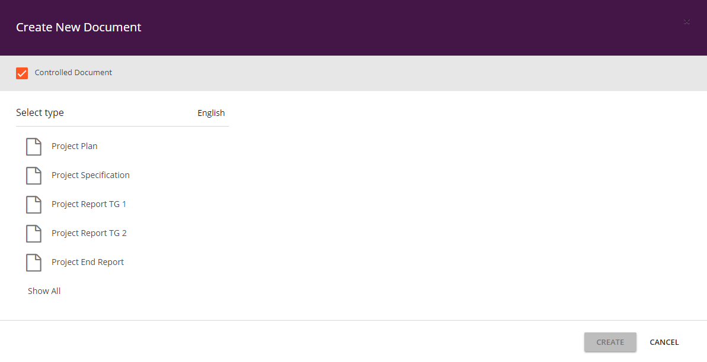

If no Document Types are selected for a specific team site, the wizard will automatically suggest the last five document types used by the current user.

Select Specific Documents in Query (Document Mangament)
~~~~~~~~~~~~~~~~~~~~~~~~~~~~~~~~~~~~~~~~~~~~~~~~~~~~~~~~~

It is now possible to select specific documents that should be shown in the Controlled Documents Viewer.

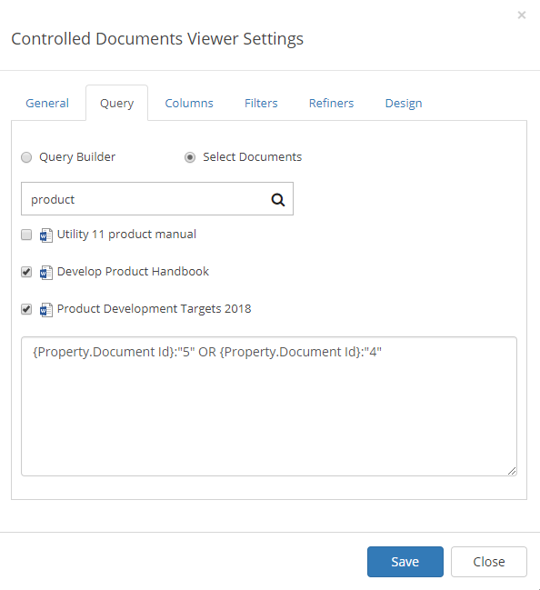

Document Revisions (Document Mangament)
~~~~~~~~~~~~~~~~~~~~~~~~~~~~~~~~~~~~~~~~~~~~~~~~~~~~~~~~~

It is possible to configure per document type whether revisions should be allowed or not. If needed, a revision can bypass approval.

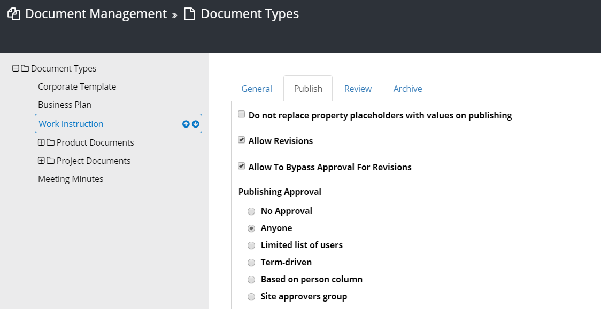

Document Statistics (Document Mangament)
~~~~~~~~~~~~~~~~~~~~~~~~~~~~~~~~~~~~~~~~~~~~~~~~~~~~~~~~~

In the start page of Document Management in Omnia Admin you will find statistics for all controlled documents.

.. image:: dm-statistics.png

Move Process (Quality Management)
~~~~~~~~~~~~~~~~~~~~~~~~~~~~~~~~~~~~~~~~~~~~~~~~~~~~~~~~~

It is possible to move a process from one team site to another.

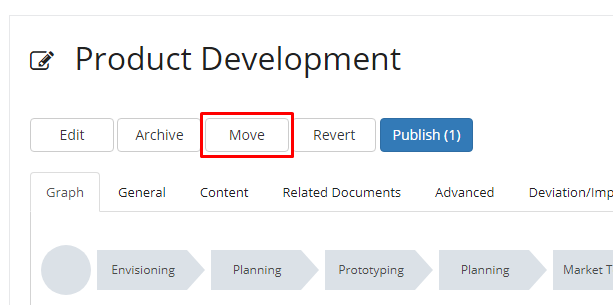
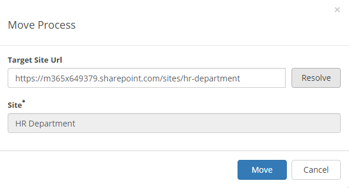

Open Link in Dialog (Quality Management)
~~~~~~~~~~~~~~~~~~~~~~~~~~~~~~~~~~~~~~~~~~~~~~~~~~~~~~~~~

It is possible to select whether a custom link (in the Tools tab or in a custom graph image) should be opened in the current window, a new window or a dialog.

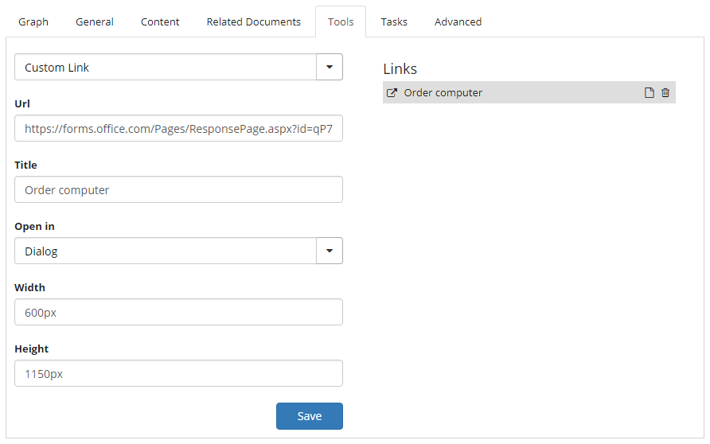
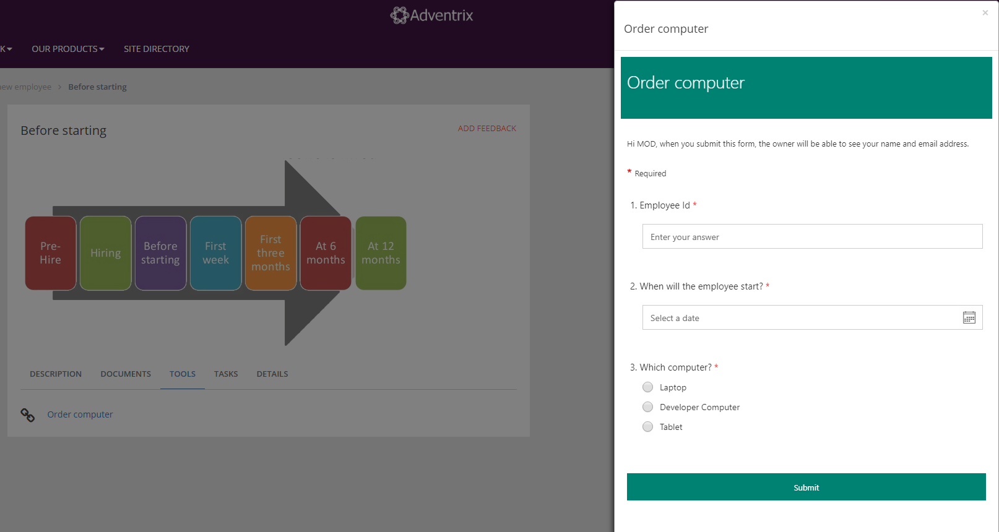

Central Deviations/Improvements Report (Quality Management)
~~~~~~~~~~~~~~~~~~~~~~~~~~~~~~~~~~~~~~~~~~~~~~~~~~~~~~~~~~~~

A new set of central administration features for QMS will rollout in the coming releases. First out is a central Deviations/Improvements Report.

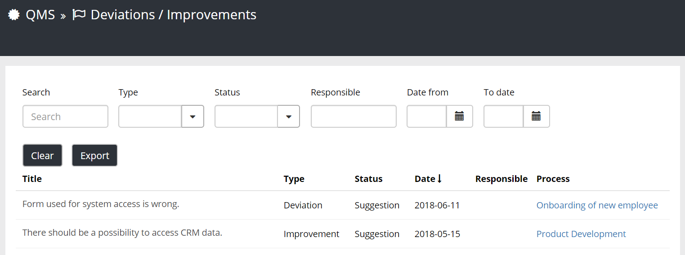

Bug Fixes and Small Improvements
----------------------------------

- The SharePoint standard icon in quick search for sites and web pages has been replaced with the Letter Avatar for sites and a web page icon for web pages.
- It is possible to configure My Sites to show a Letter Avatar instead of the site template icon.
- Fixed issue with certain web page results in quick search showing /null as url.
- Fixed issue with Omnia Admin showing 500 error when accessed from classic SharePoint sites.
- Fixed issue with Layouts in Content Mangagement in Omnia Admin not showing correctly when accessed from a sub site.
- Fixed issue with "Inherit from Parent" not being visible when sub site is in context in Omnia Admin > Content Management.
- If two news viewers have the same priority, a duplicate news article will be shown in both from this release.
- Fixed issue with the "Omnia Intranet Page Layouts" feature failing on initial activation.
- Made it possible to allow links in comments on web pages.
- Added possibility to set opacity on the News Roller view.
- Added possibility to set opacity on banners.
- Summary field on a web page now support line break.
- When you navigate to a web page or news article (quick pages) the page is now scrolled to the top.
- Fixed margins in People Rollup.
- New items in the RSS Reader is now marked with an icon in the Notification Panel.
- Fixed issue with long metadata terms (page properties) not being displayed in a nice way when too long text.
- Fixed graphical issues in Page Properties blocks in IE 11.
- Modern team sites are now displayed as last visited.
- Possibility to set whether the top navigation should be shown for external users or not.
- Fixed labels in Create Site wizard.
- Added tooltips on the icons in the new modern slim header.
- All document icons have been replaced with better quality modern icon images. (Document Management)
- We have added better support for date refiners and date filters in the Controlled Documents Viewer. (Document Management)
- Properties set in the publish form will be remembered the next time a draft is published. (Document Management)
- When a user is idle in the Controlled Documents Library for about 20 mins it doesn't throw an error anymore. (Document Management)
- The search box in the Controlled Documents Library now searches on Document Id as well even if the document id is not inside the document. (Document Management)
- Problem with certain text within DOCX being modified wrongly in the publishing process. (Document Management)
- Fixed issue with preview of PDF documents in Safari browsers. (Document Management)
- In the Details tab in the Process Viewer, a link has been added to the team site where the process is stored. (Quality Management)
- All Angular 1 dependencies have been removed from QMS. (Quality Management)
- The design of the Process Viewer has been updated to align with the design of a web page in Omnia Intranet. (Quality Management)

.. toctree::
   :titlesonly:

   2018-july-patch1/index
   2018-july-patch2/index
   2018-july-patch3/index
   2018-july-patch4/index
   2018-july-patch5/index
   2018-july-patch6/index