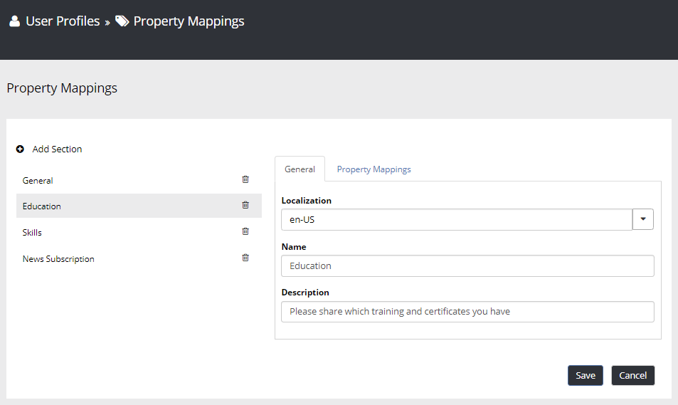
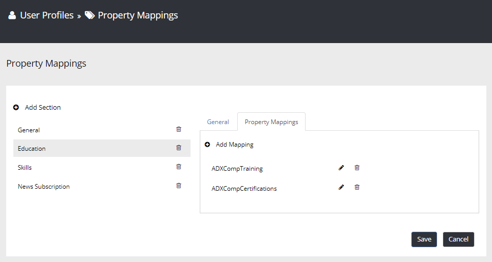
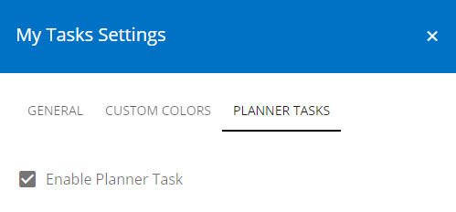
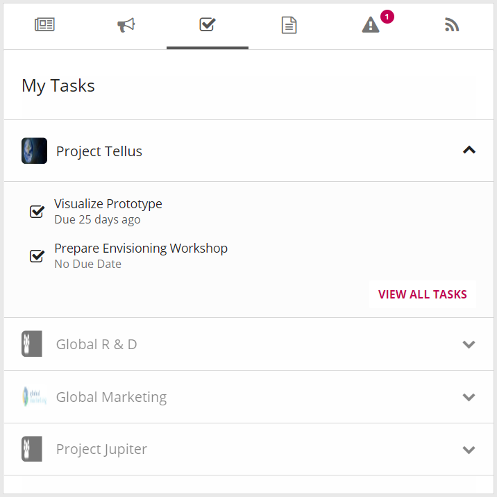
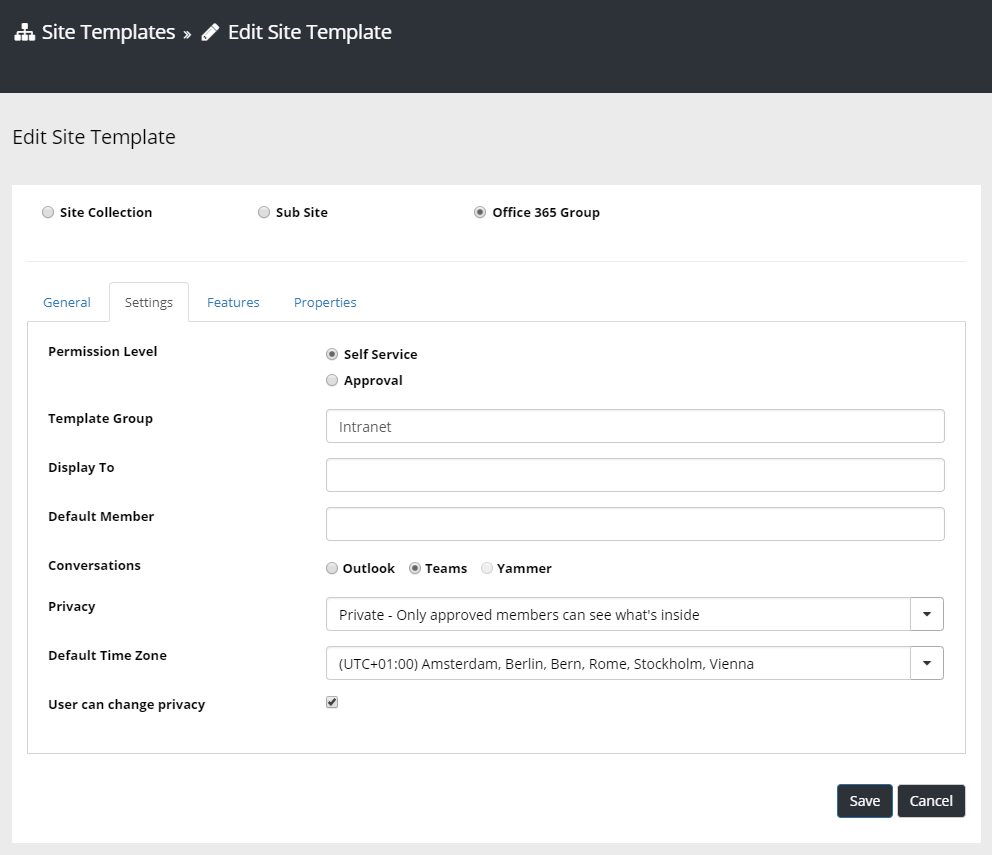
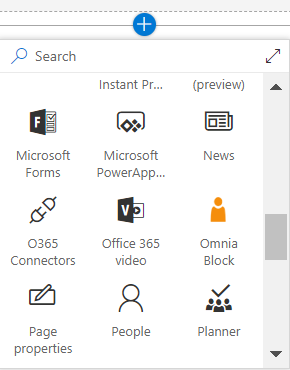

Release Notes September 2018
========================================

Features
---------------------------------

User Profile Completion Wizard
~~~~~~~~~~~~~~~~~~~~~~~~~~~~~~~~~~~~~~~~~~~

The purpose of the User Profile Completion Wizard is to make it easier for the user to fill in their user profile.

.. image:: userprofilecompletionwizard.png

An administrator can design the User Profile Completion Wizard according to needs...

.. image:: userprofile-settings.png

...and map properties from the SharePoint User Profiles that are of interest.

.. image:: userprofile-propertymappings3.png

There is also a block that can be put on a page that will display the current user profile completeness of the signed in user.

.. image:: myprofile-block.png

Refiners and Multi-column in People Rollup
~~~~~~~~~~~~~~~~~~~~~~~~~~~~~~~~~~~~~~~~~~~

The People Rollup block has been enhanced to allow for multi-column view and search refiners which makes it possible to be used as a people directory.

.. image:: peoplerollup-peopledirectory.png

Planner Tasks in My Tasks
~~~~~~~~~~~~~~~~~~~~~~~~~~~~~~~~~~~~~~~~~~~

A prerequisite for the Planner Tasks integration to work is to :doc:`enable Azure AD Services </tenant-administration/office365-integration/index>` in Omnia.

When Azure AD Services is enabled, the My Tasks block can be configured to show tasks from SharePoint and Planner.

Provision Microsoft Teams
~~~~~~~~~~~~~~~~~~~~~~~~~~~~~~~~~~~~~~~~~~~

A prerequisite for the Microsoft Teams integration to work is to :doc:`enable Azure AD Services </tenant-administration/office365-integration/index>` in Omnia.

When Azure AD Services is enabled, a Site Template can be configured to create a Microsoft Team together with the creation of the Office 365 Group.

Modern Web Part for Omnia Blocks
~~~~~~~~~~~~~~~~~~~~~~~~~~~~~~~~~~~~~~~~~~~

The blocks in Omnia have been redesign with a modern look and feel and are now available on modern pages via a modern web part called "Omnia Block".

A prerequisite for Omnia to work in modern pages is that Omnia SPFx Integration is enabled. Please find out how to do that :doc:`here </tenant-administration/office365-integration/index>`

Bug Fixes and Small Improvements
----------------------------------

- The product documentation and release notes now open up in a new tab from Omnia Admin.
- Color Picker has been fixed to show all colors without scrollbar if possible.
- The performance of the Term picker has been fixed to allow for very large term sets on a single level in the tree.
- Fixed a limitation in Personal Links where it was not possible to add two links with same icon color in the same session.
- Fixed the mobile navigation in the modern header to allow for deep navigation structures.
- Fixed issue in IE 11 with modal dialogs not working as expected.
- Fixed inconsistency in how dates where displayed when editing important announcements.
- Aligned the look and feel of action links in Omnia blocks.
- Fixed issue with web statistics not being displayed correctly for customers running in site collection only mode.
- Fixed issue with links to Lotus Notes not working in My Links.
- Localization UI in Omnia Admin has been changed to collapsed nodes by default to enhance performance.
- Fixed issue with showing number fields in Page Properties.
- Fixed small issue with mega menu that affected a couple of customers.
- Fixed Aggregated Calendar localization issue.