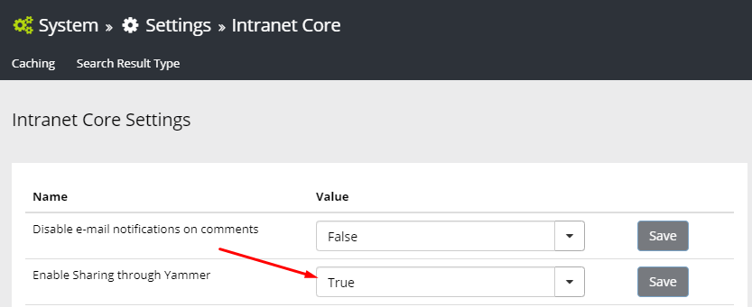
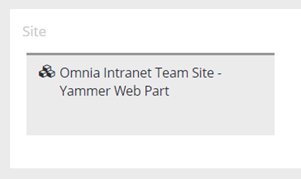
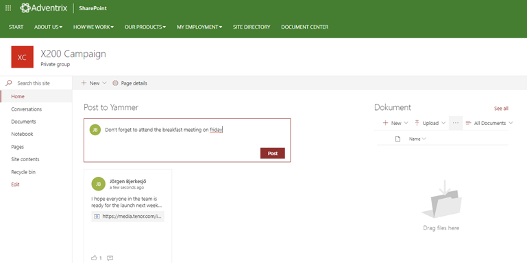
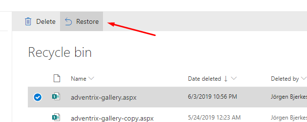

Release Notes June 2019
========================================

- Omnia.Foundation (1.0.16056)
- Omnia.Intranet (1.0.16070)
- Omnia.QMS (Cooming Soon)
- Omnia.DocumentManagement (Cooming Soon)

Features
---------------------------------

Improved Yammer Integration
~~~~~~~~~~~~~~~~~~~~~~~~~~~~~~~~~~~~~~~~~~~

You can setup the share feature on a page to allow sharing to Yammer.

When Yammer sharing is enabled, a new button will appear on pages that makes it possible to create a new post in Yammer.

.. image:: yammerintegration-sharepage.png

A new site scoped feature "Omnia Intranet Team Site - Yammer Web Part" is available that makes it possible to deploy the new Modern Web Part to the welcome page of a modern team site.

Web Content Management Improvements
~~~~~~~~~~~~~~~~~~~~~~~~~~~~~~~~~~~~~~~~~~~

Restore (Copy) Page
*******************************************

It is now possible to restore a page to the navigation menu in Manage Content. To do this:

1. Go to the Recycle bin in SharePoint.
2. Restore the aspx page.

3. Open Manage Content and start the creation of a new page in the location where you want to restore the page.
4. Click on Advanced Settings in the Create Page dialog and click on Restore/Copy Page.

.. image:: restorepage-restorecopypage.png

5. Find the page that you restored from the Recycle Bin and select it.

.. image:: restorepage-searchpage.png

6. Create the page. A new navigation node will now be created related to the restored page in the Pages library.

Note! If you restore a page in the navigation node that already exist in the structure, a copy will be created of the page in the Pages library.

New Settings in News Roller
*******************************************

Three new settings have been added to the News Roller:

* Transition: Can be either Slide or Fade.
* Interval time: Number of milliseconds between transitions.
* Number of laps: The number of times the news roller should show all articles before it stops.

Related News Improvement
*******************************************

It is possible to configure the Related News block to be based on any Managed Metadata column.

Improved Mobile Experience
~~~~~~~~~~~~~~~~~~~~~~~~~~~~~~~~~~~~~~~~~~~

All modern blocks and components have been reviewed on several mobile devices to enhance the mobile experience overall.

Bug Fixes and Small Improvements
----------------------------------

- Fixed issue with recurring events in the Month View in the Aggrgated Calendar.
- Fixed issue with closing the Likes dialog in the comments section of an Important Announcement.
- Fixed an issue in the News Roller (New) when having several News Viewers on the same page.
- Fixed issue with moving a page in Manage Content from one sub publishing site to another.
- Fixed problem with fine grained permissions on User Profiles in Omnia Admin.
- The News Center Site Template has been deprecated. Use the setup documentation instead to set up a new News Center site: https://omnia-docs.readthedocs.io/en/latest/web-content-management/news/setup/news-center.
- CSS classes have been added to all vue components for extension developers to use.
- Fixed issue with translated columns in SharePoint showing wrong display name in Omnia blocks.
- Fixed a graphical design issue with the New icon in the News Viewer.
- Made sure page properties of type Person works as multi-value on pages.
- Fixed issue with Enterprise Keywords as a Site Property when the column is not deployed to a team site.
- The Statistics and Reports tab are now available on news articles as well.
- The "Edit Tutorial" button has been moved to the action menu in the header. If a page has a tutorial, a Tutorial button will be shown for the end user in the header.
- Fixed issue with Take Ownership option not being available in the Checked Out report if filter on Checked Out to was applied.
- Fixed issue in My Links control when clicking on cancel/back button.
- Fixed some graphical design issues in the News Viewer.
- Add the option "None" for conversations in Site Templates.
- Fixed graphical design overflow issue in banners in Internet Explorer 11.
- If you hover the news roller, it will now stop the carousel.
- Fixed issue with Created date always showing english date format in the Site Directory.
- A new setting has been added to the High Priority Announcements block that will make it possible to set a time interval in minutes on how often the page should poll for new announcements. The default value is 5 minutes.
- The Media Picker is now fully extendable and it is possible in Omnia Admin to select which providers that should be used.
- If there is only one page layout available in a publishing site, the Create Page dialog will not show the page layouts dropdown.
- The available layouts setting on a publishing site in Omnia Admin will only affect the Create Page dialog, not the selection in edit mode.
- Removed the possibility to add an image in the rich text of a banner.
- Fixed issue with e-mail validation in the Contact Information form in Omnia Admin.
- Fixed some issues in the comments dialog on important announcements.
- Changed the logic of the last updated documents query to make sure PDF documents don't have modified dates in the future.
- Fixed the feedback address in user profiles in Omnia Admin to accept dot character.
- Fixed some graphical design issues with alignment of banners in larger zone.
- Made sure you can click Enter in the search box in My Sites without navigating away to another page.
- Fixed issue with language picker showing draft translations in the drop down.
- Fixed issue with duplicate sites in the My Sites control that could appear in certain scenarios.
- Fixed some issues with the Last Updated Documents block not showing the correct result in certain scenarios.
- Removed the click-out possibility in the Create Personal Link form in My Links.
- Fixed whitespace that appeared in the bottom of a page when closing a high priority important announcement.
- Fixed issue with the Privacy setting when approving an Office 365 group in Omnia Admin.
- Fixed problem with special characters being accepted in the Office 365 group creation form which leads to errors when the group is created.
- Made sure the selected Site Template is shown when approving a site request.
- Fixed some issues when hovering events in the Aggregated Calendar.
- Fixed graphical issue on page when switching language.
- Fixed problem with profile pictures on-prem in People Rollup.
- Made it possible to point the Report Error link in Omnia Admin to different locations dependant on support agreement.
- Fixed issue with required columns in the SharePoint Pages library in combination with uploading images in the new media picker.
- Fixed some minor issues in the Color Picker.
- Fixed issue with Manage Content not always being shown the first time 
- Fixed issue that could happen with the master page feature on site provisioning in rare cases.
- Fixed problem with the sum of likes in the Trending Pages block.
- Fixed some issues related to the Profile Completeness wizard on-prem.
- Fixed issue with readers not being able to access the PublishingFeedImages folder on-prem.
- Fixed issue with aggregated calendar showing Invalid Date in certain versions of iOS.
- Fixed some issues with recurrent events in the aggregated calendar.
- Increased the timeoout period for the My Sites query in slow tenants.
- Fixed problem that could happen when uploading images in the User Feed.
- Fixed issue with names sometimes adding null to the end of the name when creating an Office 365 Group.
- Fixed problem with the filter in the Member of tab in the My Sites navigation.
- Fixed accessibility bug in the Page Properties block.