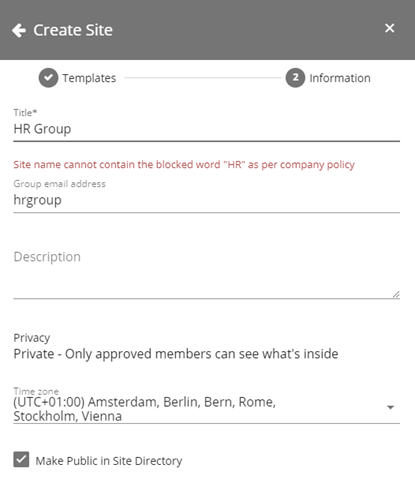
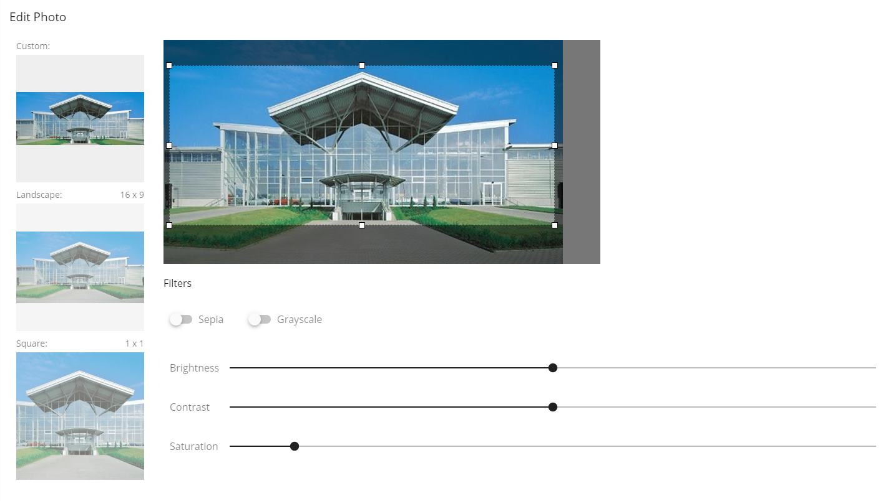
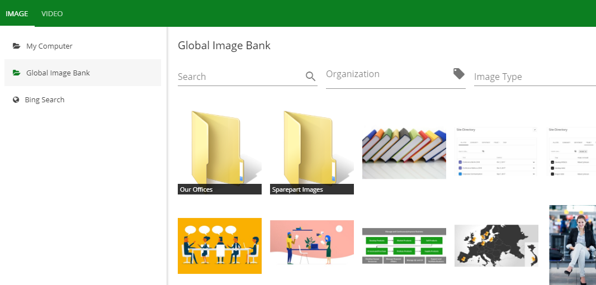
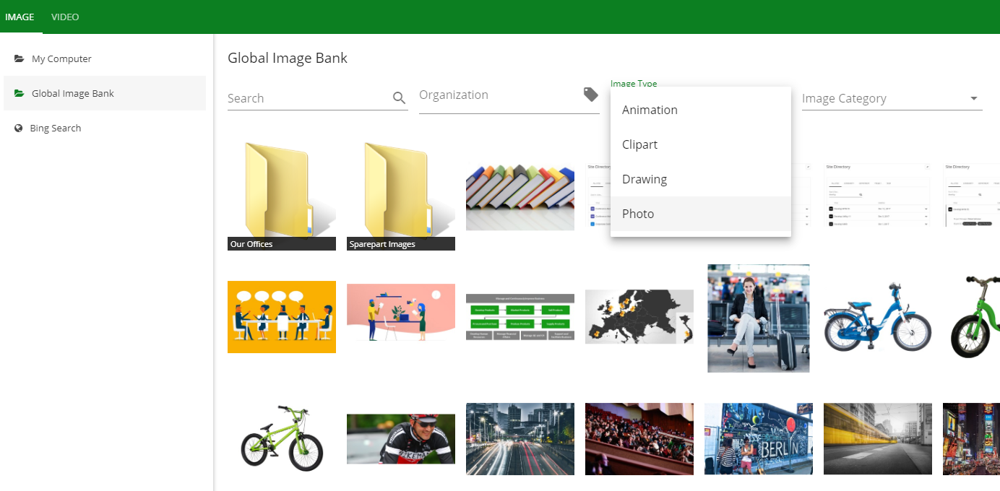
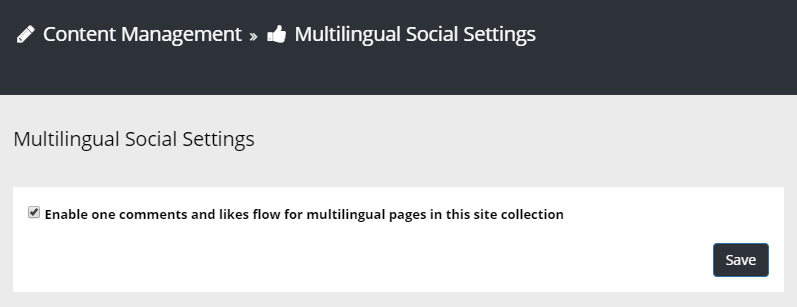
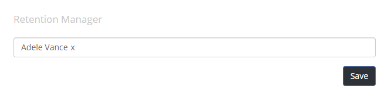

Release Notes March 2019
========================================

- Omnia.Foundation (1.0.15438)
- Omnia.Intranet (1.0.15513)
- Omnia.QMS (1.0.15624)
- Omnia.DocumentManagement (1.0.15631)

Features
---------------------------------

Office 365 Group Naming Policies
~~~~~~~~~~~~~~~~~~~~~~~~~~~~~~~~~~~~~~~~~~~

The site creation process is now fully compliant with Office 365 Group Naming Policies.

.. image:: o365-naming-policies-prefixsuffix.png

Media Picker Improvements
~~~~~~~~~~~~~~~~~~~~~~~~~~~~~~~~~~~~~~~~~~~

The new Media Picker now supports a custom ratio when adding pictures to a page.

The new Media Picker is now available when adding media in content on a page.

.. image:: media-picker-video-in-content.png

The new Media Picker now supports both folders and filters in central image locations.

.. image:: media-picker-folders2.png

Warning for big images and the possibility to make them web safe has been implemented.

.. image:: media-picker-make-web-safe.png

Comments Improvements
~~~~~~~~~~~~~~~~~~~~~~~~~~~~~~~~~~~~~~~~~~~

For multilingual publishing portals, it is now possible to configure the comments on a page to be shared between languages.

Changed behaviour when deleting a comment. If a comment is deleted it will be totally removed from the comments feed. It will only show the message "Comment has been deleted by..." if the comment has replies.

Compliant with Microsoft Teams
~~~~~~~~~~~~~~~~~~~~~~~~~~~~~~~~~~~~~~~~~~~

Both QMS and DM can now run in Microsoft Teams.

.. image:: dm-microsoft-teams-integration.png

.. image:: qms-microsoft-teams-integration.png

Status on Process Steps (QMS)
~~~~~~~~~~~~~~~~~~~~~~~~~~~~~~~~~~~~~~~~~~~

It is possible on a process to configure it as a template for a one or more site templates. A new feature added to process templates is the possibility to configure a number of available statuses on a process step.

.. image:: qms-process-status.png

This configuration can then be used on a team site to set status on process steps for this specific process instance.

.. image:: qms-teamsite-process-status.png

Retention Policies and Termination of Documents
~~~~~~~~~~~~~~~~~~~~~~~~~~~~~~~~~~~~~~~~~~~~~~~

It is possible to setup a Retention Manager in the Document Management settings.

If a Retention Manager is setup, a new tab will be visible on Document Types to set a Retention Policy.

.. image:: dm-documenttype-retention.png

When a controlled document is published, a Retention Date will be set on the document based on the policy.
The Retention Manager will get an e-mail when the Retention Date of a document is reached. The e-mail will include a link to a page where the document can be terminated (completely removed from the system).

.. image:: dm-documenttermination.png

In order to completely remove a controlled document from the system (termination), you need to find the document based on the unique document id. The Document Termination page will show all files that will be deleted from the system (drafts, appendices, hidden files, published and archived files). Once a controlled document is terminated, it can not be restored.
(The individual files can be recycled from SharePoint for an additional period of time).

Document History (DM)
~~~~~~~~~~~~~~~~~~~~~~~~~~~~~~~~~~~~~~~~~~~

A new Place Holder can be added to documents to show the history of a document: [[_DocHistory]].
The Place Holder will be replaced by a document table on publishing.

.. image:: dm-placeholder-documenthistory.png

Bug Fixes and Small Improvements
----------------------------------

- Fixed issue with default properties in the Term Picker.
- New setting in Site Templates of type Office 365 Group to allow administration of SharePoint Groups.
- Possibility to set Item Limit in the aggregated calendar for upcoming events.
- Fixed a number of issues in the aggregated calendar related to recurring events and timezone.
- Fixed graphical design issue in team site grouping of announcements in the Announcements block.
- Fixed issue with settings icon when banner is located in the notification panel.
- Fixed issue with page comments crashing on a page if a user that has submitted a commented is removed from Azure AD.
- Fixed problem with assigning admin access rights to Site Templates only in Omnia Admin.
- Fixed issue with showing properties on certain documents in the Document Rollup when a user has been removed from Azure AD.
- Fixed issue related to visitors not being able to upload images in the User Feed (when using an Everyone site in the feed).
- Updated the Conversation link to Teams in team sites to a more stable version.
- Added setting to allow the possibility to have labels on categories in the Notification Panel and decide number of categories per row.
- Added setting to the Site Directory block to decide whether to open the sites in a new window/tab or not.
- Fixed token timing issue in onprem environments. This could case temporary unexpected errors for users.
- Performance improvements on the Publish function. (QMS)
- Fixed issue when clicking "Enter" in search box in Process Directory. (QMS)
- Fixed problem uploading large file size in Tools. (QMS)
- Replaced sub process and process item labels with process step. (QMS)
- Improved read-only mode in Process Library. (QMS)
- Fixed size of Process Library in modern sites do that it uses 100% of the column width. (QMS)
- Performance improvements when loading process. (QMS)
- Show text on all shapes. (QMS)
- Made it possible to associate a SharePoint Task list to the Process library. If Task list is associated, actions in issues will become SharePoint tasks. (QMS)
- When you go from edit to read mode in the Process library it stays on the same tab. (QMS)
- Fixed issue with moring process from sub site to parent site. (QMS)
- Changed ui flow. When a process step is created, it stays on the current process. (QMS)
- Deviations/Improvements are renamed Issues. (QMS)
- Made sure the content area use a bigger height. (QMS)
- Fixed issue with the date picker closing when selecting another year than the current one. (DM)
- Fixed issue with the Document Id property not being correctly used in related documents. (DM)
- Fixed issue with certain users getting error in the Create Document Wizard when no suggested site exist. (DM)
- Fixed issue with the Controlled Documents Viewer not loading in SP2013. (DM)
- Fixed issue with the following tab in the Create Document wizard. (DM)
- Fixed issue with some special characters messing up content in a DOCX document when published. (DM)
- Fixed some problems with the upload document dialog in IE11. (DM)
- Performance improvements in the Drafts and Published view in the Controlled Documents Library. (DM)
- Fixed problem opening appendix from appendices dialog. (DM)
- Fixed issue with the "Convert to PDF" mandatory setting not being mandatory anymore. (DM)
- If a document did not have any custom properties, the title and file name were hidden in the properties diaolg. This has now been fixed. (DM)
- Performance improvements on the statistics number in Omnia Admin. (DM)
- Fixed issue with default properties not showing up for uploaded documents. (DM)
- Fixed some issues with the term picker in document properties when having many terms selected. (DM)
- Made it possible to provision sites based on the Project Site base template with Document Management. (DM)
- Fixed the logic of the notifications in the Document Subscription block. (DM)