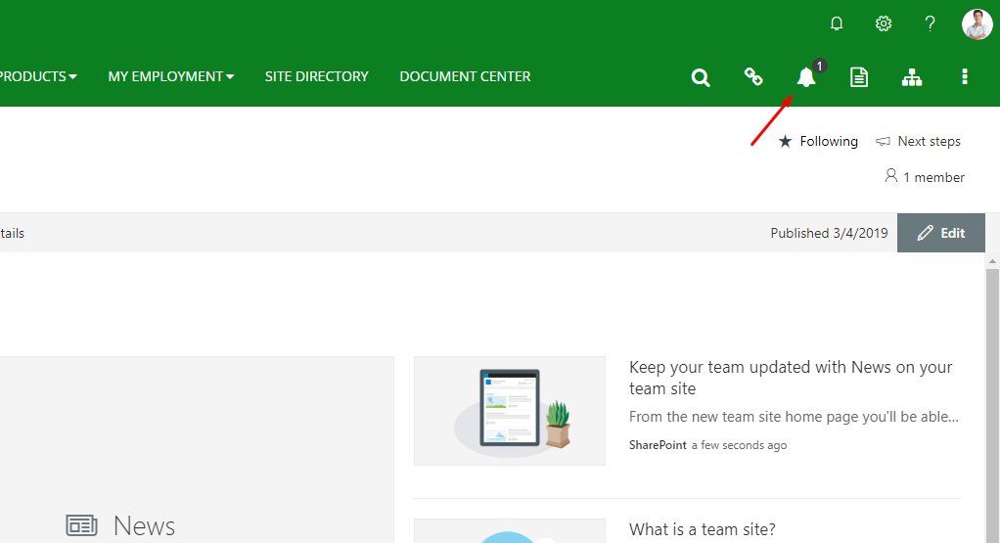
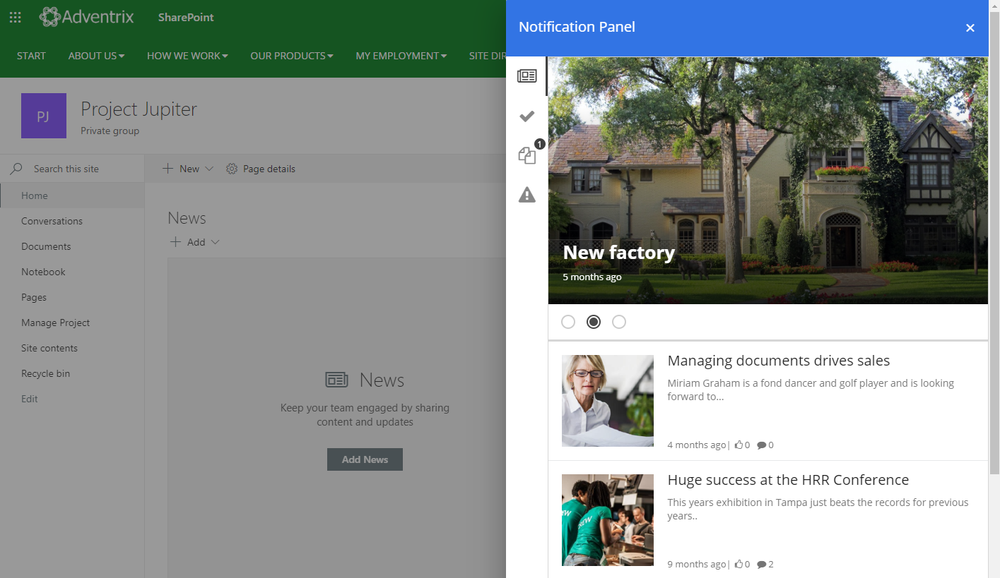
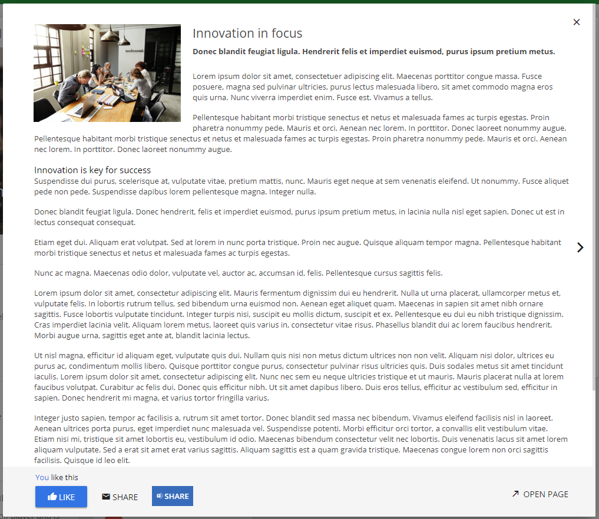
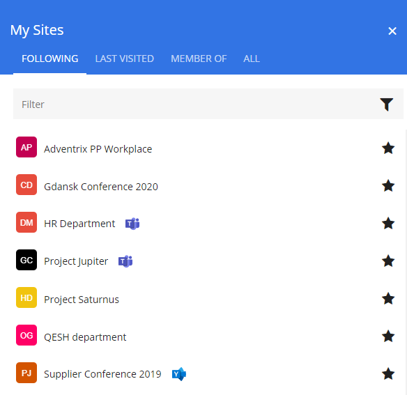
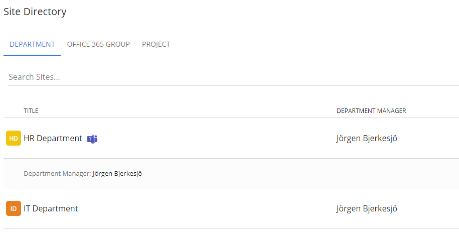

Release Notes November 2019
========================================

- Omnia.Foundation (1.0.X)
- Omnia.Intranet (1.0.X)
- Omnia.QMS (1.0.X)
- Omnia.DocumentManagement (1.0.X)

Features
---------------------------------

Notification Panel in Header
~~~~~~~~~~~~~~~~~~~~~~~~~~~~~~~~~~~~~~~~~~~

It is possible to configure a notification panel pinned in the header. Notifications will then be shown wherever you are in the solution.

To set up a notification panel in the header, please follow these steps:

1. Go to Omnia Admin > Settings > Intranet Core.
2. Set "Enable Header Notification Panel" to True.
3. Go to the start page of your solution.
4. Click on "Show Settings" in the action menu.
5. Configure the Notification Panel.

Open News Article in Modal Dialog
~~~~~~~~~~~~~~~~~~~~~~~~~~~~~~~~~~~~~~~~~~~

The News Viewer can be configured to show news articles in a modal dialog view instead of a link to the page. A news rollup can quickly be browsed through by the end user by clicking on the left and right arrows.

Teams/Yammer icons in My Sites and Site Directory
~~~~~~~~~~~~~~~~~~~~~~~~~~~~~~~~~~~~~~~~~~~~~~~~~

If you are using Teams and/or Yammer in your solution, it is now possible to show in the navigation whether a team site is attached to a team in Microsoft Teams and/or a group in Yammer.

- In order for a Teams icon to show, you need to activate the Site Feature "Omnia Intranet Team Site - Microsoft Teams Icon".
- In order for a Yammer icon to show, you need to activate the Site Feature "Omnia Intranet Team Site - Yammer Icon".

Turn of Legacy Mode
~~~~~~~~~~~~~~~~~~~~~~~~~~~~~~~~~~~~~~~~~~~

It is now possible to turn of legacy mode for a site. This will disable all code running Angular and decrease the javascript load times. Note! Any custom extensions built on Angular will stop working if legacy mode is turned off. Follow these steps

1. Go to the start page of the publishing site where you want deactivate legacy mode.
2. Go into Omnia Admin.
3. Remove the site collection feature "Omnia Legacy Support".
4. Update the site features "Omnia Glue Site" and "Omnia Core Master Page".

Bug Fixes and Small Improvements
----------------------------------

- Fixed an issue with banners floating on top of other blocks in some scenarios.
- Possibility to add Alt text in the Media Picker.
- Fixed issue with tutorial only loading after mouse click in some environments.
- Fixed word break issues for Firefox in the News Viewer.
- Fixed issue with exporting the review report to Excel.
- Made sure that Omnia does not create three versions in the backend in SharePoint when publishing a page.
- If only one targeting definition exists in a tenant, this definition will be preselected when targeting information.
- Made sure mailto-links are supported in related links on a page.
- Fixed issue with additional languages in multilingual pages (such as fr-ca).
- Fixed issue with long navigation titles overlapping other nodes in the mega menu.
- Fixed an issue in the user picker that made it really slow in some scenarios (especially IE11). 
- Fixed console error [SiteUrl]/undefined that was registered a lot in tenants where user photo was missing for some users.
- The RSS and Document Rollup block is now available as an SPFx web part.
- Made sure that multi-value is working as expected when targeting an event in the Aggregated Calendar.
- Made sure deleted single item recurring events does not show up in the Aggregated Calendar.
- Fixed the Show More button in the user feed when displayed inside the notification panel.
- Multi-lingual support has been added to the navigation title.
- Made sure the settings gear in the Notification Panel is avaialable in legacy web part pages.
- Multi-lingual support fixed for titles in News Center blocks.
- When adding a group to set permission in Omnia, distribution groups are now filtered out from the picker.
- Fixed a small issue when editing targeted events in the Aggregated Calendar.
- Fixed wysiwyg issue in rich text editor on banners.
- Fixed issue with the People Rollup and page properties when running as a web part on a classic SharePoint page.
- Fixed some issues related to changes in follow site api.
- Made it possible to target information based on preferred language in the user profile.
- Fixed issue with Banner Group getting error if special characters is used in the name.
- It is now possible to save a document type without selecting a default document template.
- Fixed bug in Aggregated Calendar when the built-in field Category was changed to multi-value.
- Added possibility to download a document template in Omnia Admin. (DM)
- Fixed issue that occured in certain environments where it was not possible to find specific documents in the Bulk Update when searching on a person field. (DM)
- When you create a new draft from the Controlled Documents Viewer, you will now get the same UX as if you create it through the Publish view in the team site. (DM)
- Added possibility to attach a document template to an uploaded document on publishing. (DM)
- When a property change display name centrally, the new name is ensured the next time this property is used in a team site. (DM)
- Made sure the user preferred language is used for property titles in the Create New Document wizard. (DM)
- Made sure that drafts are last modified by the last user that worked with the draft and not the system. (DM)
- Show the document id when selecting a related document. (DM)
- Made it impossible to cancel a workflow if someone has the document open for editing. (DM)
- Made sure the correct drafts library is shown when navigating between modern team sites in the My Sites navigation. (DM)
- Fixed issue with placeholders in footer of DOCX that didn't get replaced on publishing in certain scenarios. (DM)
- Added a Copy Link option in the action menu of published documents. (DM)
- Fixed an issue with validation of certain required properties on publishing. (DM)
- Fixed problem adding more than one Document Subscription via the Controlled Documents Viewer block. (DM)
- Fixed problem with strange word wrap och process steps and wysiwyg issue in the rich text editor. (QMS)
- Fixed some issues with paging etc in the Controlled Documents Viewer when running inside of the Process Viewer in QMS. (DM/QMS)
- Fixed issue with DM/QMS not loading properly on modern team sites in IE11. (DM/QMS)