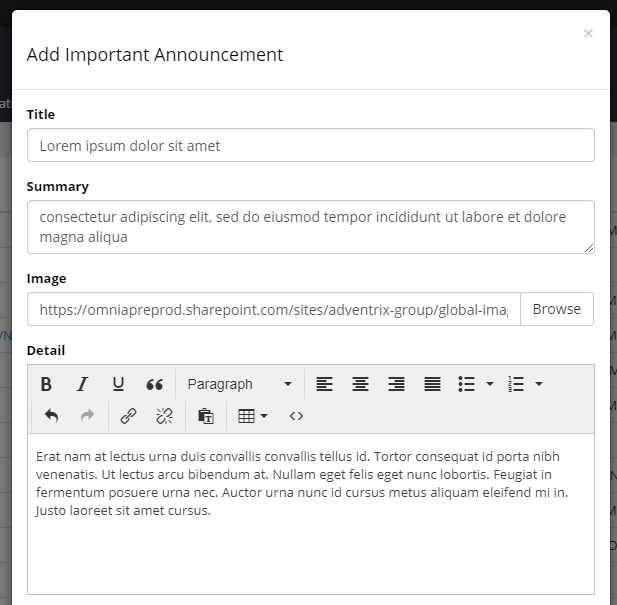
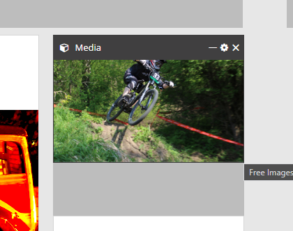
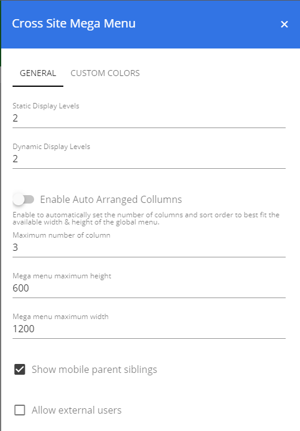
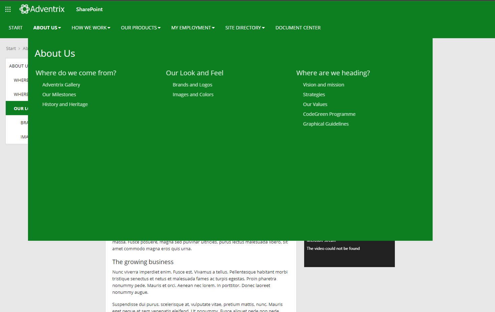
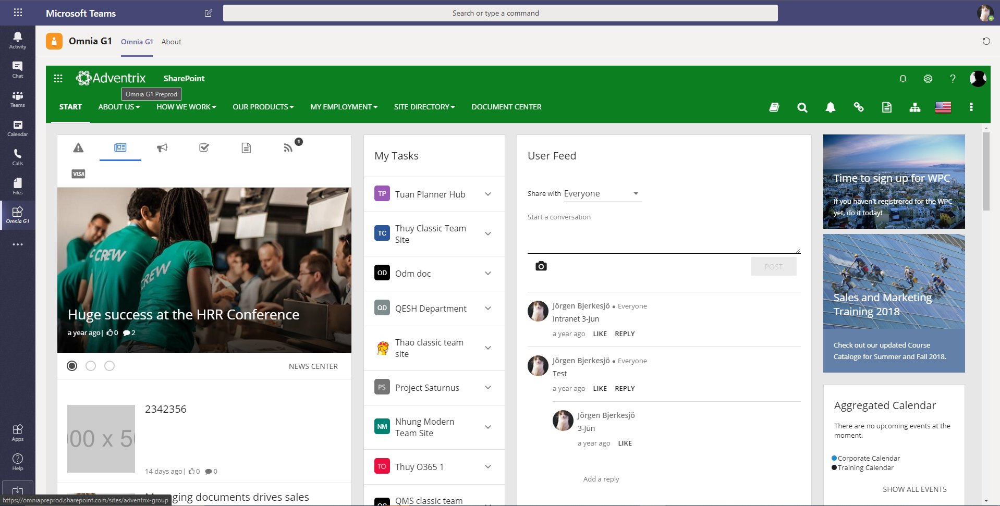
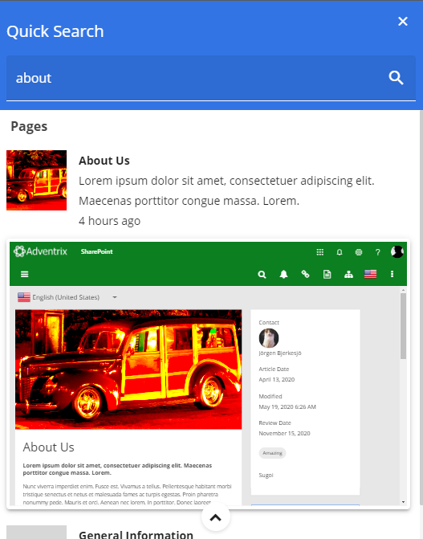
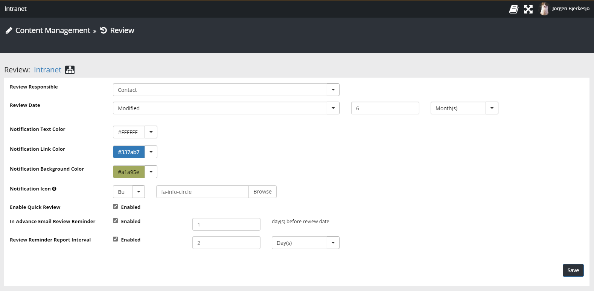
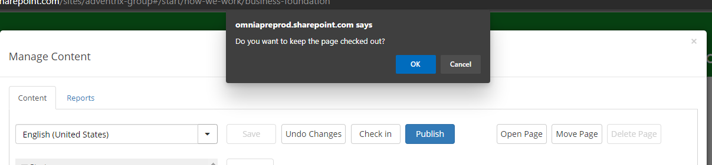

Release Notes 28.0.0 (Preview)
========================================
*NOTE: Items might be added, altered or removed.*

New Features
---------------------------------

Important Announcements  Rich Text Support
************************************************

We now support Rich Text in Important Announcements. 

When Rich Text is added to an Important Announcement a "show more >>" link is displayed in the notification message in the header.

.. image:: important-announcements-notification.png

Click on the link to open the announcement in a dialog window for more information.

.. image:: important-announcements-dialog.png

Media Block
************************************************

A new block has been added that makes it easy to add media to other areas of the page. Add the block to the page in Edit Page mode and select the media you would like to display

Improved Managed Content
************************************************
It is now possible to move a page with children to another location in the structure. Simply choose to move like before and follow the steps to move a page and its children. 
If the target location is connected to a specific publishing site, you will get prompted to choose to move the selected page and its children physical pages to the new publishing site or just move the navigation nodes.

.. image:: move-pages.png

Improved Mega Menu
************************************************
(#107044)

It is now possible to set the sorting of columns in the mega menu to use the same sorting as shown in Managed Content. Simply turn of the "Enable auto arrange columns" to enable custom sorting.

You can also decide the number of columns that you would like to display per row and also set a specific height & width for the global navigation flyout area.

Omnia Portal in Microsoft Teams
************************************************
Omnia can now be displayed in Microsoft Teams to enhance your digital workplace experience. 

Improved Search Experience
************************************************
(#109309, #107344, #108063)

A new way of showing search results has been introduced. This new mode is more flexible and provides a better search experience for end user. 

You can now preview pages & documents directly in the search result before opening them.
Configure what to display in the quick and advanced search area. 

The new advanced search flyout offers a more detailed search experience with support for refiners without having the user leave their current context. 

Change portal display Language
************************************************
Its now possible to see the page content, current and mega menu in a other available languages. Users can choose what language to see the portal in the Omnia Header.

.. image:: portal-lang.png

Improved Page Review Workflow
************************************************
We have improved page review workflow to make it more flexible. You can now configure specific page review for different publishing sites with different rule and notification settings.

A message is displayed on the page that the review date is surpassed. An author can quickly set a new review date for a page directly from the page.

.. image:: review-notification.png

Find and update all pages and needs review in Manage Content Review Reports.

.. image:: review-report.png

Improved Page Content Management - Prompt for changes
************************************************
Manage content will prompt the user if they try to leave the page without saving or check in. 

Enhancements
------------------------------------

- Several improvements to align with WCAG 2.1 AA. (#114277)
- Improved behaviour of Request Access for Office 365 Groups.
- Pre-Allocate height for Omnia Header on SharePoint Team Sites.
- Omnia document Management: Review job will now try to self heal if something went wrong during previous runs.
- Omnia blocks small look & feel improvements. (#106917)
- Profile Completion: Display message informing user that a change to the profile image cant be reverted after a new image is uploaded. (#106298)
- Navigation node hover text translation support. (#101774)
- You can now disable support for legacy pages and hide the option in Manage Content. (#102851)

Omnia Document Management

- Read receipt support when publishing ODM documents. (#110992)
- Get a link to a document from ODM blocks. (#113605)
- Show more information when hovering taxonomy values in ODM block. (#114454)

Fixes
------------------------------------

- Various IE11 improvement. (#116572, #114995)
- Taxonomy Field Values displayed as Chip issues. (#115280)
- Quick Search: URL problems for Quick Pages. (#106336, #111441)
- Aggregated Calendar rendering issues. (#114137)
- User Feed - Show more issues. (#115914)
- Related links and open in Office Web Apps settings issues. (#112240)
- Issues with navigation nodes in mega menu. (#111091, #105853)
- Issues with missing site icons in My Sites. (#106260)
- Button positions in create / request sites dialog. (#106971, #103230)
- Issue with access denied when working with images in Banner block. (#116688)
- Issue with Omnia footer in dialog windows. (#117219)
- Showing the correct translation language e.g. English English Canadian. (#111534)
- Aggregated Calendar various fixes. (#113991, #106644, #108949, #109988, #107054, #113200)
- Cant remove link in content editor using RTE editor. (#112781)
- Improvements to Site Template Properties management in Omnia Admin. (#112124)
- News Centre page shown in trending pages block. (#115911)
- Swedish translation of Enterprise Keywords, rendering issues. (#112453)
- Swedish translation of Review date, rendering issues. (#102238)
- Showing completed tasks in My Tasks. (#119617)
- Last updated documents shows documents form sites not followed by the user. (#114614)
- Issues with scheduled publishing and prompt messages. (#116488)
- Issues with navigation in mobile devices. (#116938)
- Sites not getting the correct Icon from Site Template settings. (#108707)
- Issues with Quick Search All Sites Scope. (#112351)
- Issue with related links icons not rendering correct. (#114416)
- Quick Search: Better support for wildcard search. (#108186, #107165)

Omnia Document Management

- Issue with mixed language displayed in authoring sites. (#112987)
- Issue with setting date on minor revisions. (#117204)
- Issue with tooltip on Create Document Wizard. (#115150)
- Issue with showing the correct file type icon. (#115372)
- Saving issues with "/" charachter in document name. (#114820)
- Issues when updating column settngs on ODM block. (#108701)

Quality Management System

- Filtering on QMS Issues not working as expected. (#113016)
- Issues with saving changes to QMS processes. (#109411)
