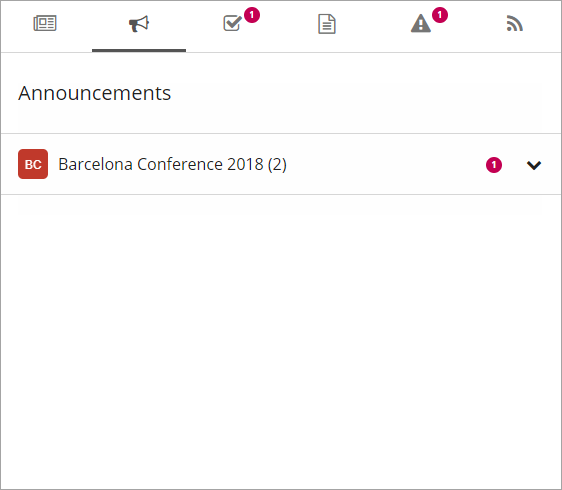

Announcements
===========================

The Announcements Control aggregates the latest non expired announcements that the user has read access to. 

Announcements is often a part of the Notification Panel, for example:

Announcements can also be added as a separate control.

Settings for the control
************************
When the Announcements control is added as a separate control, the following settings are available:

.. image:: announcement-settings.png

The General tab
---------------
+ **Row Limit**: Set the maximum number of announcements to display in the list.
+ **Day Limit**: Set the number of days for how old an announcements is allowed to be, to be shown in the list. This is based on the modified date for the announcement.
+ **View**: Select to view the announcements in a single list, in time order or grouped by site.

The Custom colors tab
----------------------
You should primarily set colors through Theme colors in Omnia Admin (System/Settings/Default colors). If you still would like custom colors for the control, you can set them here.

.. image:: announcements-custom-colors.png
