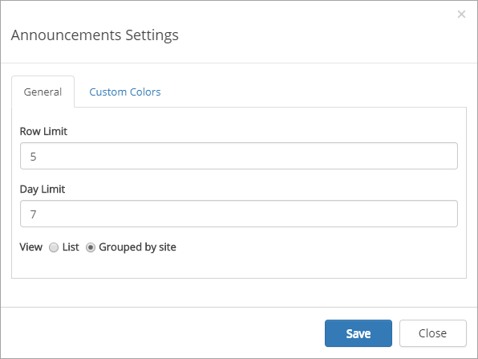
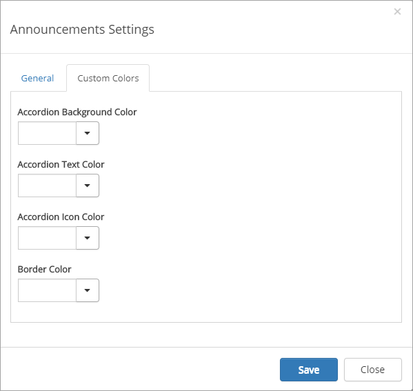

Announcements
===========================

The Announcements Control aggregates the latest non expired announcements that the user has read access to. 

Note! The Announcements Control is based on the search engine in SharePoint. It may take several minutes before an announcement created in a team site is shown on the start page.

Announcements is often a part of the Notification Panel, for example:

.. image:: important-announcements-notification-panel-frame.png

Announcements can also be added as a separate control.

Important announcements, the messages, are created and edited through Omnia Admin, see: :doc:`Important Announcements <OminaDocs/web-content-management/news/important-announcements/index>`

Settings for the control
************************
When the Announcements control is added as a separate control, the following settings are available:

+ **Row Limit**: Set the maximum number of announcements to display in the list.
+ **Day Limit**: Set the number of days for how old an announcements is allowed to be, to be shown in the list. This is based on the modified date for the announcement.
+ **View**: Select to view the announcements in a single list, in time order or grouped by site.
+ **Custom colors**: You should primarily set colors through Theme colors in Omnia Admin (System/Settings/Default colors). If you still would like custom colors for the control, you can set them here.

