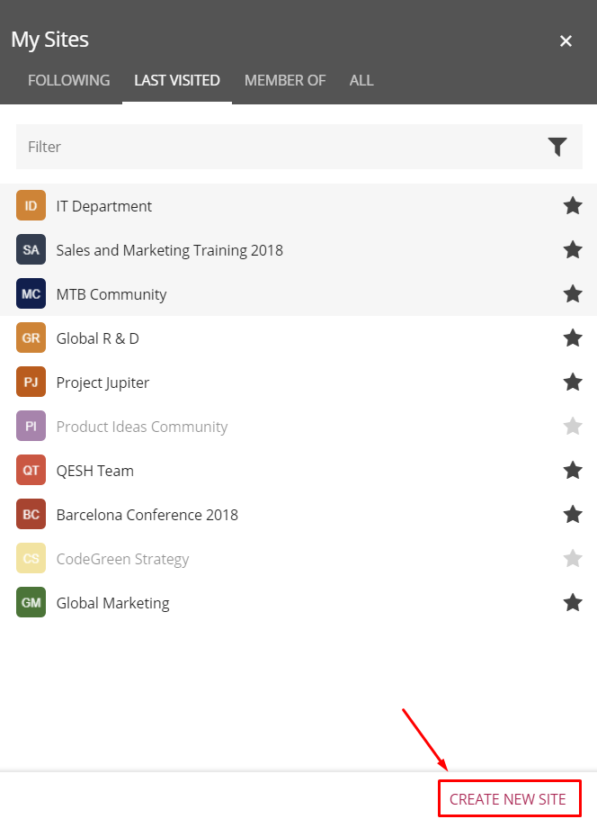

Create Site
====================

The Create Site function is accessibile via the My Sites navigation control.

The Create Site function relies on a number of different parts of Omnia.
In the My Sites navigation control there are settings for the Create Site form.

.. image:: site-creation-settings.png

See this page for more information about these settings: :doc:`My Site </team-collaboration/my-sites/index>`

An important aspect of the create site process is whether the user should be able to create the site with approval or not. That is set per site template, in the Omnia Admin settings.

.. image:: site-create-border.png

See this page for more information: :doc:`Site templates </team-collaboration/site-templates/index>`

In the Create Site process, the following are Omnia additions:

The first step includes a setting for the control Site Directory, if that is used. The option means a user can find the site in Site Directory, even without having access to it, and can see that it exists and can request access to the site. "Make Public in Site Directory" is selected as default. 

.. image:: make-public-in-site-directory.png

For some types of sites, most often for project sites, there can be an Omnia specific step for the user to set properties. Here's an example:

.. image:: create-site-properties.png

Properties for this step is set in the site template. See the heading "The Properties tab" on this page for more information: :doc:`Site templates </team-collaboration/site-templates/index>`

