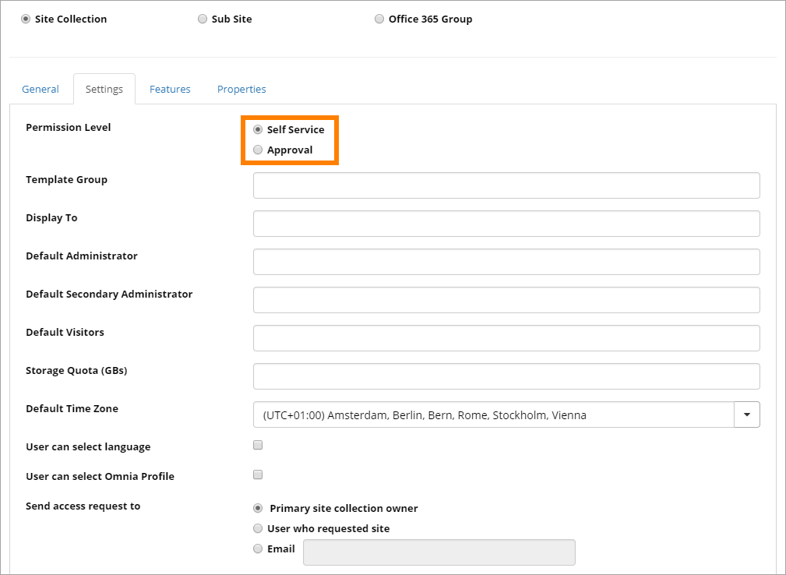

 Create Site
=============

The Create Site process is a combination of Sharepoint standard and some Omnia additions. Here is a description of the Omnia additions.

The settings for My sites has settings for creating new sites, on the "Site Creation Settings" tab.

.. image:: site-creation-settings.png

See this page for more information about these settings: :doc:`My Site </team-collaboration/my-sites/index>`

An important aspect is if a user should be able to create a site without approval, or if approval should be needed. That is set per site template, in the Omnia Admin settings.

See this page for more information: :doc:`Site templates </team-collaboration/site-templates/index>`

In the Create Site process, the following are Omnia additions:

The first step includes a setting for control Site Directory, if that is used. It is selected as default. Users can deselect the option.

.. image:: make-public-in-site-directory.png

For some types of sites, most often for project sites, there can be an Omnia specific step for the user to set properties. Here's an example:

.. image:: create-seite-properties.png

Properties for this step is set in the site template. See this page for more information: 

