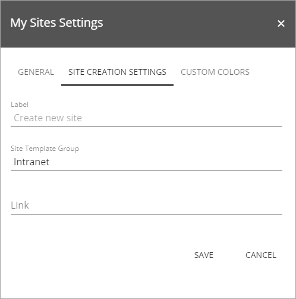
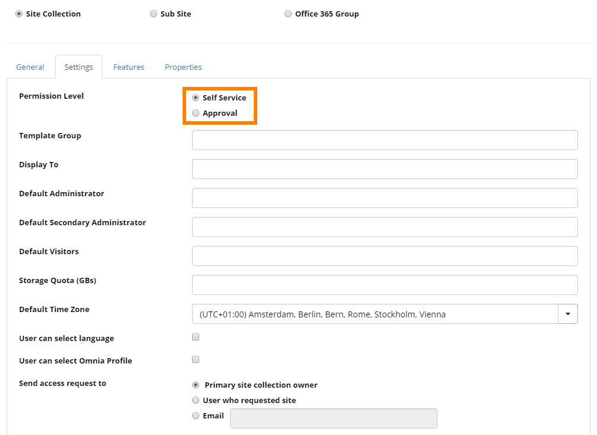

 Create Site
=============

The Create Site process is a combination of Sharepoint standard and some Omnia additions. Here is a description of the Omnia additions.

The settings for My sites has settings for creating new sites, on the "Site Creation Settings" tab.

See this page for more information about these settings: :doc:`My Site </team-collaboration/my-sites/index>`

An important aspect is if a user should be able to create a site without approval, or if approval should be needed. That is set per site template, in the Omnia Admin settings.

See this page for more information for these settings: :doc:`Site templates </team-collaboration/site-templates/index>`

