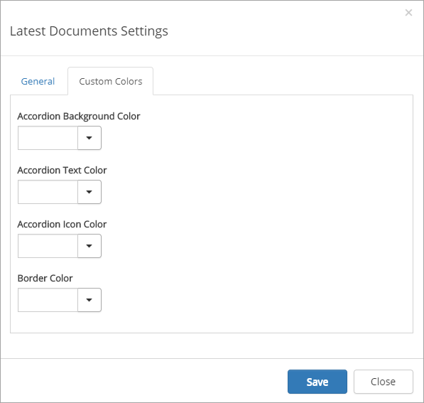

Last Updated Documents
======================

The Latest Documents control (also called Last Updated Documents) aggregates all documents that have been recently modified from all sites the user is following. 

Note! The Latest Documents control is based on the search engine in SharePoint. It may take several minutes before an updated document is shown on the start page.

Latest Documents is often displayed in the Notification Panel, for example:

.. image:: last-updated-documments-notification-panel.png

Latest Documents can also be added as a separate control. 

Settings for the control
*************************
When added as a separate control, the following settings are available for that control:

.. image:: latest-dcouments-settings-new.png

The General tab
----------------
On this tab you can set the following:

+ **Title**: Here you can add a title for the control.
+ **Row Limit**: The maximum number of documents to show in the list.
+ **Day Limit**: The number of days back to get updated documents based on their modified date.
+ **OPen in Client App**: If you would like the document to always be opened in the full version of application (the version installed on the computer, not the web version), check this box.
+ **View**: Select to view the announcements in a single list, in time order or grouped by site.
+ **Icon**: Select how to display the icons for the document type, Sketched (black and white) or Image (color).

The Custom Query tab
---------------------
On this tab, the following settings are available:

.. Image:: custum-query-tab.png

+ **Exclude File Types**: Use this field if certin file types should be displayed in the list.
+ **Query Template**: ???
+ **Title Search Property**: ???
+ **Author Search Property**: ???

The Custom Colors tab
------------------------
You should primarily set colors through Theme colors in Omnia Admin (System/Settings/Default colors). If you still would like custom colors for the control, you can set them using this tab.

