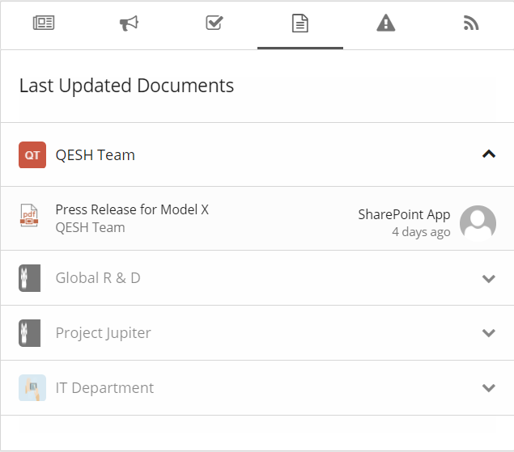
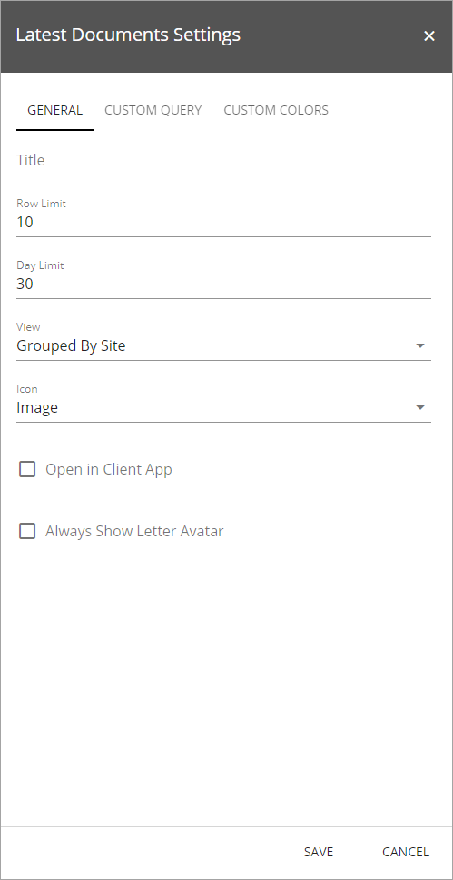
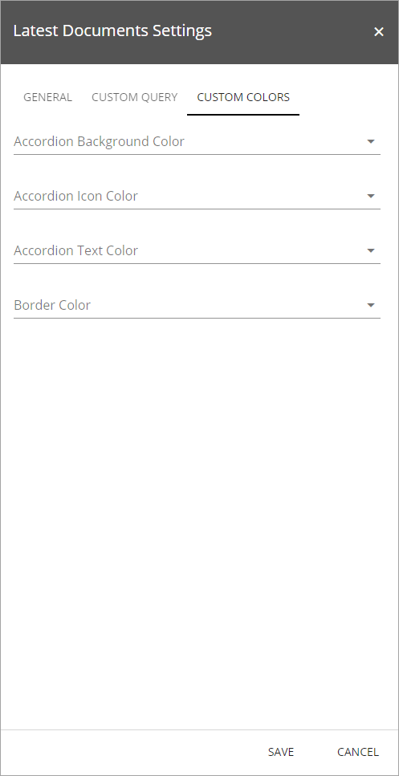

Last Updated Documents
======================

The Last Updated Documents control aggregates all documents that have been recently modified by someone else from all sites the user is following. 

Note! The Last Updated Documents control is based on the search engine in SharePoint. It may take several minutes before an updated document is shown in the control.

Last Updated Documents is often used in the Notification Panel, for example:

It can also be added as a separate control. 

Settings for the control
*************************
When added as a separate control, the following settings are available for that control:

The General tab
----------------
On this tab you can set the following:

+ **Title**: Here you can add a title for the control.
+ **Row Limit**: The maximum number of documents to show in the list.
+ **Day Limit**: The number of days back to get updated documents based on their modified date.
+ **View**: Select to view the announcements in a single list, in time order or grouped by site.
+ **Icon**: Select how to display the icons for the document type, Sketched (black and white) or Image (color).
+ **Open in Client App**: If you would like the document to always be opened in the full version of application (the version installed on the computer, not the online version), check this box.
+ **Always Show Letter Avatar**: If letter avatars should be used, select this option. The red "QT" for Qesh Team in the top image, is an example of a letter avatar.

The Custom Query tab
---------------------
On this tab, the following settings are available:

.. Image:: latest-updated-documents-block-query.png

+ **Exclude File Types**: Use this field if certain file types should not be displayed in the list. 
+ **Query Template**: Search querys for advanced scenarios. One example could be "fileextension:DOCX" to only show docx documents.
+ **Title Search Property**: This property decides which Managed Search Property that should be used for the title field in the list. By default, it is set to the Managed Search Property "Title".
+ **Author Search Property**: This property decides which Managed Search Property that should be used for the modified by field in the list. By default, it is set to the Managed Search Property "Author".

The Custom Colors tab
------------------------
You should primarily set colors through Theme colors in Omnia Admin (System/Settings/Default colors). If you still would like custom colors for the control, you can set them using this tab.

