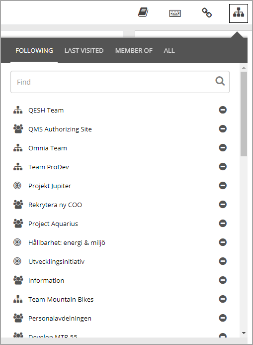
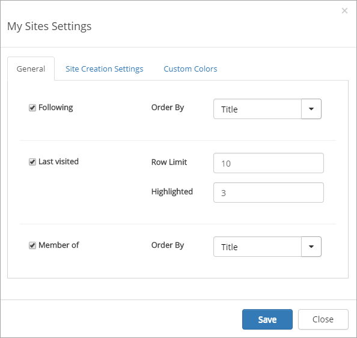
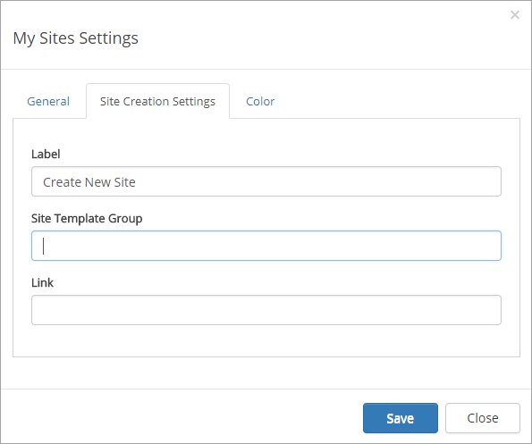
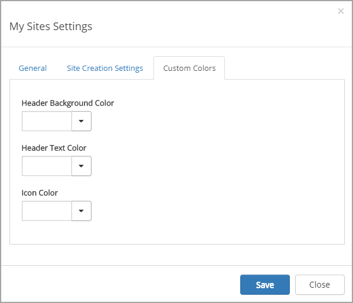
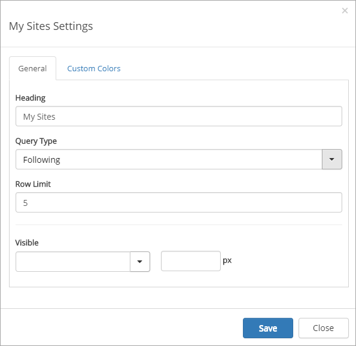

My Sites
===========================

The My sites control makes it possible for the end user to navigate to all sites that the user has access to.

The My sites quick search makes it possible for the end user to find sites, that the user has access to, based on any of the following base templates:

+ Team Site (STS#0)
+ Document Workspace (STS#2)
+ Project Site (PROJECTSITE#O)
+ Blog (BLOG#0)
+ Community Site (COMMUNITY#0)
+ Wiki Site (WIKI#0)

Four tabs can be available in the control:

+ **FOLLOWING**: Lists all sites that the user are following.
+ **LAST VISITED**: Lists the sites the user has visited recently.
+ **MEMBER OF**: Lists all sites the user is member of (has member access to).
+ **ALL**: Can be used to serch for any site, available for the user.

The user can follow a site by clicking the "Follow site" icon, the plus, in the search result or the Last visited or Member of lists. 
The user can stop following a site by clicking the "Stop following site" icon, the minus, in any of the lists. 

Two things will happen when a user follows a site:

+ The site will be available as a quick link in the "Follwing" list in the My sites control.
+ Any conversations in the newsfeed on the site will be available in the user feed on the start page, in the "Following" tab.

Settings for the control
*************************
The following settings is available for the My Sites control:

The General tab
---------------
On the General tab you can select which tabs to display (All is always displayed) and set the following:

+ **Following**: Select order for the site links: Title or Last Visited.
+ **Last visited**: Set the Row Limit, ie the number of site links to be displayed. Select the number of the displayed links to be highlighted (at the top).
+ **Member**: Select order for the site links: Title or Last Visited.

The Site Creation Settings tab
-------------------------------
On this tab you can set the following:

Here you can set the link Label for creating news sites.

The Custom colors tab
-----------------------
You should primarily set colors through Theme colors in Omnia Admin (System/Settings/Default colors). If you still would like custom colors for the control, you can set colors for header and icons.

My Sites Web Part/block
************************
My sites can also be added to any legacy page as a web part and as a block to a Quick Page. The web part/block can be set to display either the "Following" list or the "Latest visited" list from My sites, but the user cannot stop follow sites from the list.

Then the following settings are available:

+ **Heading**: You can change the heading that is displayed for the control.
+ **Query type**: Select to display either "Following" or "Latest visited".
+ **Row Limit**: The maximum number of rows to display before a "Show more" link appears.
+ **Visible** Set when the control will be visible; always, withing a maximum width or within a minimum width.
+ **Custom colors**: You should primarily set colors through Theme colors in Omnia Admin (System/Settings/Default colors). If you still would like custom colors for the control, you can set colors for header and icons on this tab.

My Sites Mobile Navigation
***************************
The my sites control will not be shown when the screen is below a certain width. When the my sites control is hidden, the mobile navigation will be shown. The mobile navigation includes the "Following" list from My sites, but the user cannot stop follow sites from the list.

.. image:: mysites3.png

