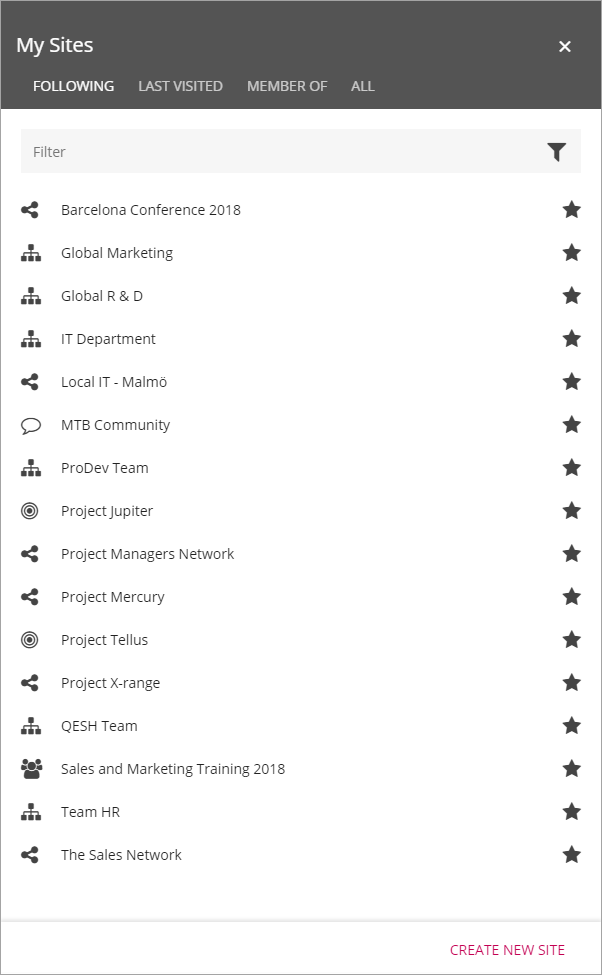
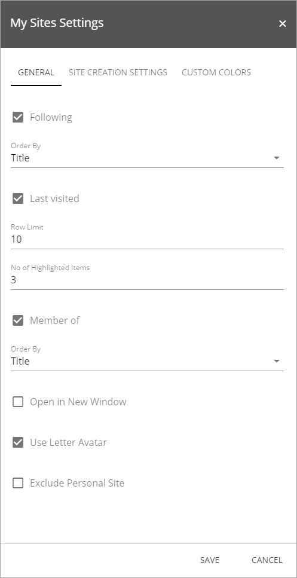
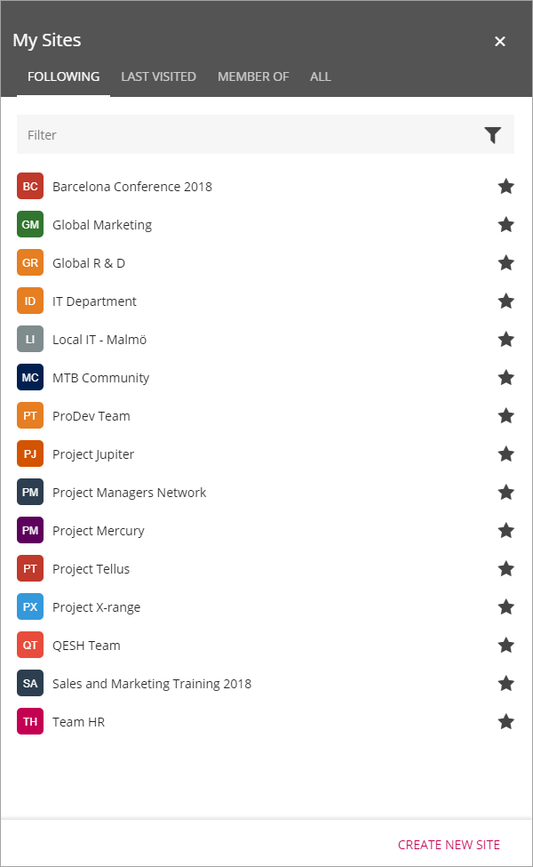
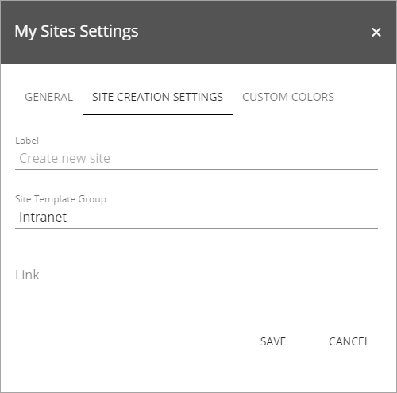
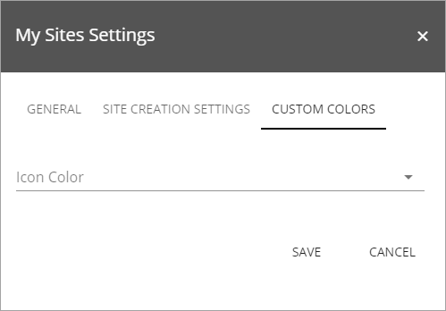
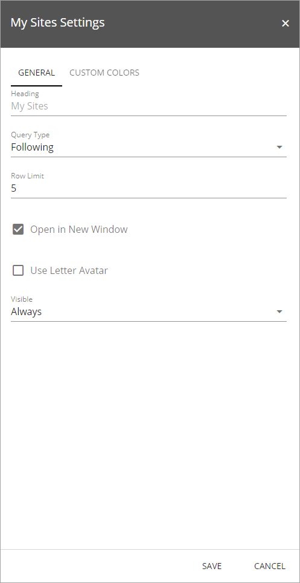
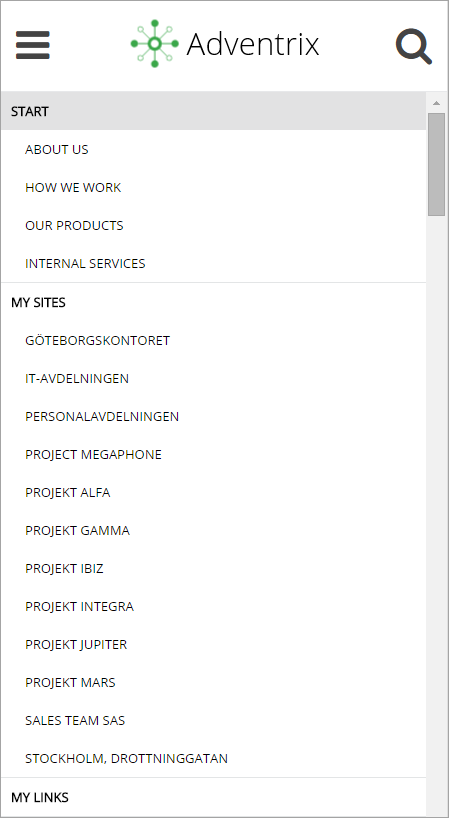

My Sites
===========================

The My Sites control makes it possible for an end user to navigate to all sites that the user has access to.

Four tabs can be configured in the control:

+ **FOLLOWING**: Lists all sites that the user is following.
+ **LAST VISITED**: Lists the sites the user has visited recently.
+ **MEMBER OF**: Lists all sites the user is member of (has member access or owner access to).
+ **ALL**: Can be used to search for any site the user has read access to.

The user can follow or unfollow a site by clicking the star, in the search result or the Last visited or Member of lists. A grey star indicates that the site is not followed and a black or colored star indicates that the user follows the site. 

Two things will happen when a user follows a site:

+ The site will be available as a quick link in the "Following" tab in the My Sites control.
+ Any conversations in the newsfeed on the site will be available in the user feed on the start page.

Settings for the control
*************************
The following settings are available for the My Sites control:

The General tab
---------------
On the General tab you can select which tabs to display (All is always displayed) and set the following:

+ **Following**: Select order for the site links: Title or Last Visited.
+ **Last visited**: Set the Row Limit, ie the number of site links to be displayed. Select the number of the displayed links to be highlighted (at the top).
+ **Member of**: Select order for the site links: Title or Last Visited.
+ **Open in New Window**: Select to open in new window or not when a link (site) is clicked.
+ **Use Letter Avatar**: Select to use Letter Avatars or not. In the image at the top of the page letter avatars are not used. Here's an example when they are:

+ **Exclude Personal Site**: If personal sites should not be shown in the list, select this option. A personal site is the OneDrive site where a user's files as stored.

The Site Creation Settings tab
-------------------------------
On this tab you can set the following:

+ **Label**: Here you can set the label for "Create new site" to something else.
+ **Site Template Group**: Type the name of the template group to be used for creating new sites here, if you use more than one group. The template groups are set up in Omnia Admin when creating or editing site templates.
+ **Link**: If a custom form has been created for the Create Site function, the url to the form should be put in here.

The Custom colors tab
-----------------------
You should primarily set colors through Theme colors in Omnia Admin (System/Settings/Default colors). If you still would like custom colors for the control, you can set colors for the icons (the star) here.

My Sites Web Part/block
************************
My Sites can also be added to any legacy page as a web part and as a block to a Quick Page. The web part/block can be set to display either the "Following" list or the "Last Visited" list from My Sites, but the user cannot stop follow sites from the list.

In this case the following settings are available:

+ **Heading**: You can change the heading that is displayed for the control.
+ **Query type**: Select to display either "Following" or "Last Visited".
+ **Row Limit**: The maximum number of rows to display before a "Show more" link appears.
+ **Open in New Window**: Select to open in new window or not when a link (site) is clicked.
+ **Use Letter Avatar**: Select to use Letter Avatars or not. See above for examples. In the image at the top of the page letter avatars are not used. The third image is an example when avatars are on.
+ **Visible** Set when the control will be visible; always, withing a maximum width or within a minimum width.
+ **Custom colors**: You should primarily set colors through Theme colors in Omnia Admin (System/Settings/Default colors). If you still would like custom colors for the control, you can set colors on this tab.

.. image:: my-sites-block-color.png

My Sites Mobile Navigation
***************************
The My Sites control will not be shown when the screen is below a certain width. When the My Sites control is hidden, the mobile navigation will be shown. The mobile navigation includes the "Following" list from My Sites, but the user cannot stop follow sites from the list.

