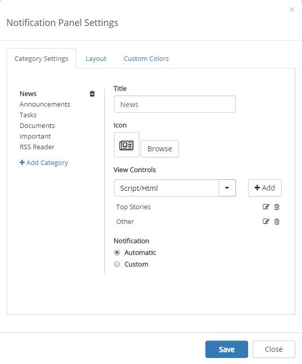

 
My Tasks
########
The My Tasks Control aggregates all tasks that have been assigned to the current user from all team sites. 

**Note!** The My Tasks Control is based on the search engine in SharePoint. It may take several minutes before a task assigned to the current user in a team site is shown on the start page.

All sites with tasks assigned to the user is displayed in a list, with the number of tasks assigned in each site. 

The My taskslist is often part of the Notification panel but can also be added as a separate control, as a web part on a legacy page, or a block on a Quick Page.

My Tasks list in Notification Panel
***********************************
Here's an example of a My Tasks list in Notification Panel:

The user can then click a site to see more information about the tasks there, for example:

-Pic-

Settings is in this case made through the Notification Panel, see below.

My Tasks as a separate control
******************************
You can place the My Tasks control as a web part on any legacy page, or as a block on a Quick Page.

Here's an example when My Tasks is used on a Quick Page:

-Pic-

Prerequisites
*************
What do describe here?

Omnia Admin settings
********************
There are no settings in Omnia Admin för My Tasks.

Settings in the Notification Panel
**********************************
If My Tasks is set up as a part of the Notification Panel, the following settings are available:

-Pic-

???More text???

Settings for the control
************************
When using My Tasks as a separate control, the following settings are avilable:

-Pic-

- **Row Limit**: The maximum number of tasks to show in the list.
- **Day Limit**: (No longer used).
- **Custom colors** You should primarily set colors through Theme colors in Omnia Admin (System/Settings/Default colors). If you still would like custom colors for the control, you can set them using this tab.
