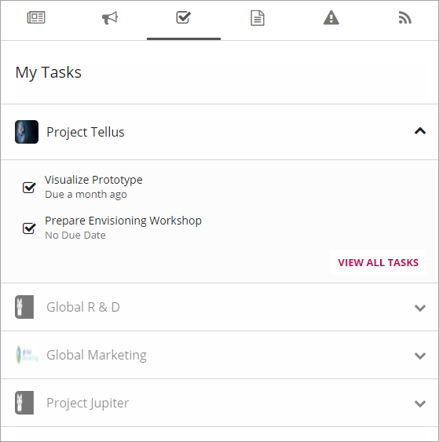
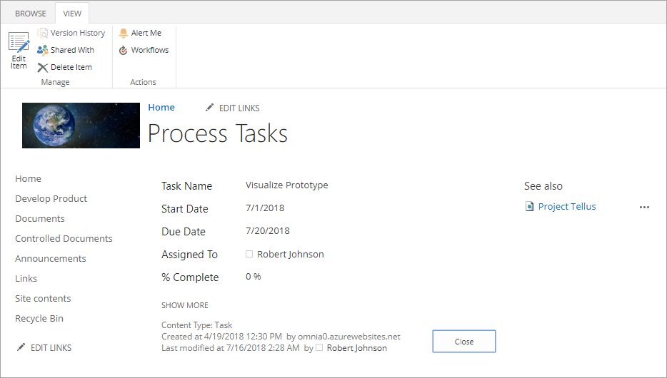
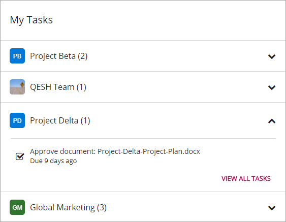
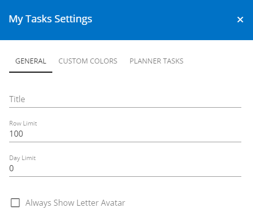
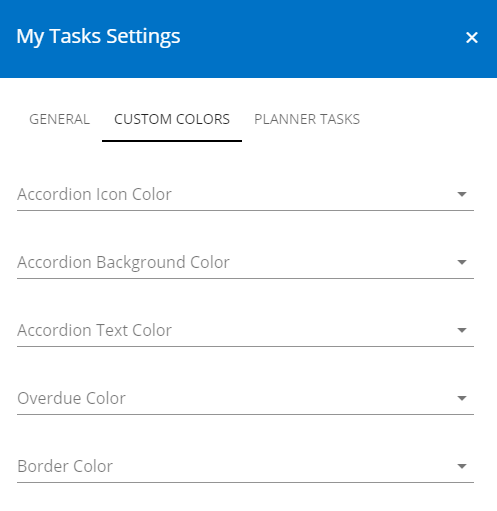

My Tasks
========
The My Tasks control aggregates all tasks that have been assigned to the current user. 

**Note!**
The My Tasks control is based on the search engine in SharePoint. It may take several minutes before a task assigned to the current user in a team site is shown on the start page.

(The My Tasks control also supports aggregation of Tasks from Planner in Microsoft 365. This feature requires some additional configuration in the tenant. Please consult your local Omnia contact.)

All sites with tasks assigned to the user is displayed in a list, with the number of tasks assigned in each site.

The My tasks list is often part of the Notification panel but can also be added as a separate control, as a web part on a legacy page, or a block on a Quick Page.

My Tasks list in Notification panel
***********************************
Here's an example of a My Tasks list in the Notification Panel:

The user can click on a task to get more information, for example:

Settings for the control are in this case handled in the Notification Panel, see :doc:`Notification Panel </my-workplace/notification-panel/index>`

My Tasks as a separate control
******************************
You can place the My Tasks control as a web part on any legacy page, or as a block on a Quick Page.

Here's an example when My Tasks is used on a Quick Page:

Settings for the control
************************
The following settings are available:

+ **Row Limit**: The maximum number of tasks to show in the list.
+ **Day Limit**: How many days forward in time to show assigned tasks. 0 = no limit.
+ **Always Show Letter Avatar**: If a letter avatar should always be shown instead of site image.

+ **Custom colors**: You should primarily set colors through Theme colors in Omnia Admin (System/Settings/Default colors). If you still would like custom colors for the control, you can set them using this tab.

+ **Planner Tasks**: This option is only available if Azure AD Services has been enabled. Check the box "Enable Planner Tasks" to include tasks from planner in the My Tasks rollup.