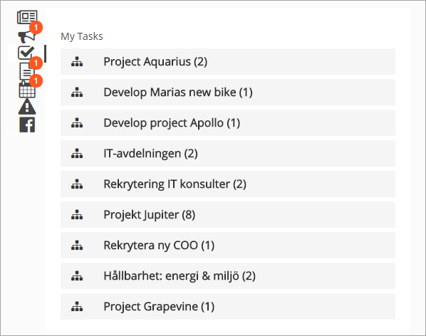
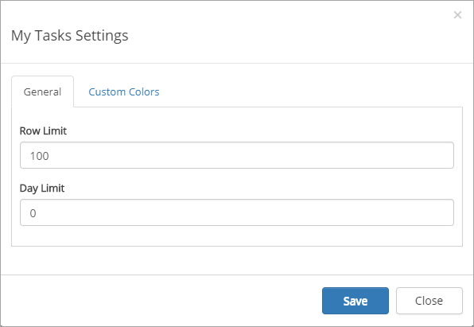
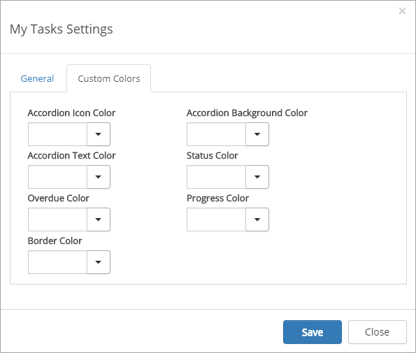

My Tasks
========
The My Tasks Control aggregates all tasks that have been assigned to the current user from all team sites. 

**Note!**
The My Tasks Control is based on the search engine in SharePoint. It may take several minutes before a task assigned to the current user in a team site is shown on the start page.

All sites with tasks assigned to the user is displayed in a list, with the number of tasks assigned in each site.

The My taskslist is often part of the Notification panel but can also be added as a separate control, as a web part on a legacy page, or a block on a Quick Page.

My Tasks list in Notification panel
***********************************
Here's an example of a My Tasks list in Notification Panel:

The user can then click a site to see more information about the tasks there, for example:

.. image:  mytasks-clicked.png

Settings for the control are in this case handled through the notification panel, see: The Notification Panel (link)

My Tasks as a separate control
******************************
You can place the My Tasks control as a web part on any legacy page, or as a block on a Quick Page.

Here's an example when My Tasks is used on a Quick Page:

.. image:: my-tasks-block.png

Settings for the control
************************
The following settings are available:

+ **Row Limit**: The maximum number of tasks to show in the list.
+ **Day Limit**: (No longer used).
+ **Custom colors**: You should primarily set colors through Theme colors in Omnia Admin (System/Settings/Default colors). If you still would like custom colors for the control, you can set them using this tab.

