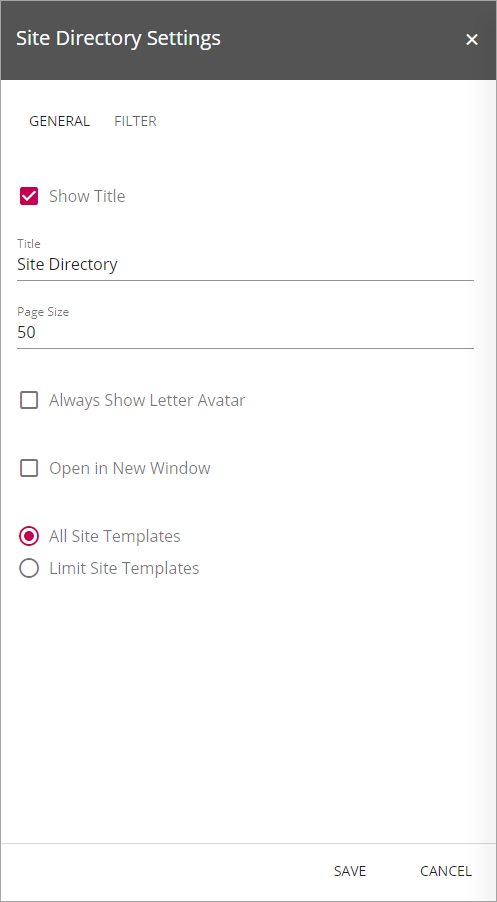
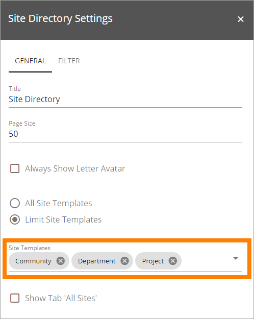
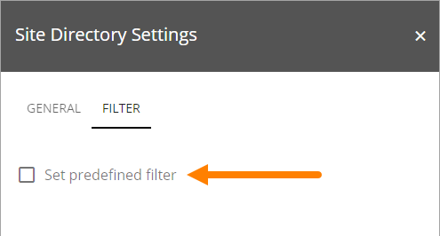
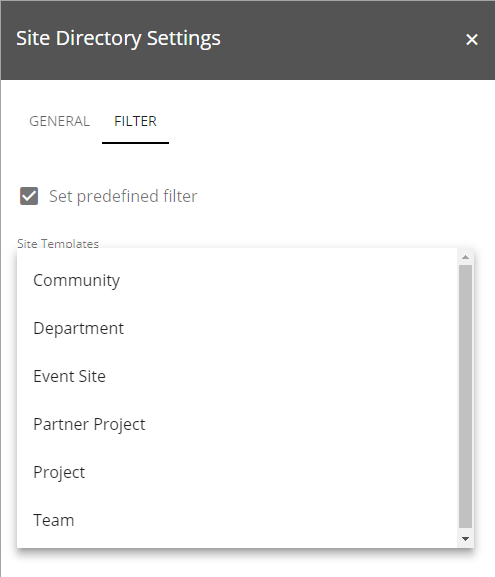
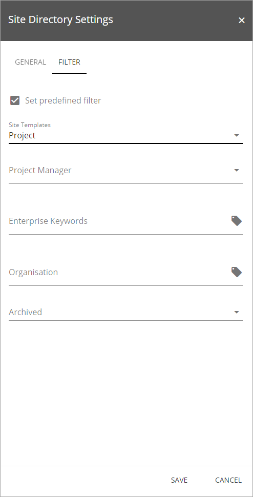
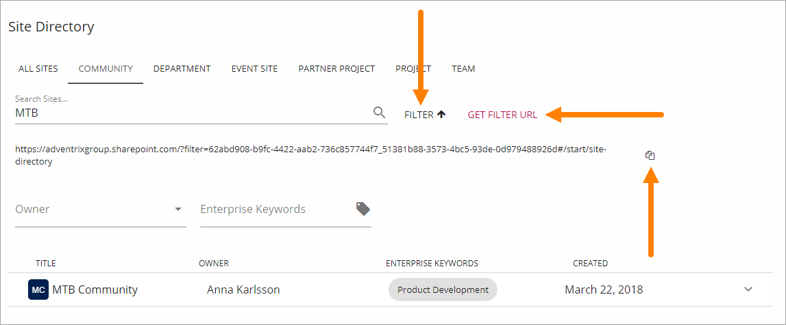

Site Directory
===========================

.. toctree::
   :titlesonly:

   setup/index

A Site Directory normally lists all sites the user has some sort of access to, of the site types the Site Directory is set to show.

This is an important difference to the My sites list, where one list displays all sites the user follows, and another list displays all sites the user are a member of.

An owner of a site can decide to show the site in the Site Directory even for users that has no access, using the setting "Make public in Site Directory", available in "Team Site Quick Edit".

Office 365 team sites that are created with Omnia site templates are also shown in the list.

The user can view the list for all sites or for a certain type of site (a "type" is all sites created from a certain site template). 

.. image:: sitedirectory-new.png

The user can search for sites using the site title.

.. image:: site-directory-search.png

The user can follow or unfollow a site by opening the small menu to the right:

.. image:: site-directory-follow.png

In the panel opened by this menu additional information about the site can be shown, for example: 

.. image:: site-directory-properties2.png

The properties, that can be shown here, are set for the site template, except "Title" and "Created" which is always used, and displayed as headings in the list.
See this description for more information about site template properties:
:doc:`Site Templates </team-collaboration/site-templates/index>`

To implement a Site Directory, note the following:

+   The Omnia features "Omnia Site Directory" and "Omnia Site Directory Web Parts" must be active.
+   The Site Directory can be added as a web part to a standard Sharepoint site or as a block to a Quick Page.
+   The web part/block can be added to any web part zone/area, but note that the Site Directory requires some space.

Settings for the control
************************
The following settings are available for the control:

The General tab
-----------------
Here you can set the following:

+ **Show Title**: Decide if a Title should be shown or not. Default = Shown (selected).
+ **Title**: If the Title is shown: Add the title here.
+ **Page Size**: Set the number of list rows that should be displayed on each page.
+ **Always Show Letter Avatars**: If letter avatars should be shown, select this option. (The image at the top shows letter avatars.)
+ **Open in New Window**: Select this option if trhe site should be opened in a new window when a user clicks a link in the list. Default = opened in the same window.
+ **All Site Templates**: If it should be possible to show all site types in the list, check this box (default).
+ **Limit Site Templates**: If just some site types should be shown in the Site Directory, check this box and select all site types to show from the list. Here's an example with three site types selected:

+ **Show Tab 'All Sites'**: When you have selected "Limit Site Templates" you can select to show the "All Sites" tab or not - which in this case displays all sites of the chosen types.

The Filter tab
------------------
Use this tab to set the scope for the directory, for example to create a projects only directory. There are a number of predefined filters you can choose from.

To choose a predefined filter:

1. Select "Set predefined filter".

2. Select filter from the list.

For some filters you can set additional details, for example to only display projects managed by a certain Project Manager, or just display archived projects.

Tip! Users can create filters to share with others. When a user has searched the directory he or she can click "Filter" and then "Get Filter URL" to display the URL for the search resultat. The Url can then be copied and pasted for example into an e-mail.

