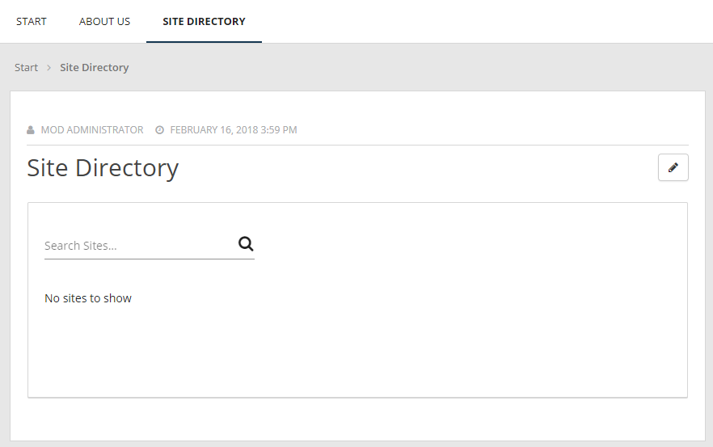

Setup Site Directory
=========================

1. Go to Omnia Admin > Features.
2. Activate the tenant scoped feature “Omnia Site Directory”.
3. (If you want to add support for the Site Directory legacy web part, go to Omnia Admin > Features and activate the site collection scoped feature “Omnia Site Directory Web Part”.)
4. Go to the start page of the main publishing site and select Manage Content.
5. Add a new page below Start called “Site Directory” using the layout “Page no left navigation”.
6. Switch to page layout mode and add the block “Site Directory” below the page Content.
7. Publish the page.

