Site Templates
===========================

.. toctree::
   :titlesonly:

   setup/index

There are two different ways of implementing new site templates in Omnia:

1. Implement through code (normally done by a developer). 

2. Add/edit templates in the Site Templates user interface in Omnia Admin.

The first option does not necessarily rule out the second. A possible, and rather common scenario, is that a developer implements a number of templates that a administrator then can edit to add some details.

An important difference is that a developer can lock parts of, or the whole site template. A locked template can't be deleted but can be edited, or be cloned to form the base for a new template created here. The News Center template is an example of a developer implemented, locked site template.

When you enter Site Templates, the existing templates are shown, for example:

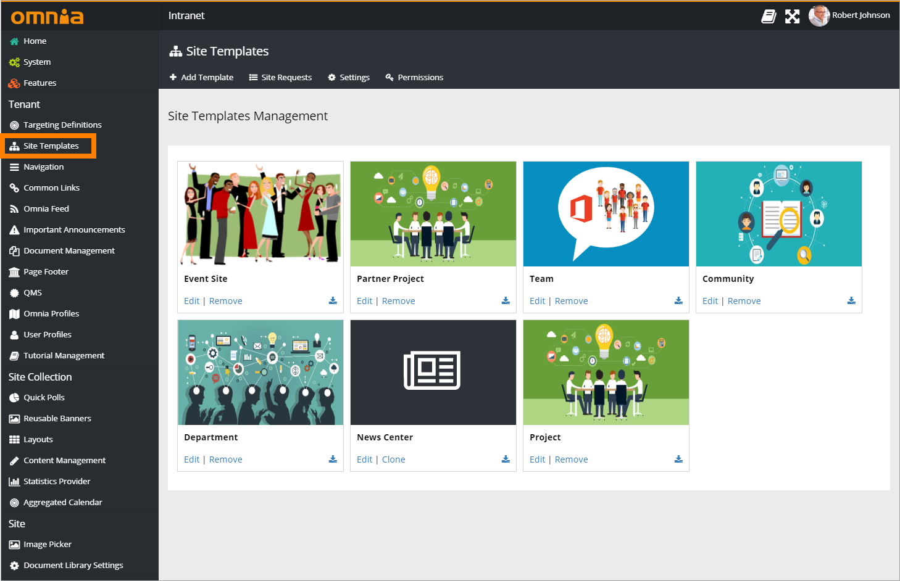

Any existing template can be downloaded as JSON (normally only used by developers).

Create or edit template
***********************
When you create or edit a template, the following fields and options can be used:

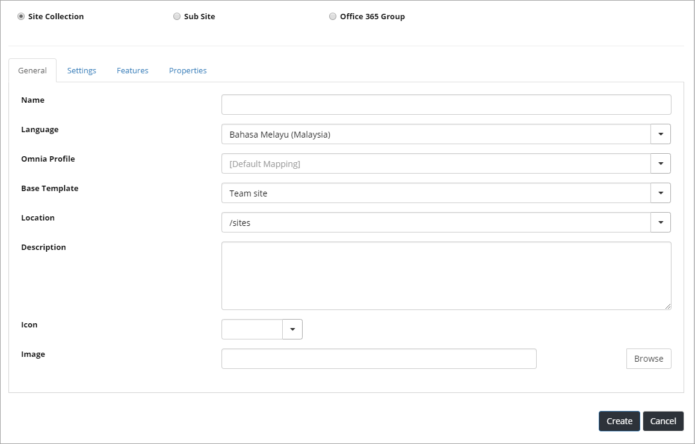

The first step when creating a new template is always to select "Site collection", "Sub site" or "Office 365 Group". For different kinds of Omnia team sites, you should normally select "Site collection". If you would like to create a standard Office 365 group, click that option. In an Office 365 group you get all the standard tools, for example a group mail. An Office 365 group will be available in "My Sites" the same way as the Omnia sites.

The General tab
----------------
The following can be set on this tab:

+ **Name**: The title of the template, shown under the image.
+ **Language**: Select language for the template. On the "Settings" tab you can set if the user is allowed to change language or not. This option is not available for Office 365 Groups, language is in this case handled through Office 365.
+ **Omnia Profile**: An Omnia Profile can be used for this site template, if profiles are set up. See more info about Omnia Profiles here: :doc:`Omnia Profiles </tenant-administration/omnia-profiles/index>`
+ **Base template**: Select template to base the new template on. If in doubt, select "Team site", it's the most commonly used. This option is not available for Office 365 Groups.
+ **Location**: Select location for the sites created from this template. For a site collection site, you can select to create sites from this template in any of the managed paths, normally either /sites or /teams. For sub sites you can select that a site created from this template will be placed as a sub site to the current site, or in a certain site collection (recommended) for example /sites/projects. This option is not available for Office 365 Groups.
+ **Description**: Add important details for the template here, for example when this template should be used.
+ **Icon**: The icon is shown in the My Sites lists for all sites created with this template, and in the Site Directory. Useful to, at a quick glance, see what type of site it is. You can use an icon from the built in set, or choose any image as an icon. Not mandatory. This option is not available for Office 365 Groups.
+ **Image**: You can select any image for the template.

The Settings tab
-----------------
The following can be set on this tab:

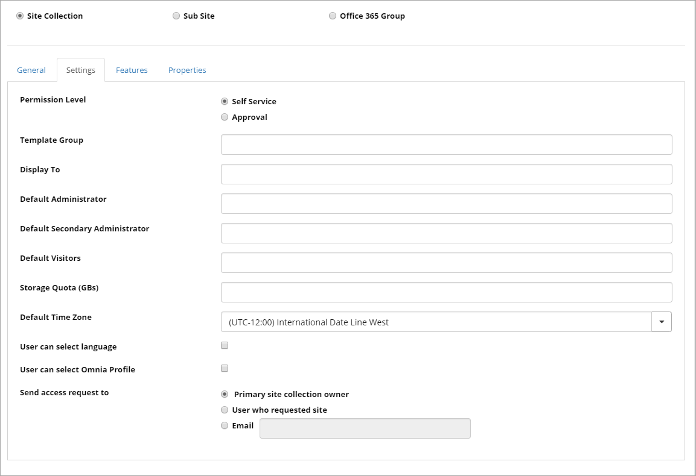

+ **Permission Level**: Selecting "Self Service" means users can create sites from this template themselves. When you select "Approver" you must also add approver(s). This can be a person or a service account. A notification e-mail is sent to the approver(s) when a user requests a site. All requests are placed in the "Site Requests" list, see below. Approval can be useful to for example make sure name standards are used correctly or the correct template is used for the stated purpose.
+ **Template Group**: You can use headings to group templates. This can be used in the settings for the My Sites control, to define which template group should be available when creating or requesting new sites, in a certain publishing site. 
+ **Display To**: This can be used for targeting templates to a specific group of users.
+ **Default Administrator**: If empty, the user creating or requesting the site will automatically become the administrator (Owner) of the site. If a specific group or user should be administrator for all sites created from this template, add that group or user. Not available for sub sites or Office 365 groups.
+ **Default Secondary Administrator**: If empty, the user creating or requesting the site can set default secondary administrator of the site. If a specific group or user should be secondary administrator for all sites created from this template, add that group or user. Not available for sub sites or Office 365 Groups.
+ **Default Visitors**: You can use this to set a default visitor group (read permissions) to all sites created from this template. Let's say it's a template for community pages - then probably all users of the intranet should have read permission to all pages in the site. Not available for Office 365 Groups.
+ **Default member**: This option is available for Office 365 Groups only. If empty, the user creating the site will automatically become the default user (Owner) of the site. If a specific group or user should be default member for all sites created from this template, add that group or user. 
+ **Conversations**: This option is available for Office 365 Groups only. The default option is "Outlook". If "Teams" is selected, a Microsoft Teams group will be created, related to the Office 365 Group. If "Yammer" is selected, a Yammer group will be created related to the Office 365 Group.
+ **Privacy**: This option is available for Office 365 Groups only. An Office 365 can be either public or private. In a public site alla users of the tenant can enter the site, read and edit all information. In a private site only actual members of the site can do that.
+ **Storage Quota (GBs)**: You can use this to set maximum storage in Gb that can be used by a site created from this template.
+ **Default Time Zone**: Select default time zone. Can always be changed by the user when creating or requesting a site.
+ **User can select language**: If the user, when creating or requesting a site, should be able to choose language, select this option. Not available for Office 365 Groups.
+ **User can select Omnia Profile**: If the user should be able to select an Omnia Profile during site creation, select this option.
+ **User can change privacy**: This option is available for Office 365 Groups only. When active, the user creating the group can change privacy. If not active, all Office 365 Groups will have the privacy setting you set here.
+ **Unique Permission**: Only available for sub sites. Check if permission inheritance should not be on for sub sites created from this template.
+ **Send access request to**: Select receiver of access requests. Note that you can use the last option to enter an e-mail to any user of the site, but also note that a user must have owner permission to be able to grant permission to the site.

The Features tab
-----------------
The following is available here:

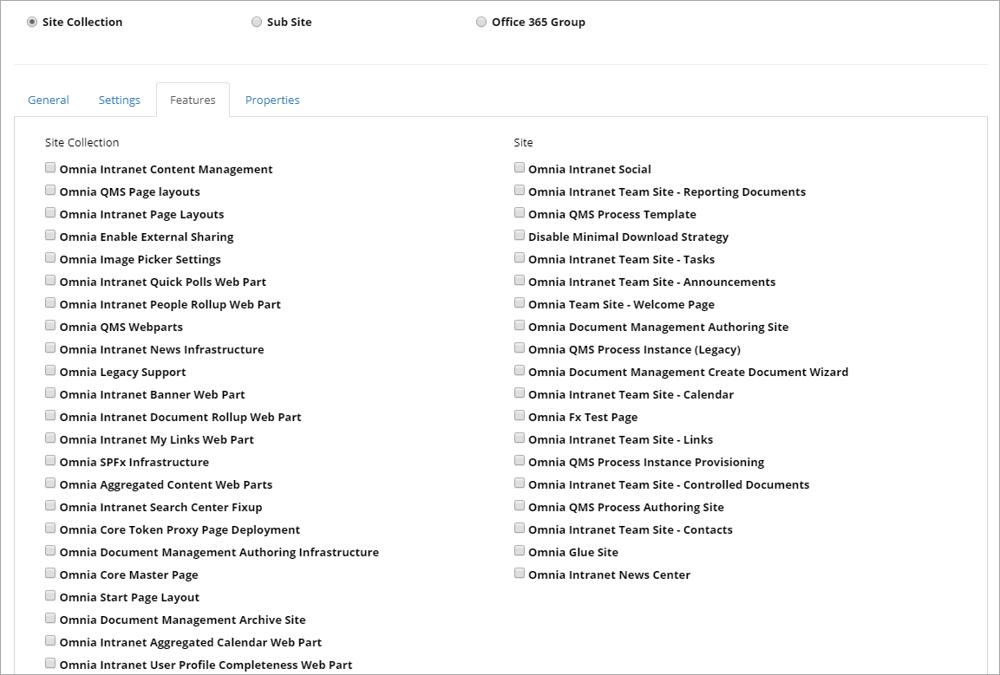

(All features are not shown in the image.)

Select all Omnia features that should be active for sites created from this template.

Note that all features are not available for sub sites or Office 365 Groups.

The Properties tab
-------------------
On this tab you define which site properties that should be used for sites using this
template. This tab is not available for sub sites.

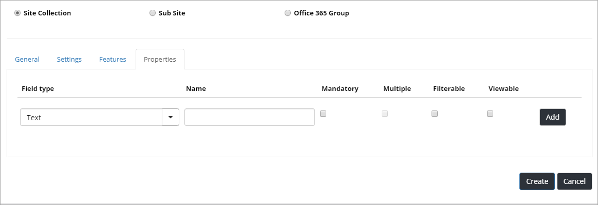

The first step is to select "Field type" in the list. For "Managed metadata" you have to select a term set. For "Enterprise Keywords" no settings can be submitted. Enterprise Keywords are always shared throughout the tenant.

For each property you can set:

+ **Mandatory**: Set mandatory or not.
+ **Multiple**: Set if multiple choices should be allowed.
+ **Filterable**: If the field should be available for filtering in the site directory, select this option.
+ **Viewable**: If information from this field should be displayed in the Site Directory list, select this option. 

If changes for the properties are made in an existing site template, the changes will be pushed to all existing sites created from the template. If there are many sites created from the template, this can take considerable time to execute. 

**Note!** If a properties field is removed from a site template, all data for that field, in all sites created from the template, will be deleted.

Site requests
***************
When "Approval" is selected for any site templates, all requests are placed in this list. 

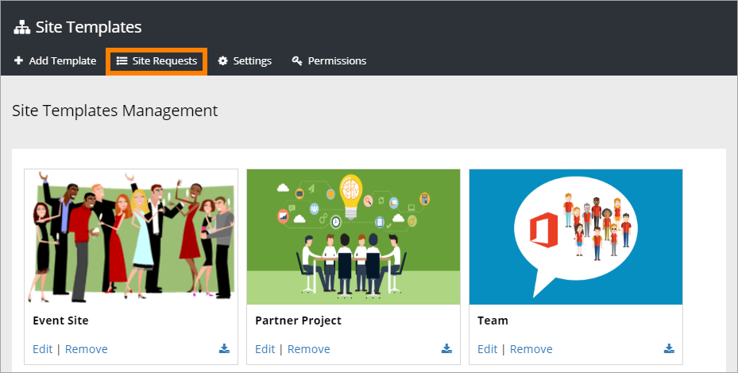

An administrator selects a request from the list, and can see the settings, edit some of them if needed, and approve or reject creation of the site.

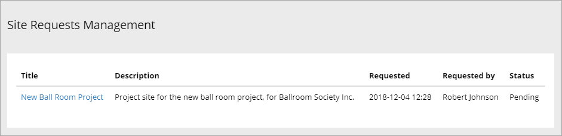

Click a link to browse the settings and properties.  

The process of approval or rejection is done thrugh a number of steps. The last step is to approve or reject the request.

Manage requests - Site information
-----------------------------------
Here site information cen be edited if needed:

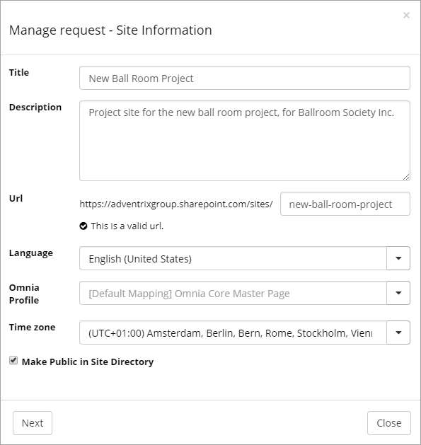

+ **Title**: Te title can be edited here. It could for example be needed i the title of the site does not follow name conventions in your organization, .
+ **Description**: The description can be edited here, if needed.
+ **Url**: The last part of the Url can be edited if needed.
+ **Language**: If the requester has selected the wrong language, change it here.
+ **Omnia Profile**: If profiles are used, you can select another Omnia Profile if needed. You can find more information on Omnia Profiles here: :doc:`Omnia Profiles </tenant-administration/omnia-profiles/index>`
+ **Make Public in Site Directory**: This optiin can be changed here.

Manage requests - Properties
----------------------------
The fields available here depends on how the site template was set up. This is probably a common example for project sites:

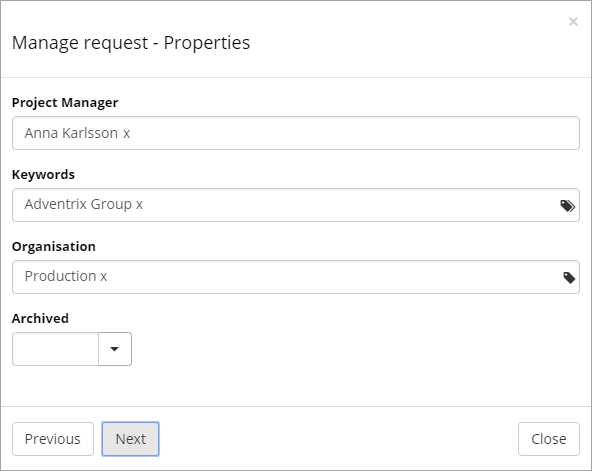

In name fields, users can be removed or added the ususal way, in other fields metadata can be deleted or added from a fixed list. Note that "Arhcived" cen not be empty. It must be set to either Yes (normally) or No.

Manage requests - users
------------------------
Here users can be added or removed:

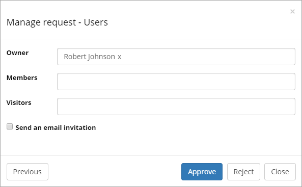

If for example a central administration should be added as owner for all sites, this is the place to do that.

For "Send an email invitation" you can change the requesters choice, if needed.

Here you make the final selection as well - to approve or reject creation of the site. If "Approve" is selected the site is created. If "Reject" is selected, a form is displayed where comments on why the site request was rejected should be entered.

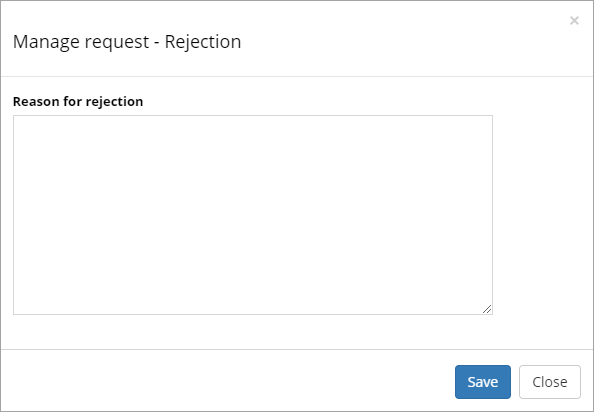

If a site request is rejected, an e-mail is sent to the requester, with the message you entered. A new site request must then be done.

Settings
**********
Use "Settings" to disable dynamic properties for some site templates, if needed.

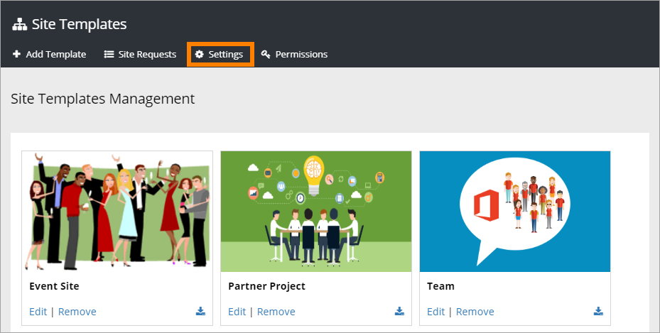

The settings can look something like this:

.. image:: site-template-settings.png

Use the list to add additional sites to disable dynamic properties in. To remove a site from the list, to enable dynamic properties, click the dust bin.

Permissions
************
If additional users should be able to create site templates, use "Permissions" to add them.

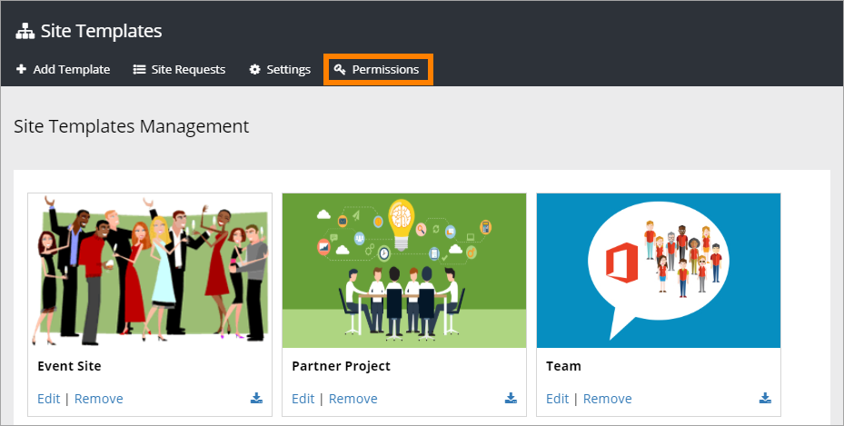

You add or remove users from this list:

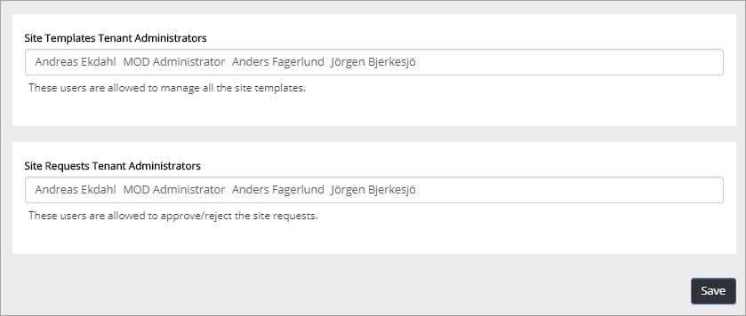
