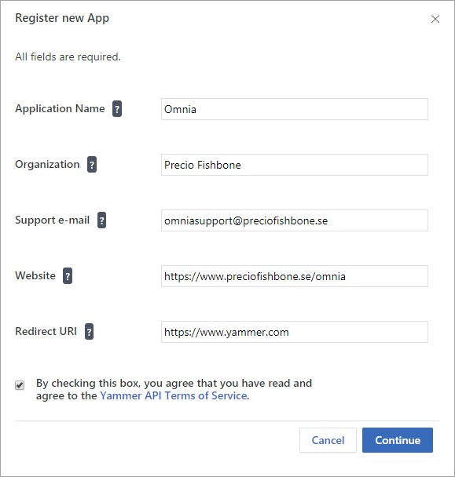

Setup Site Templates
=========================

1. Go to Omnia Admin > Features.
2. Activate the tenant scoped feature “Omnia Site Templates”.

Enable Yammer group provisioning
*********************************
If you would like to use Yammer as the conversations tool in team sites (available for Microsoft 365 groups only) - Yammer group provisioning needs to be enabled in the solution. The following steps needs to be carried out:

1.	Make sure Azure Services is enabled in Omnia Admin.
2.	Login to Yammer with a Network Admin account. (This account will be used by Omnia to provision new Yammer groups.)
3.	Go to Settings > Apps and register a new app.

4.	Note down the Client Id and Client Secret.
5.	Browse to https://www.yammer.com/oauth2/authorize?client_id=[ClientId]&response_type=code&redirect_uri=https://www.yammer.com
6.	Click on Allow to authorize the app.
7.	Copy the Code in the url in the page you get redirected to. (Something like: lirOpPqZXwjTpRXx4ctDA)
8.	Browse to https://www.yammer.com/oauth2/access_token.json?client_id=[ClientId]&client_secret=[ClientSecret]&code=[Code]
9.	Note down the token you receive from the JSON response. (Something like: 11503671-bAjUZJODAyrXENlNKJNA)
10.	Go to Omnia Admin > Settings > Azure AD > Yammer Group.
11.	Read the prerequisites text and make sure your Yammer network is configured accordingly.
12.	Put the token into the Yammer Access Token field.
13.	Check the box “I ensure all prerequisites are configured correctly” and save.

Site templates can now use Yammer as its preferred way of handling conversations within a group.
