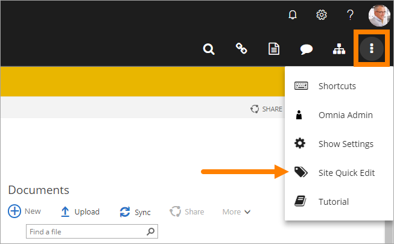
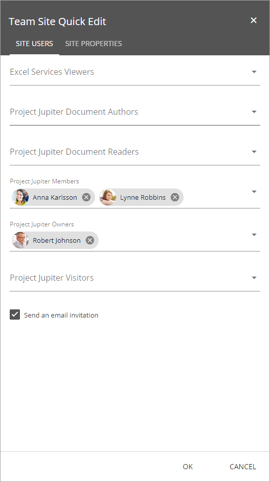
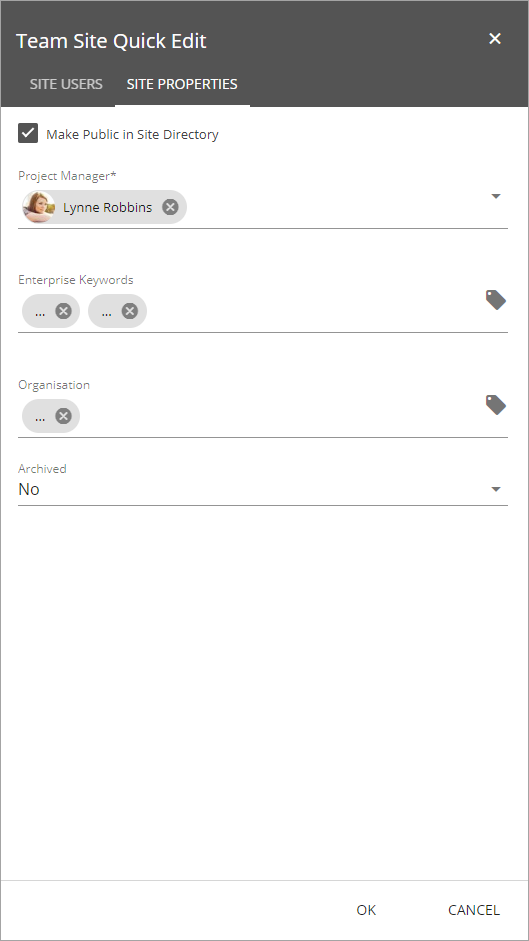

Team Site Quick Edit
===========================

Site Quick edit is available in team sites and similar, for site owners. The purpose is twofold:

+ to be able to add and remove site users in a quick and easy way,
+ to be able to edit the properties for the site.

Which properties (fields) should be avaible is set in the site template for each type of site. That can't be changed here. All sites created from a certain template always has the same property fields.

To access Site Quick Edit, open the menu and click the button:

The first tab is used for adding and removing site users, for example:

Groups for Owners, Members and Visitors are normally present. There can be other groups depending on how the site is set up. (The Document Authors and the Document Reader groups are for example Omnia Document Management groups.)

**Note!** When a user is added to any of the user groups, an e-mail is automatically sent to that user, with a link to the site.

The second tab is used for editing the properties, for example:

Available properties vary depening on how Omnia, and the site, are set up.

There are no settings for the control.
