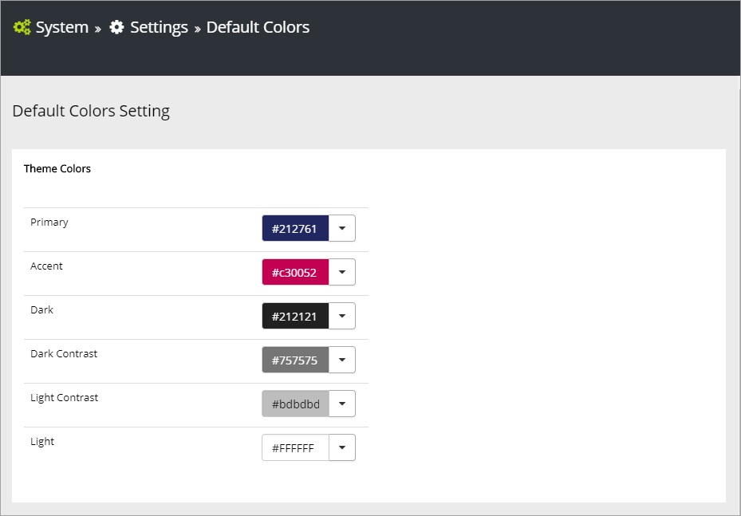
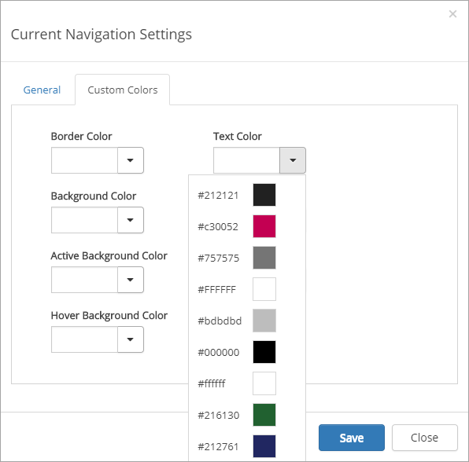

Color Themes
===========================

Set the default colors in Omnia using these options. You find them in Omnia Admin under System/Settings/Default colors.

Theme colors is the primary source for colors. The colors you set here will be applied everywhere in the tenant. "Primary" and "Accent" is the two theme colors that is the most important. The Accent color is used for action links.

If you would like different colors for some controls you can set them there. If you don't set Custom colors for a control, the theme colors will be used.

Under "Custom colors" you can set additional colors if needed. 

.. image:: default-colors-custom.png

All the colors you set here, both Theme colors and Custom colors, will be available in the lists for selecting Custom colors for controls. Here's an example from the settings for Current Navigation.

