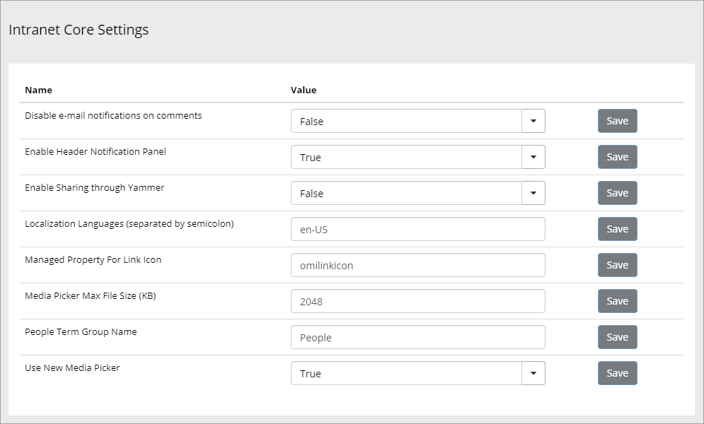
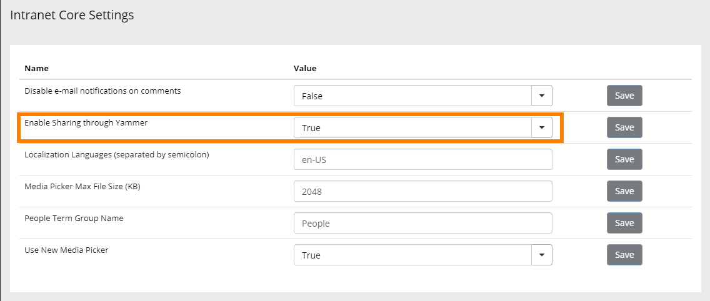
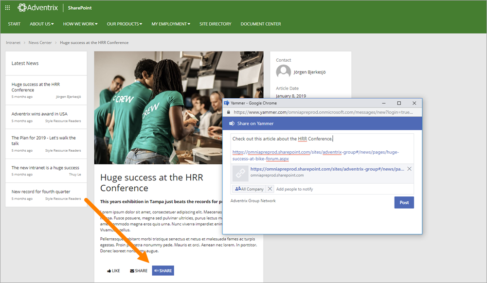
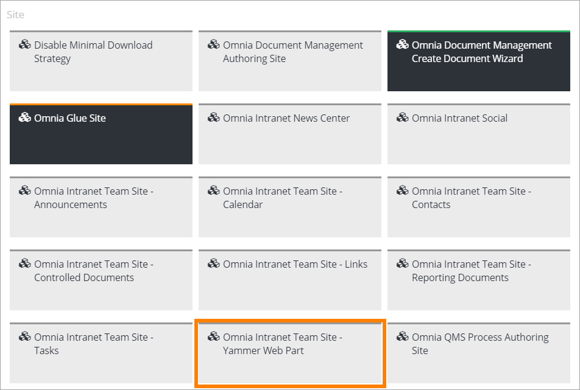

Intranet Core Settings
===========================

The Intranet Core Settings are found under System-Settings-Intranet Core in Omnia Admin.

+ **Disable e-mail notification on comments**: To send and e-mail notification to the page author or not when a user adds a comment.
+ **Enable Header Notification Panel**: To be able to add an icon in the header, for access to the Noticifation Panel, set this option to "True".
+ **Enable Sharing through Yammer**: To activate Yammer Sharing, set this to True. See below for more information.
+ **Localization Languages**: Add all Localization Languages here.
+ **Managed Property for Link Icon**: (A descripttion will be added soon).
+ **Media Picker Max File Size**: The file size entered here triggers the message "The image is too big" when a user uploads a file using the Media Picker.
+ **People Term Group Name**: As it says.
+ **Use New Media Picker**: Select to use the new Media Picker or the older version that is called "Image Picker".

When Header Notification Panel is active (True), an icon is placed in the Header:

.. image:: notification-panel-icon.png

Setup sharing with Yammer
***************************
You can setup the share feature on a page to allow sharing to Yammer. Do the following:

1. Go to Intranet Core Settings.
2. Set "Enable Sharing through Yammer" to "True" and save the change.

Now a new button will appear on pages that makes it possible to create a new post in Yammer.

A new site scoped feature also becomes available, that makes it possible to deploy the new Modern Web Part to the welcome page of a modern team site. 

