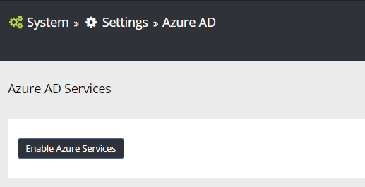
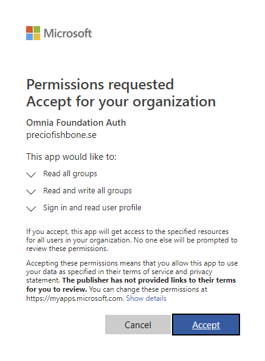
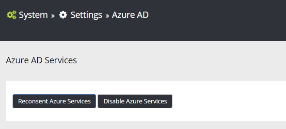

Office 365 Integration
========================

SPFx Integration
-----------------

To be able to run Omnia in modern pages (SPFx), the Omnia SPFx Integration app needs to be installed in the app catalog and a specific feature needs to be activated on site collection level.

Follow these steps to enable Omnia in modern pages.

1. Go to Omnia Admin > System and note down the Omnia Foundation Url.
2. Send an e-mail to your support contact for Omnia and request the correct "Omnia SPFx Integration" app file for the Omnia cloud you are connected to.
3. The support contact will send you an e-mail with an sppkg file attached.
4. Go to SharePoint Admin Center > Apps > App Catalog.
5. Go to Apps for SharePoint and upload the sppkg file. Make sure to check the box "Make this solution available to all sites in the organization" and deploy.
6. Now you are ready to deploy the new header. Go to Omnia Admin > Features.
7. Activate the tenant scoped feature "Omnia Modern Header". Once this feature is activated, all sites will by default not support legacy Omnia components anymore (which is still the majority of all components in Omnia except the new header). Activate the site collection feature "Omnia Legacy Support Site" for all sites that need to run legacy Omnia components. (Some Omnia features will make sure to do this automatically).
8. Upgrade the site collection scoped feature “Omnia Core Master Page” on all site collections that needs upgrade.
9. Upgrade the site scoped feature “Omnia Glue Site” on all site collections that needs upgrade.
10. Activate the site collection feature "Omnia SPFx Infrastructure" on all sites where you want to enable support for the new header in modern pages and lists. (Also remember to add this feature to any Site Template that you have that will create modern team sites).

(In order for the new Omnia Block web part to be available, you need to upgrade to the Omnia SPFx Integration app with version 1.1.0.0)

Azure AD Services
-----------------

To be able to utilize features outside SharePoint, such as Planner, Teams and Yammer, an Azure AD app needs to be enabled in the solution.

To enable Azure Services you need to be logged in as a Global Administrator in Office 365.

1. Go to Omnia Admin > System > Settings > Azure AD.
2. Click on Enable Azure Services.
3. You will be redirected to a page where you need to accept that Omnia can perform certain activities in your tenant.

If you want to disable the Azure AD Services integration, you can go back to Omnia Admin > System > Settings > Azure AD and click on the button "Disable Azure Services".

