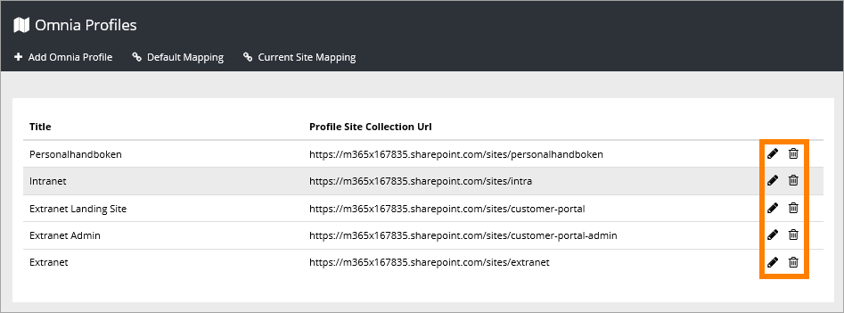
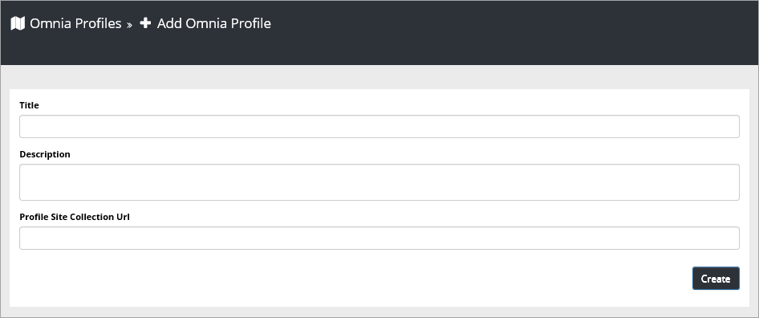

Omnia Profiles
===========================

You can use this Omnia Adm settings to split a tenant into different profiles. Profiles can be used to create different publishing portals for different needs, for example Intranet and Extranet or profiles for different companies sharing the same tenant.

.. image:: omnia-profiles.png

The list displays all current profiles. Use the icons to edit or delete a profile.

You can add new profiles here, set default mapping and set current site mapping.

Add a new profile
******************
When you create a new profile you use the following fields:

+ **Title**: A name for the profile.
+ **Description**: A description, if needed.
+ **Profile Site Collection URL**: The URL to the main site for this profile.

Default Mapping
******************
Set the Default Mapping here. When a new team site is created it will inherit the Default Mapping and for example display the top navigation from that Site Collection. 

.. image:: default-site-mapping.png

To map the new team site to another profile, use "Current Site Mapping".

Current Site Mapping
*********************
Use this setting to map the current site to any profile you have created.

.. image:: current-site-mapping.png

If the default mapping is active, as it is in the image above, you must always first brake the inheritance, and then select another profile.

