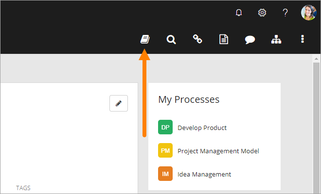
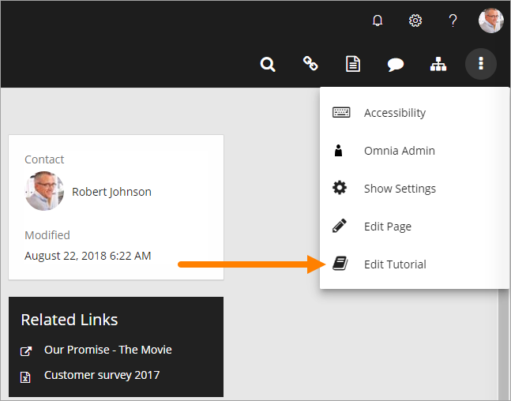
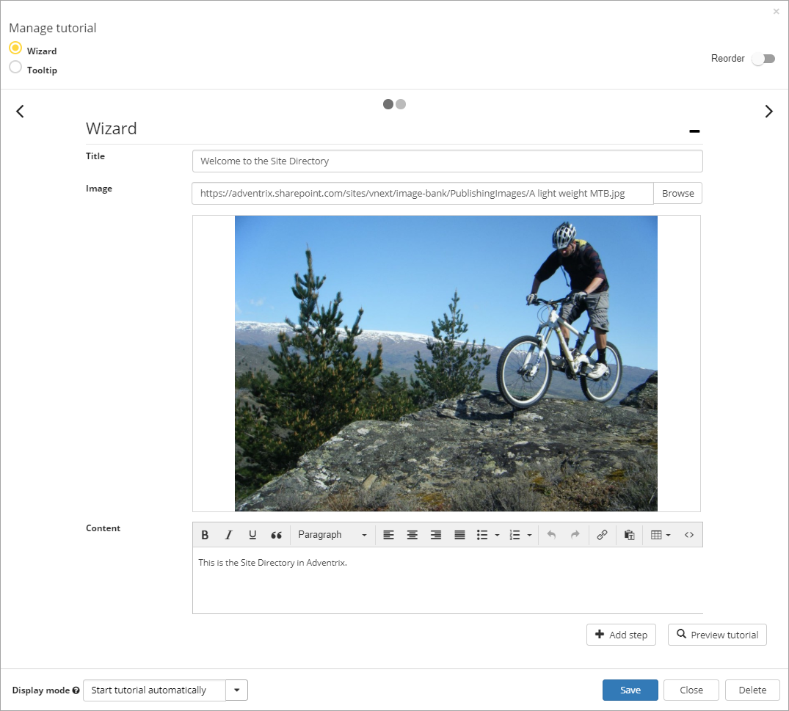
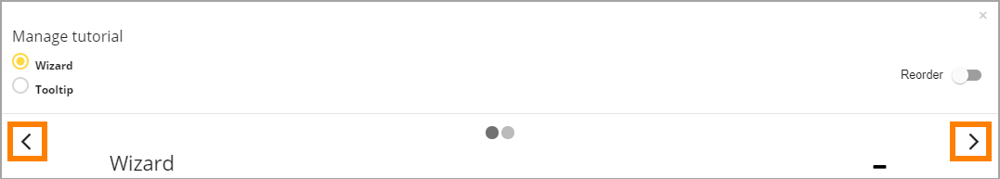
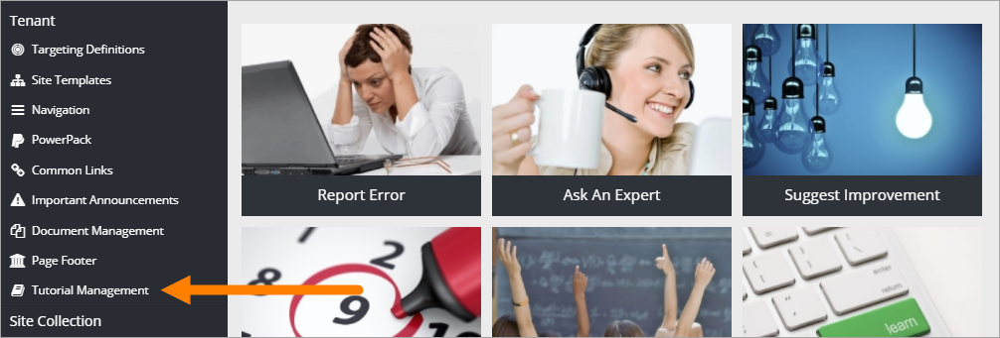

Tutorial Management
===========================

.. toctree::
   :titlesonly:

   setup/index

An editor creates and edits tutorials for selected publishing pages. An administrator can manage tutorials for the tenant.

A user's options
*******************
A tutorial can be set up to start automatically when a page is opened (see more info below). But if it's not, users select the "Tutorial" icon in the heading:

Editors options
********************
An editor must have Edit Permissions to a page to be able to work with tutorials there. A tutorial is always created for a specific page, the first step for the editor is therefore to go the page.

The tutorial options are accessed by selecting "Edit Tutorial" in the Actions Menu.

The following options are then available (example with an existing Wizard tutorial):

When creating a tutorial, there can be either a Wizard or a Tooltip tutorial available for the page, so the first step is always to select this. If there is one type of tutorial and you select the other type, the tutorial will be saved as a new version, replacing the former.

.. image:: wizard-or-tooltip.png

Common options
----------------
The following options are available for both Wizard and Tooltip tutorials.

Use these icons to go to another Tutorial step:

The number of dots in the middle indicates the number of steps, in the example above, two.

The following fields and options are available for both types of tutorials:

+ **Title**: Add/edit the title for the tutorial step.
+ **Content**: Use this field to add a description. Note the bar with layout options.
+ **Add step**: Use the button to add a new tutorial step after the last step. 
+ **Reorder**: Use this button to change the order in wich tutorials steps are shown (handy if you have added a step that should go before any of the existing steps.) 
+ **Preview tutorial**: When you want to check how the tutorial will look for users, select this button. 
+ **Display mode**: Use the list here to decide how users should acccess the tutorial - "Start tutorial automatically", "Show tooltip alert for new version" or "User starts tutorial manually". 
+ **Save**: Use this button to save your work. Recommendation - save every time you are finished working on a tutorial step, before going to the next step. 
+ **Delete**: This button is used to delete the tutorial for the page. Note! The whole tutorial is deleted, just not the tutorial step. Also note that a tutorial can be deleted in the Tutorial Management in Omnia Admin, as well, see below. 

Extra option for a Wizard tutorial
-----------------------------------
When working on a Wizard tutorial, you can add an image to a tutorial step (see example above). You can add/replace an image by clicking "Browse". You can use any image from any Image Bank you have access to, and even upload an image, if needed. 

Extra options for a Tooltip tutorial
--------------------------------------
The create a tooltip step, do the following:

1. Click the "Add step" button.
2. Click on a position on the page to add a tooltip for.
3. Add a Title and a description (in the Content field).

In the "Selector" field you can see an indication of where the Tooltip step will be placed.

.. image:: selector.png

Administrator options
**********************
The administrator options are found in Omnia Admin:

All tutorials created in the tenant are displayed in a list, for example:

.. image:: all-tutorials.png

+ **Page**: Use the link to the page to go there and check out the tutorial.
+ **Created by**: Name of the editor that has created the tutorial is shown here.
+ **Created date**: Date for when the tutorial was initially created is shown here.
+ **Modified by**: Name of the editor that made the latest changes is shown in this column.
+ **Modified date**: Date for the latest version of the tutorial is shown here.
+ **Delete**: If the tutorial on this page should now longer be available, you can click this button. A new tutorial can then be created if and when the need arises. 

Permissions for Tutorial management
------------------------------------
If additional users should be able to manage tutorials, use the "Permissions" option to add or delete users.

.. image:: tutorials-permission.png

