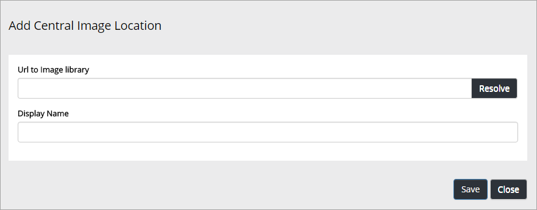

Central Image Locations
===========================

Set central image locations for the editors to use. Normally the editors can't upload images to a Central Image Location, or set image renditions, only use images from there. You find the settings in Omnia Adm.

One or more locations can be set up in the list.

.. image:: imagebank_list.png

To add a new Central Image Location, click "Add" and use the following settings:

+ **Url to Image Library**: Type or paste the Url here.
+ **Display Name**: Add the name to be shown in the lists.
