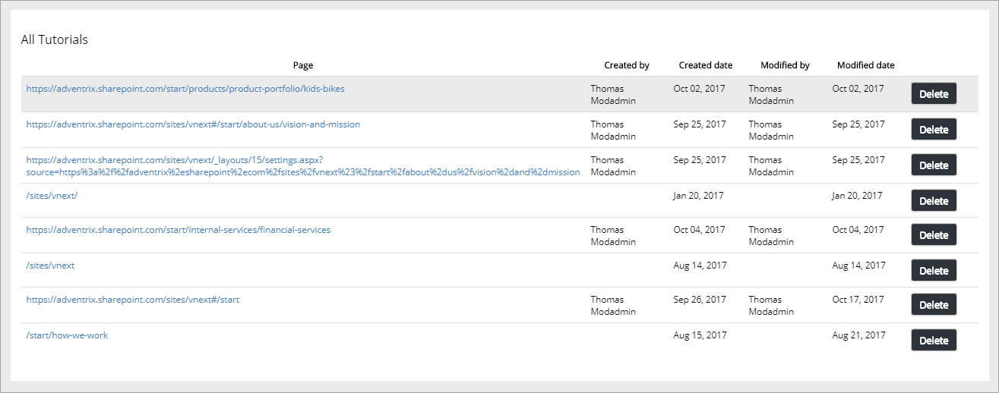
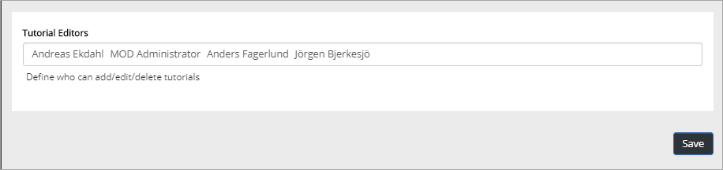
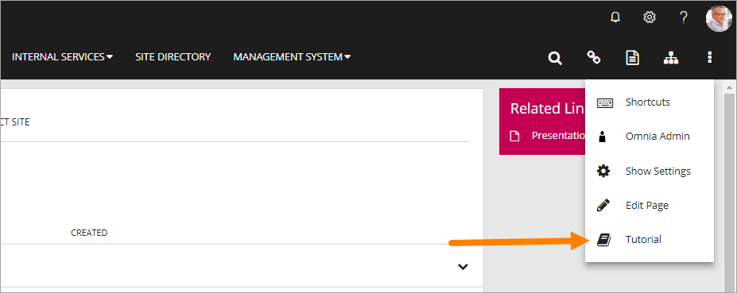
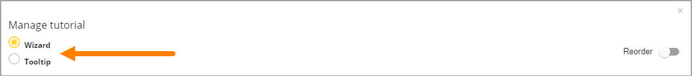
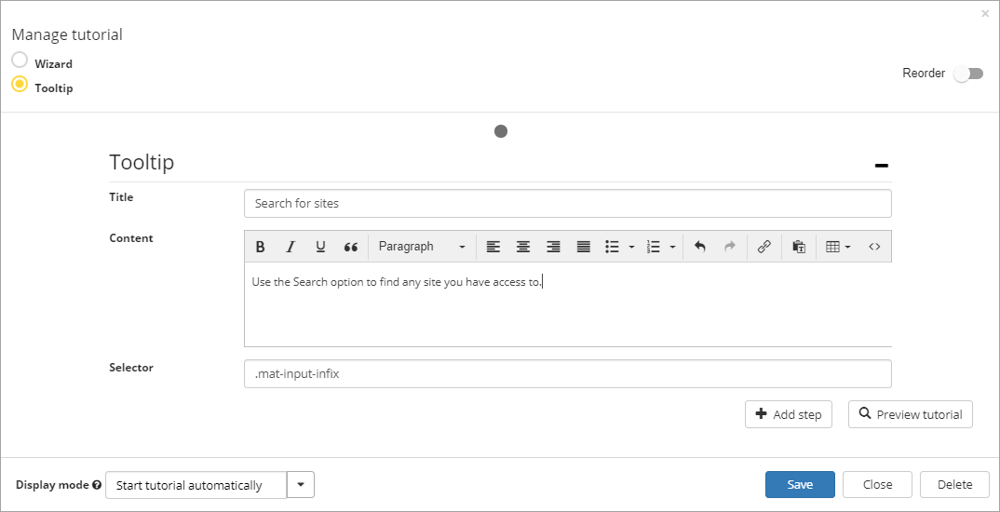

Tutorial Management
===========================

An editor creates and edits tutorials for selected publishing pages. An administrator can manage tutorials for the tenant.

The administrator options
**************************
The administrator options are found in Omnia Admin:

.. image:: tutorial-management.png

All tutorials created in the tenant are displayed in a list, for example:

+ **Page**: Use the link to the page to go there and check out the tutorial.
+ **Created by**: Name of the editor that has created the tutorial is shown here.
+ **Created date**: Date for when the tutorial was initially created is shown here.
+ **Modified by**: Name of the editor that made the latest changes is shown in this column.
+ **Modified date**: Date for the latest version of the tutorial is shown here.
+ **Delete**: If the tutorial on this page should now longer be available, you can click this button. A new tutorial can then be created if and when the need arises. 

Permissions for Tutorial management
------------------------------------
If additional users should be able to manage tutorials, use the "Permissions" option to add or delete users.

The editors options
********************
A tutorial is always created for a specific page, the first step is to go the page.

To access the Tutorial options, open the Admin menu and select Tutorials.

The following options are then available (example with an existing Wizard tutorial):

.. image:: tutorial-example.png

When creating a Tutorial, there can be either a Wizard or a Tooltip Tutorial available for the page, so the first step is always to select this.

Common options
**************
The following options are available for both Wizard and Tooltip Tutorials.

Use the these icons to go to another Tutorial step:

.. image:: wizard-step-new.png

The number of dots in the middle indicates the number of steps, in the example above, two.

The following fields and options are available both types of Tutorials:

+ **Title**: Add/edit the title for the Wizard step.
+ **Content**: Use this field to add a description. Note the bar with layout options.
+ Use the |add-step-button| button to add a new Tutorial step. 
.. |add-step-button| image:: add-step-button.png
   :align: middle
   :width: 8
+ Use the |reorder-button| button to change the order in wich tutorials step are shown. 

+ Use the |preview-tutorial-button| button to see the Tutorial as a user would. 

+ Use the |display-mode-button| button to select how users should acccess the Tutorial, "Start tutorial automatically", Show tooltip alert for new version" or "User starts tutorial manually". 

+ Use the |save-button| button to save. Recommendation - save every time you are finished working on a Tutorial step, before going to the next step. 
.. |save-button| image:: save-button.png
   :align: middle
   :width: 8
+ Use the |delete-button| button to delete the Tutorial for this page Note! The whole Tutorial is deleted, just not the Tutorial step. 

Options for a Wizard Tutorial
*****************************
When working on a Wizard Tutorial, you can add an image (see example above). You can add/replace an image by clicking "Browse". You can use any image from any Image Bank you have access to and even upload an image if needed. 

Options for a Tooltip Wizard
*****************************
The create a tooltip step, do the following:

1. Click .. image:: add-step-button.png
2. Select a position on the page to add a Tooltip for.
3. Add a Title and a description (in the Content field).

In the "Selector" field you can see an indication of where the Tooltip step will be placed.

