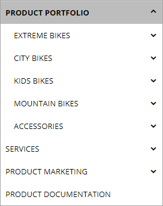
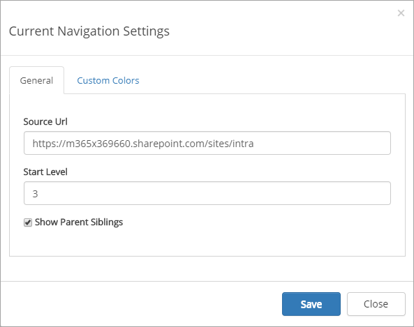
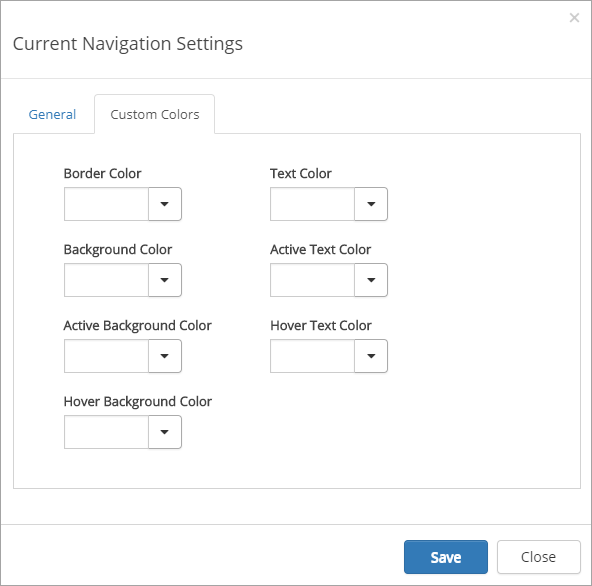

Current Navigation
===========================

The current navigation control makes it possible for the end user to navigate to siblings, parent nodes and parent node siblings. The control is part of page layouts using left-hand-side navigation.

The current navigation settings are page layout scoped. The settings are valid for a specific page layout within the current site collection.

The current navigation is responsive. In a certain width (optimized for mobile phones and tablets) the current navigation will be hidden. The mobile navigation will then be used instead.

The settings
*************
These settings are available:.

The General tab
-------------------
On this tab you can set the following:

+ **Source Url**: The current navigation will be based on the navigation settings that is used on the site of the source url.
+ **Start Level**: The current navigation will start on a specific level in the navigation structure. 1 = Start, 2 = Second level, 3= Third level etc. The default value is 3.
+ **Show parent siblings**: (A description will be added soon).

The Custom Colors tab
----------------------
You should primarily set colors through Theme colors in Omnia Admin (System/Settings/Default colors). If you still would like custom colors for the control, you can set them using this tab.

