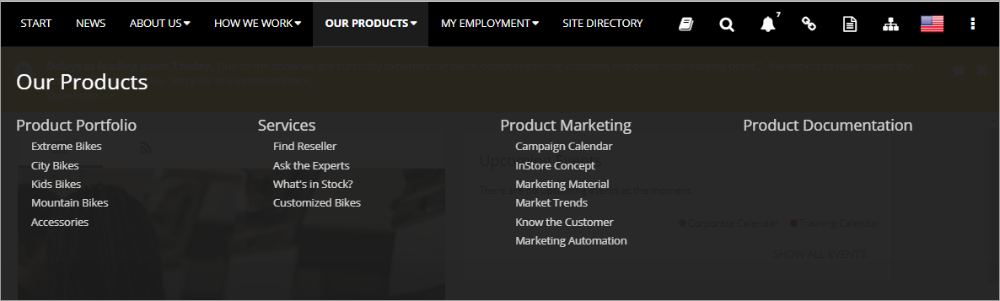
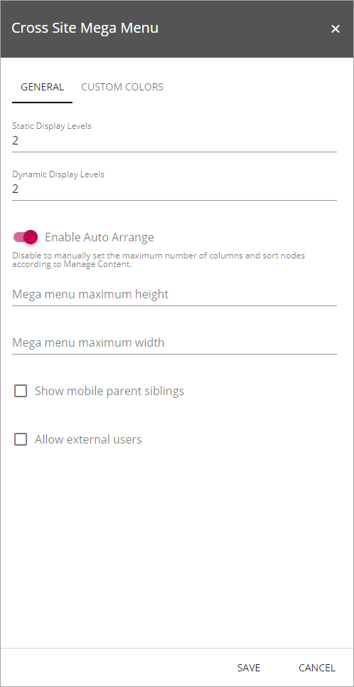

Megamenu
===========================

The Cross Sites Mega Menu control makes it possible for the end user to navigate to any page in the navigation structure. It is displayed across all Sharepoint sites in Omnia.

Settings
**********
The following settings are available for the control:

The General tab
----------------
On this tab you can set the following:

+ **Static Display Levels**: Defines the number of levels in the navigation term set that will always be displayed in the menu.
+ **Dynamic Display Levels**: Defines the number of levels in the navigation term set that should be displayed in the mega menu when a user clicks an item in the static menu.
+ **Enable Auto Arrange**: The columns in the mega menu can be sorted automatically (default) or the same way as shown in the navigation when you edit pages. If you would like the latter, deselect this option. 
+ **Maximum number of columns**: Set the number of columns to be shown in each "row" of the menu. Available only when the option above is turned off.
+ **Mega menu maximum height and width**: Here you can set a specific height and width for the navigation flyout area.
+ **Show mobile parents siblings**: To save space in a mobile environment, this option can be used to select not to show the sub options (siblings) to the main heading (parent).
+ **Allow external users**: If the mega menu should be displayed for external users as well, this option must be selected. Otherwise external users may experience a CTD.

The Cross Sites Mega Menu settings are master page scoped. All sites using this master page will inherit the settings.

The Custom Colors tab
-----------------------
You should primarily set colors through Theme colors in Omnia Admin (System/Settings/Default colors). If you still would like custom colors for the control, you can set them using this tab.

.. image:: cross-sites-mega-menu-colors.png

