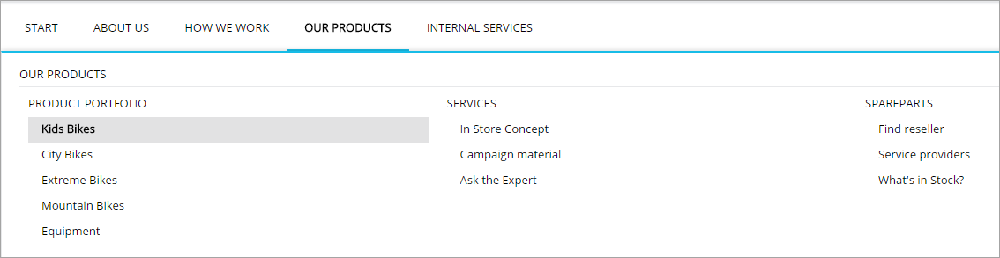
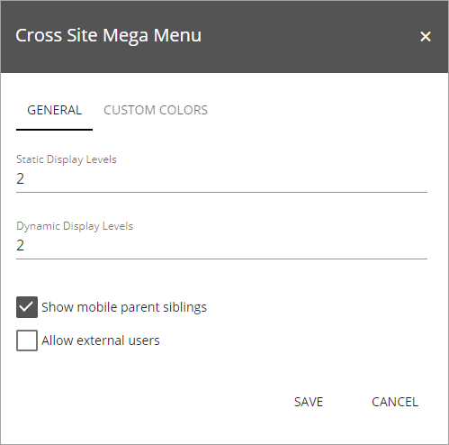
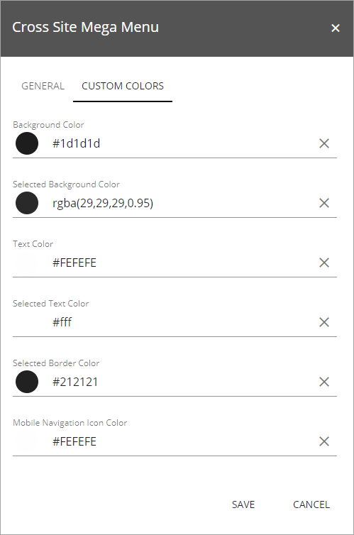
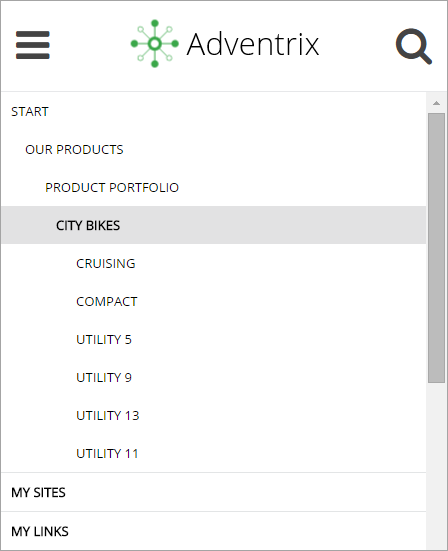

Megamenu
===========================

The Cross Sites Mega Menu control makes it possible for the end user to navigate to any page in the navigation structure. It is displayed across all Sharepoint sites in Omnia.

Settings
**********
The following settings are available for the control:

The General tab
----------------
On this tab you can set the following:

+ **Static Display Levels**: Defines the number of levels in the navigation term set that will always be displayed in the menu.
+ **Dynamic Display Levels**: Defines the number of levels in the navigation term set that should be displayed in the mega menu when a user clicks an item in the static menu.
+ **Show mobile parents siblings**: To save space in a mobile environment, this option can be used to select not to show the sub options (siblings) to the main heading (parent).
+ **Allow external users**: If the mega menu should be displayed for external users as well, this option must be selected. Otherwise the external user may experience a CTD.

The Cross Sites Mega Menu settings are master page scoped. All sites using this master page will inherit the settings.

The Custom Colors tab
-----------------------
You should primarily set colors through Theme colors in Omnia Admin (System/Settings/Default colors). If you still would like custom colors for the control, you can set them using this tab.

The mobile View
*****************
The Cross Site Mega Menu is responsive. In a certain width (optimized for mobile phones and tablets), the menu will go into mobile mode. This view will only display the parent and child structure of the current node, not any siblings.

