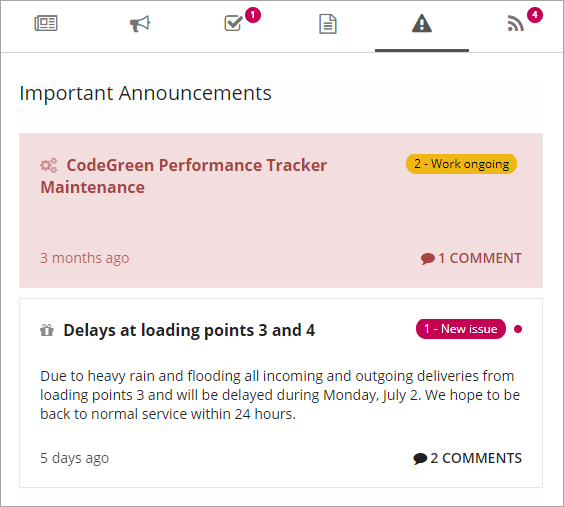
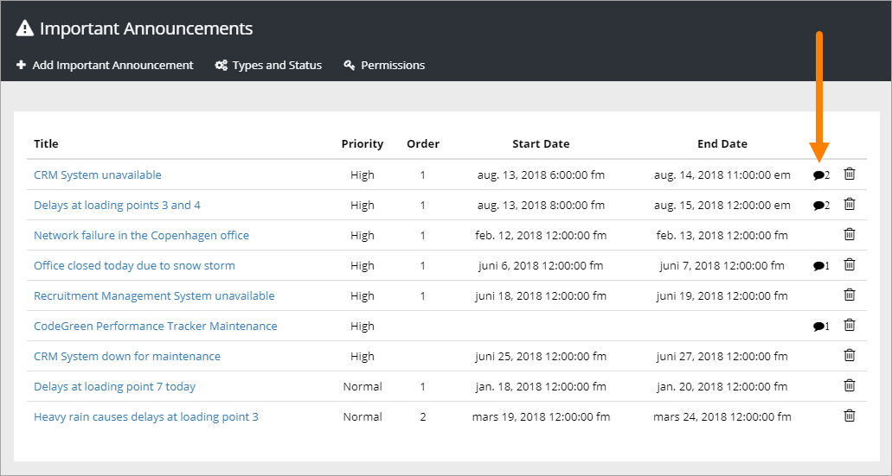
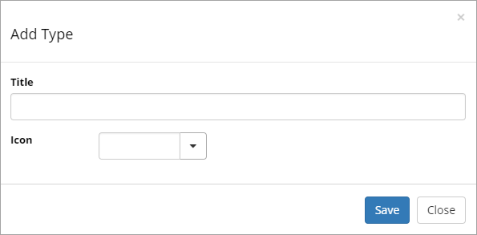
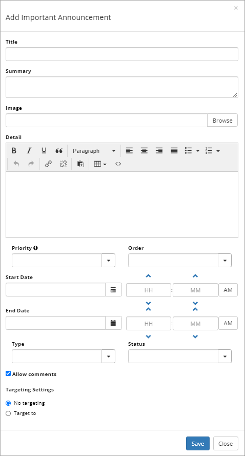
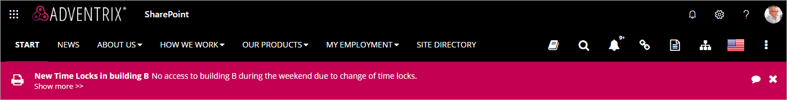
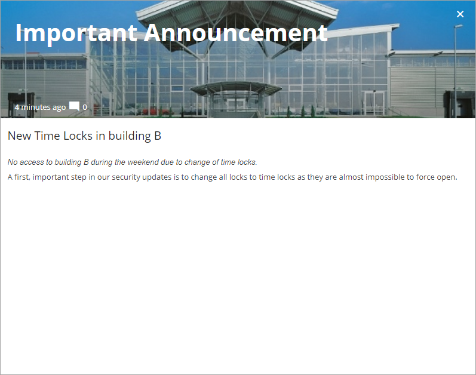
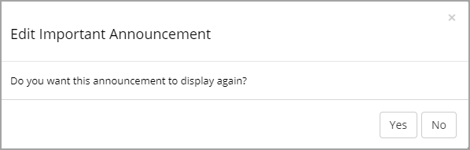
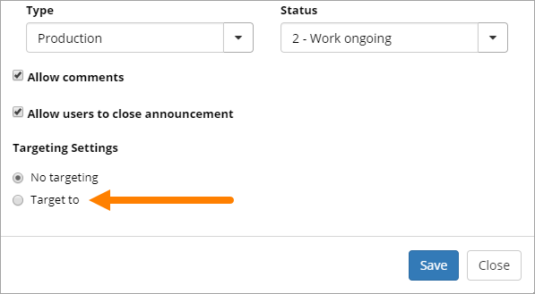
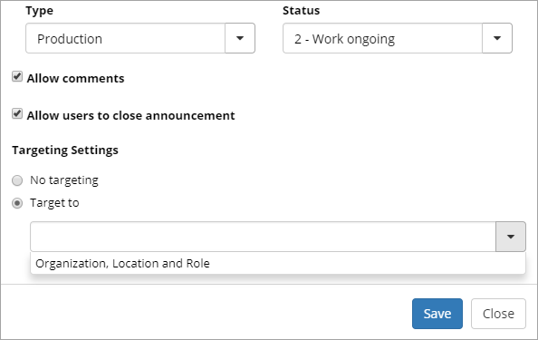
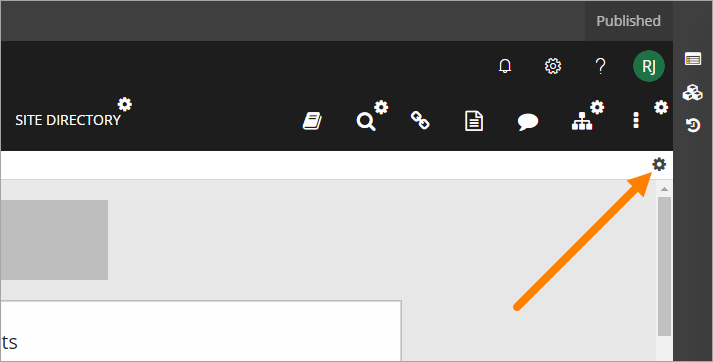

Important Announcements
===========================

Important Announcements are displayed in the Important Announcements control, in the Notification panel. Important Announcements can  have Normal priority or High priority.

The end user experience
***********************
All Important Announcements messages are shown in the the Notification panel, for example:

.. image:: important-announcements-notification-panel-frame.png

Imnportant Announcements with Normal priority are shown in the Notification panel only. Important Announcements with High priority are displayed below the cross site mega menu on all pages in the intranet, both publishing pages and team sites.

When the message has been read, the user can choose to close the message by clicking he x, if it is allowed. In the settings for each important announcement, the editor can set if the user will be able to close the message manually.

.. image:: high-important-message.png

If the user does not actively close the message, the message is shown the full time the administrator has set.

Commenting an Important Announcement
-------------------------------------
If commenting is allowed for the Important Announcement (set indivually for each Important Announcement, see below) any user can comment the message. It works the same way as commenting a publishing page, for example news. The number of comments for each message are shown in the list, for example:

To read or add comments, click "Comment(s)" and something like the following is shown:

.. image:: important-announcements-comments-read-new.png

Creating and editing Important Announcements
********************************************
Global and tenant administrators can add or edit Important Announcements, in Omnia Admin. If additional users should be able to create important announcements, add them using the "Pemissions" option. Users or permission groups can be added.

Note! The tenant feature "Omnia Important Announcements" needs to be activated in order for the Important Announcements administration page to appear. The administration page displays the history of all important announcements published in the tenant.

.. image:: important-announcements-list.png

An important announcement can be tagged with a Type and a Status. When an important announcement is updated (for example to change status), it is possible to republish the announcement for users that have closed the announcement.

If comments are allowed for an announcement, which is default, you can read the comments by clicking the icon:

To comment the announcement, or another comment, yourself, you do that the normal way, as any other user would.

Types and Status
-------------------
You can create Types and Status to use as an indicator for Important Announcements. A list of Types and status can look like this:

.. image:: types-and-status.png

Is a Type or a Status no longer needed? Just click the dust bin.

For Types you can add a title and select an icon:

For Status you can can do the same, ad a title and select an icon:

.. image:: status.png

New Important Announcement
----------------------------
To add a new Important Announcement, click the link "Add Important Announcement" and the following is shown:

1. Add a Title and a Summary.
2. Add an image if you wish. This image is used in the details dialog, see below for an example.
3. Add a description if needed (Detail). Shown for High priority announcements and used in the header only. Here you can use Rich Text for formatting. If you add content here a Show more link is shown in the message, that users can click on to read the details. See images below for an example.
4. Set the Priority. Important Announcements with High priority will be displayed below the cross site mega menu on all pages, and in the Notification panel. Important Announcements with Normal priority will be displayed in the notification panel only.
5. Set the order for this Imortant Announcement when there are several displayed.
6. Set the start and end date of the Important Announcement. You can set exact times within the dates if needed. Start and end dates are optional, but we recommend that you always at least set an end date.
7. Choose Type and Status if needed.
8. Decide to allow comments or not. The default is to allow comments. If allowed, users can add comments, and even comment other comments (and so can you of course) the same way as for example for news.
9. Decide to let users close an announcement when it's read, or not (only applicable for High priority announcements). Default is on. A good reason to have this option active is that when an announcement is closed, the user can't see any new comments. You can for example use comments to inform about developments and when the problem is solved.
10. You can also target the Important Announcement. See below (Heading "Targeting").

When details are added to an Important Announcement a "Show more" link is added. Here's an example:

When a user clicks the link the detailed text is shown, for example:

Edit and republish
-------------------
When you edit an Important Announcement of High priority you can choose to republish the announcement so even users that has closed the announcement will be able to see the update.

When you click "Save", the following is shown:

To republish the announcement for all users, click "Yes".

Targeting
----------
An Important Announcement can be targeted to any receivers that has been defined in Target Definitions, see: :doc:`Targeting Definitions </tenant-management/targeting-definitions/index>`

To target an Important Announcement, do the following:

1. Select "Target to".

2. Open the list and select target.

High Priority Announcements settings
***************************************
There are som settings available for High Priority Announcements. It can be reached by the cog wheel here:

The following settings are available:

.. image:: high-priority-announcements-settings.png

+ **Poll interval (minutes)**: Set a time interval in minutes on how often the page should poll for new announcements. Default=5 minutes.
+ **Background color** and **Text color**: You should primarily set colors through Theme colors in Omnia Admin (System/Settings/Default colors). If you still would like custom colors for the control, you can set them using these two options.
