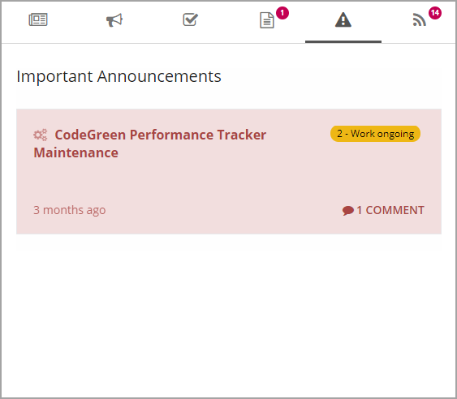
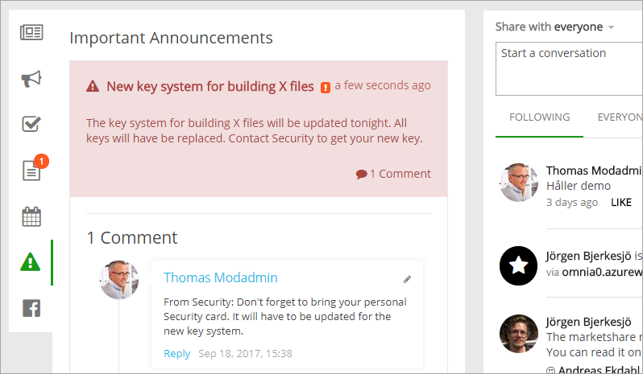

Important Announcements
===========================

The Important Announcements control in the notifiation panel displays all current important announcements with Normal priority. The control has no settings.

High Priority Announcements
*****************************
Important Announcements with high priority are displayed below the cross site mega menu on all pages in the intranet, both publishing pages and team sites.

When the message has been read, the user can choose to close the message, if it is allowed. In the settings for each important announcement, the editor can set if the user can close the message.

.. image:: high-important-message.png

If the user does not actively close the message, the message is shown the full time the administrator has set.

Important Announcements are administrated in Omnia Admin.

Commenting Important Announcements
*************************************
Important Announcements can be commented (if enabled, which is the defsulat), the same way as pages (for example news).

It's done through the Notification panel. Here's an example:

