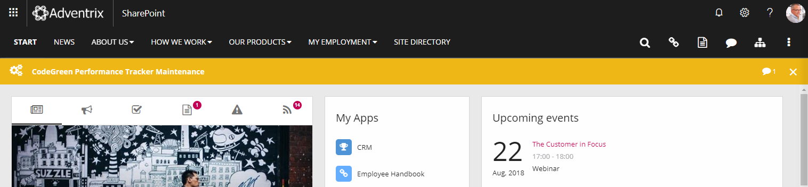
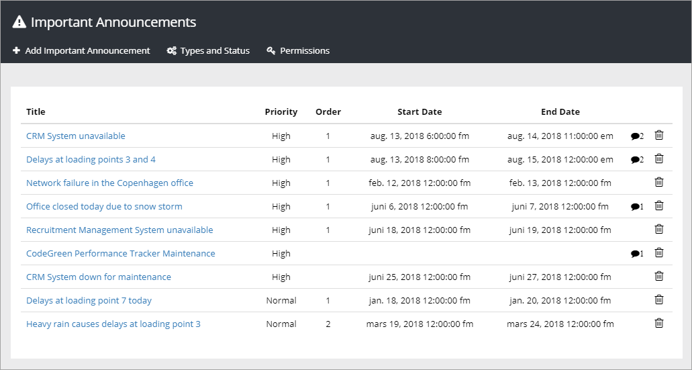
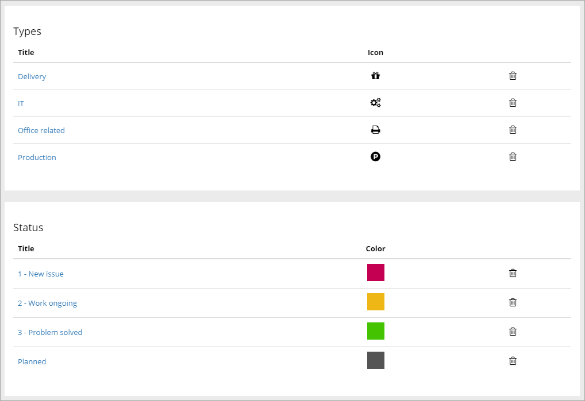
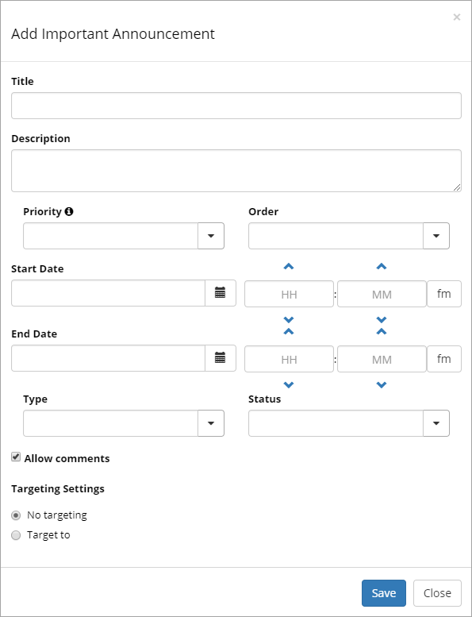

Important Announcements
===========================

Important Announcements are displayed in the Announcements control, which is often used in the Notification panel, but can also be added as a separate control. See :doc:`Announcements </team-collaboration/announcements/index>`

Important Announcements with high priority are displayed below the cross site mega menu on all pages in the intranet, both publishing pages and team sites.

When the message has been read, the user can choose to close the message by clicking he x, if it is allowed. In the settings for each important announcement, the editor can set if the user will be able to close the message manually.

If the user does not actively close the message, the message is shown the full time the administrator has set.

Creating and editing Important Announcements
********************************************
You create and edit Inportant Announcements in Omnia Admin.

Note! The tenant feature "Omnia Important Announcements" needs to be activated in order for the Important Announcements administration page to appear. The administration page displays the history of all important announcements published in the tenant.

Global and tenant administrators can add new Important Announcements. If additional users should be able to create important announcements, add them using the "Pemissions" option. You can add users or permission groups.

An important announcement can be tagged with a Type and a Status. When an important announcement is updated (for example to change status), it is possible to republish the announcement for users that have closed the announcement.

If comments are allowed for an announcement, which is default, you can read the comments by clicking the icon:

.. image:: Important-announcements-comments-read.png

To comment the announcement, or another comment, yourself, you do that the normal way, as any other user would.

Types and Status
******************
You can create Types and Status to use as an indicator for Important Announcements. A list of Types and status can look like this:

Is a Type or a Status no longer needed? Just click the dust bin.

For Types you can add a title and select an icon:

.. image:: types.png

For Status you can can do the same, ad a title and select an icon:

.. image:: status.png

New Important Announcement
***************************
To add a new Important Announcement, click the link "Add Important Announcement".

1. Add a Title and a Description.
2. Set the Priority. Important Announcements with High priority will be displayed below the cross site mega menu on all pages. Important Announcements with Normal priority will be displayed in the notification panel.
3. Set the order for this Imortant Announcement when there are several displayed.
4. Set the start and end date of the Important Announcement. You can set exact times within the dates if needed. Start and end dates are optional, but we recommend that you always at least set an end date.
5. Decide to allow comments or not. The default is to allow comments. If allowed, users can add comments, and even comment other comments (and so can you ofcourse) the same way as for example for news.
6. Decide to let users close an announcement when it's read, or not (only applicable for High priority announcements). Default is on. A good reason to have this option active is that when an announcement is closed, the user can't see any new comments. You can for example use comments to inform about developments and when the problem is solved.

Edit and republish
********************
When you edit an Important Announcement of High priority you can choose to republish the announcement so even users that has closed the announcement will be able to see the update.

When you click "Save", the following is shown:

.. image:: important-announcement-republish.png

To republish the announcement for all users, click "Yes".

Targeting
*********
An Important Announcement can be targeted to any receivers that has been defined in Target Definitions, see: :doc:`Targeting Definitions </tenant-management/targeting-definitions/index>`

To target an Important Announcement, do the following:

1. Select "Target to".

.. image:: important-announcement-target.png

2. Open the list and select target.

.. image:: important-announcement-targeted.png

