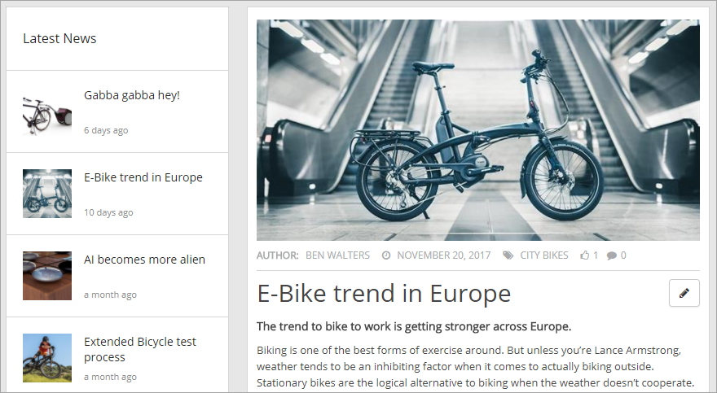
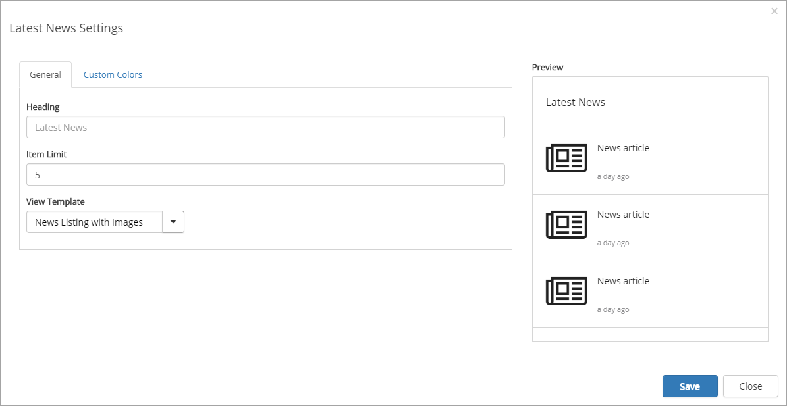
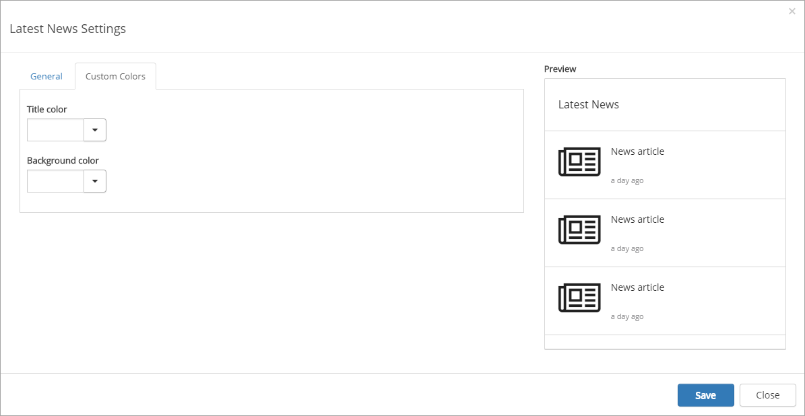

Latest News
===========================

The Latest News control displays the latest news published, when reading a news article.

The settings
***************
The following settings are available for the control:

The General tab
---------------------
On the General tab you can set the following:

+ **Heading**: You can edit the heading shown for the list here.
+ **Item Limit**: Set the maximum numbers of news articles to display in the list.
+ **View Template**: Select to show the list as a news listing with images or as a simple list. See the "Preview" for a rough example.

The Custom Colors tab
----------------------
You should primarily set colors through Theme colors in Omnia Admin (System/Settings/Default colors). If you still would like custom colors for the control, you can set them using this tab.

